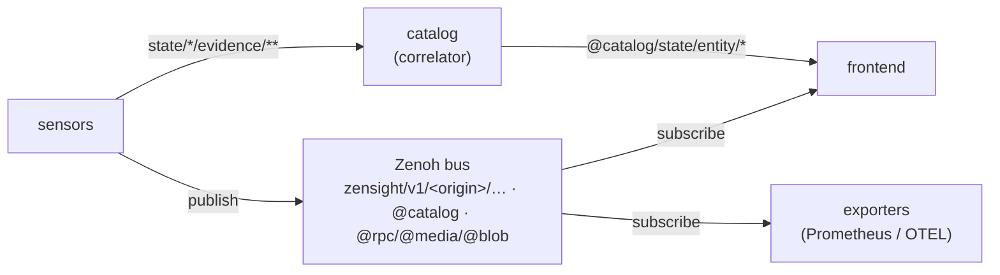

# CLAUDE.md

Guidance for Claude Code (claude.ai/code) working in this repository.

## Project Overview

ZenSight sensors legacy monitoring protocols into Zenoh's pub/sub, visualizes the result in
an Iced desktop frontend, correlates per-host identity, and exports to Prometheus/OTel.

**Every crate documents itself** in its own `README.md` + `docs/` directory — that is the
authoritative reference for how that crate works. This file is the *contributor/agent* guide:
build/test/lint commands, conventions, and a map into the per-crate docs. The cross-cutting
contracts are the ratified **keyspace-v2 convention**
(normative spec + enforcement crate + `zenctl` live in the external
[zenkey repo](https://github.com/p13marc/zenkey); deployed-profile summary in
[`docs/KEYSPACE.md`](docs/KEYSPACE.md))
and [`docs/ARCHITECTURE.md`](docs/ARCHITECTURE.md) (system overview). Archived
design rationale lives in [`docs/design/`](docs/design/).

### Crate map (→ each crate's docs)

| Crate | What it is |
|-------|-----------|
| `zensight/` | Iced 0.14 frontend — views/state, testing, design system, local store |
| [`zenctl`](https://github.com/p13marc/zenkey/tree/main/zenctl) | bus explorer CLI (RFC 08 §6) — external, in the zenkey repo |
| `zensight-store/` | tiered time-series store (hot ring + redb minute/hour tiers, logs/events/chunks) — extracted from the GUI binary (#904), shared with the historian |
| `zensight-historian/` | durable fleet telemetry history (#898): ingests `v1/*/telemetry/**` into `zensight-store`'s tiers under a resource budget, serves bounded range queries — a host-origin producer, read-only, publishes no telemetry |
| `zensight-common/` | shared model: telemetry, alert/command, identity/evidence/entity, artifact, QoS, keyexpr, payload type table |
| [`zenkey`](https://github.com/p13marc/zenkey) | v1 key grammar (`V1Context`, `AppProfile`, origin minting) — external repo (crates.io dep, like `zblob`), was in-tree `zensight-keyspace/`; registry TOMLs live in `zensight-common/registry/`, compiled by `zenkey-build` |
| `zensight-sensor-core/` | sensor framework: runner, publishers (declared, QoS), health, alerting, identity, artifacts |
| `zensight-sensor-{snmp,logs,netflow,modbus,sysinfo,gnmi}/` | protocol pollers/receivers |
| `zensight-sensor-netlink/` | kernel net telemetry (RTNETLINK/sock_diag) + sentinel + optional eBPF |
| `zensight-sensor-netring/` | wire-level flow/L7/NDR (AF_PACKET/AF_XDP/pcap) + detectors + threat-intel |
| `zensight-sensor-systemd/` | systemd unit/boot telemetry (D-Bus) + sentinel + gated actions |
| `zensight-sensor-hostspec/` | machine-checked desired-state assertions (#821): mounts/files/listeners/symlinks/content/perms sentinel — read-only, executes nothing |
| `zensight-sensor-container/` | OCI containers (#819): per-container cgroup/OOM/restart/exit-code, image ref + digest, healthcheck state (incl. *never ran*), signature presence, and the owning systemd unit — read-only socket + cgroupfs, no action surface |
| `zensight-sensor-probe/` | outside-in synthetic checks (#820): HTTP/TLS/DNS/TCP (+opt-in ICMP) against configured targets, plus local certificate expiry — a client only, and every result carries its vantage point |
| `zensight-sensor-pve/` | Proxmox VE (#818): guests + their `onboot`/NIC-firewall config, storage allocated-vs-capacity, vzdump outcomes and size trend, cluster/HA/replication — read-only, **no action surface at all** |
| `zensight-sensor-parallax/` | live video (V4L2/RTSP/test) → H.264 + JPEG previews on `@media` (parallax pipeline) |
| `zensight-correlator/` | fuses identity evidence → one `HostEntity` per host |
| `zensight-exporter-{prometheus,otel}/` | forward telemetry/alerts to external systems |
| `zensight-conformance/` | CI harness (#744): stands a deployment up and runs `zenkey-fleet`'s RFC judges against it. `publish = false`. It links `zenkey-fleet`, as does `zensight` for the fleet view (#745); the invariant is that **no crate a sensor links may** — see `Cargo.toml`'s note on the dependency |
| [`zblob`](https://github.com/p13marc/zblob) | resumable content-addressed large-data transfer (external repo, was in-tree `zenoh-blob/`) |
| `zensight-sensor-{netlink,sysinfo}-ebpf{,-common}/` | opt-in eBPF programs (compile to host stubs) |

## Build Commands

```bash
cargo build --release --workspace                       # everything
cargo run -p zensight --release                         # frontend
cargo run -p zensight-sensor-snmp --release -- --config configs/snmp.json5
cargo run -p zensight-exporter-prometheus --release -- --config configs/prometheus-exporter.json5
cargo run -p zensight-exporter-otel --release -- --config configs/otel-exporter.json5
cargo run -p zensight-correlator --release -- --config configs/correlator.json5 [--demo]
just run                                                # GUI + local sensors (see README)
just demo-prometheus                                    # sensors + exporter + Prometheus + Grafana (demo/)
just demo-otel                                          # sensors + exporter + grafana/otel-lgtm (demo/)
```

## Testing

```bash
cargo test --workspace                     # all tests
cargo test -p zensight-sensor-netring      # one crate
cargo test -p zensight test_dashboard_empty  # one test
```

Sandbox note: `zensight-sensor-gnmi` needs protoc, `zensight-sensor-systemd` needs
systemd-devel. If a toolbox/container has them, run the full
workspace there; otherwise `--exclude` those crates and say so.

## Linting and Formatting

CI is **Forgejo Actions** (`.forgejo/workflows/`) — there is no `.github/` in this repo;
GitHub is a passive push mirror. `ci.yml` enforces, as a merge gate, in four jobs:

- **test** — `cargo test --workspace --locked`
- **demo-smoke** — `PROFILE=debug scripts/demo-verify.sh`: one real sensor, BOTH real
  exporters (a Prometheus scrape and, since #845, an OTLP/HTTP export to a local
  sink), executed. Nothing in CI had ever *executed* an exporter before it.
- **features** — `cargo clippy -D warnings` per optional feature (`zensight`
  `tester`/`h264`/no-default, netring's six detectors, logs/btf no-default — #845
  upgraded these from `cargo check`, which passed on warnings). A default workspace
  build never type-checks these; `h264` shipped broken for a week under exactly that
  blind spot. The `ebpf` legs are out-of-band in `features-ebpf.yml` (nightly +
  `bpf-linker`).
- **lint** — `cargo fmt --all --check`, `cargo clippy --workspace --all-targets --locked
  -- -D warnings`, plus five grep guards: a **design-system color guard** (no ad-hoc Color
  constructors — `from_rgb*`, `new`, the constants, `color!`, the struct literal —
  outside `zensight/src/view/{theme.rs,tokens.rs,components/}`
  — see [`zensight/docs/design-system.md`](zensight/docs/design-system.md)), a
  **`session.put`/`session.delete` ban** (publish through declared publishers), a ban on
  exporters hand-rolling `declare_subscriber` (history/recovery, #763), a ban on raw
  `declare_queryable` (serve through `served::serve_queryable`, #484), and the two #466
  checks — no `"zensight/` literal in application source, and only
  `zensight_common::session` may call `zenoh::open`.

Two CI jobs execute rather than compile, because the suite could not see what they
cover: **demo-smoke** (`scripts/demo-verify.sh` — one real sensor, one real exporter,
one real scrape; nothing in CI had ever *executed* an exporter) and **conformance**
(`scripts/conformance-verify.sh` — one real sensor and `zenkey-fleet`'s RFC judges
against the live bus; nothing had ever asked a running fleet whether it *conforms*:
slice sync, `alive ⇒ callable`, schema drift, QoS, freshness, cardinality). What the
conformance gate fails on, and the one check it excludes with the condition that lifts
it, are in [`zensight-conformance/README.md`](zensight-conformance/README.md).

```bash
cargo fmt --all
cargo clippy --workspace -- -D warnings
scripts/conformance-verify.sh            # judge a live deployment (isolated port)
```

## Architecture (one screen)



- **Keyspace v1** (RFC, ratified): everything rides
  `zensight/v1/<origin>/<class>/<producer>/<subject...>` with classes
  `telemetry`/`state`/`events`, verbatim planes `@rpc`/`@media`/`@blob`, and the
  `@catalog` identity service; commands are `@rpc` GETs, not publications. The
  registry TOMLs live in `zensight-common/registry/`, compiled by `zenkey-build`
  into typed builders (`zensight_common::registry`) over the external
  [`zenkey`](https://github.com/p13marc/zenkey) grammar crate; contract summary:
  [`docs/KEYSPACE.md`](docs/KEYSPACE.md), normative spec:
  [the zenkey repo](https://github.com/p13marc/zenkey/blob/main/rfcs/00-index.md).
- **Sensors** self-report a stable `host_id` and (with `evidence` on) republish observed
  hosts/names; the **correlator** fuses them (union-find over ranked identity rules) into one
  `HostEntity` per host. See `zensight-common/docs/identity-evidence.md` and
  `zensight-correlator/docs/`.
- **Data model / conventions** (TelemetryPoint, alert/command model, CBOR-default serialization
  with first-byte sniff, QoS classes): `zensight-common/docs/`.
- **Frontend** (view/state pattern, shell, overlays, redb local store): `zensight/docs/`.
- **Large data** (report/snapshot/capture requested via `@rpc/<producer>/artifact/*`,
  delivered on `@blob/{artifact,tree,store}`): the external
  [`zblob`](https://github.com/p13marc/zblob) crate
  + `zensight-sensor-core/docs/artifacts.md`.

## Feature Flags

| Crate | Feature | Purpose |
|-------|---------|---------|
| `zensight` | `tester` | F12 UI recorder (iced/tester) |
| `zensight` | `h264` | opt-in H.264 live view for parallax streams (pulls openh264, a C++ build from source; default GUI stays JPEG-preview-only) (enabled by the justfile build) |
| `zensight-sensor-netring` | `lateral` / `sigma` / `yara` / `snmp` | opt-in NDR detectors (off by default) |
| `zensight-sensor-netring` | `ja4plus` | JA4/JA4H fingerprints — FoxIO License 1.1 (NOT OSI); default build stays OSI-clean |
| `zensight-sensor-{netlink,sysinfo}` | `ebpf` | opt-in eBPF collectors (need host validation) |

Netring detector features are documented in `zensight-sensor-netring/docs/detectors.md`.

## Configuration

JSON5 in [`configs/`](configs/), one per crate. Shared Zenoh block, overridable via
`ZENSIGHT_ZENOH_{MODE,CONNECT,LISTEN,SCOUTING,GOSSIP,NAMESPACE}` (scouting and
gossip default mode-aware: both off for a client with explicit `connect`
endpoints, on otherwise — #626):

```json5
{ zenoh: { mode: "peer", connect: ["tcp/localhost:7447"], listen: [] },
  serialization: "cbor" }   // "json" or "cbor" (cbor is the default)
```

The optional `zenoh.namespace` is the deployment base (RFC 03 §1.1): **empty by
default** (no session namespace — keys at the bus root, Zenoh's own default);
set it to isolate deployments sharing one Zenoh infrastructure. All
participants of one deployment must agree on it.

## Development Notes

- Rust edition 2024; Iced 0.14 (tokio, canvas, svg); Zenoh 1.10 (`unstable`); tokio async runtime.
- Conventional commits (`feat:`/`fix:`/`chore:`/`docs:`). Key expressions: v1 grammar via
  `zenkey`/`zensight-common` builders (never ad-hoc `format!`). Each view uses a
  per-view state struct; UI tests use `iced_test::simulator` (see `zensight/docs/testing.md`).
- When you change a crate's behavior, update **that crate's `docs/`** and, if the wire contract
  moves, [`docs/KEYSPACE.md`](docs/KEYSPACE.md).
