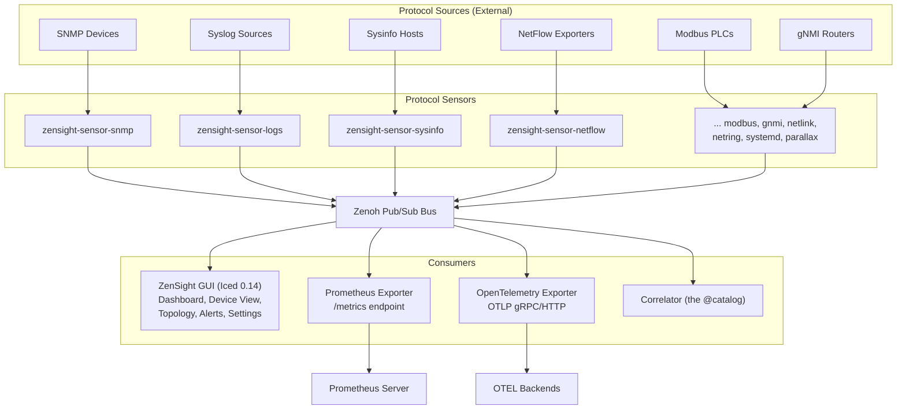
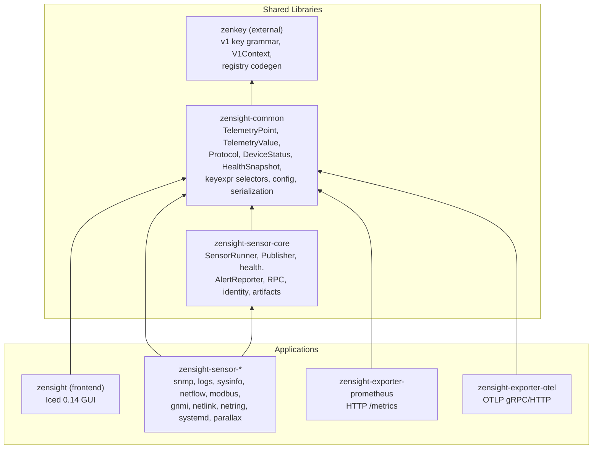
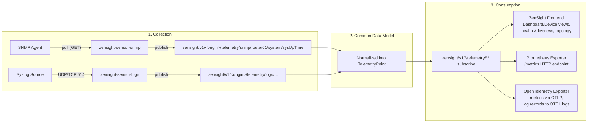
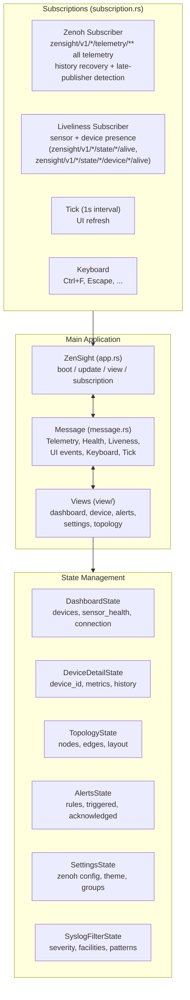
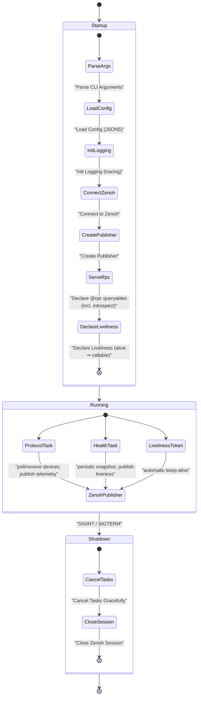
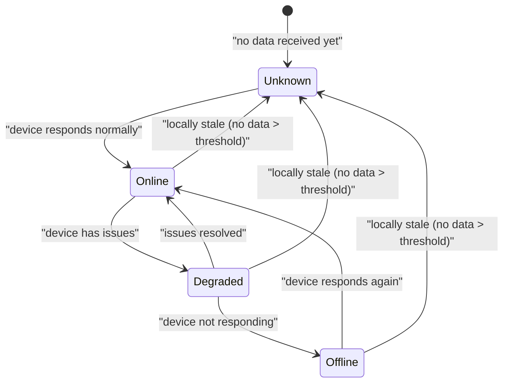
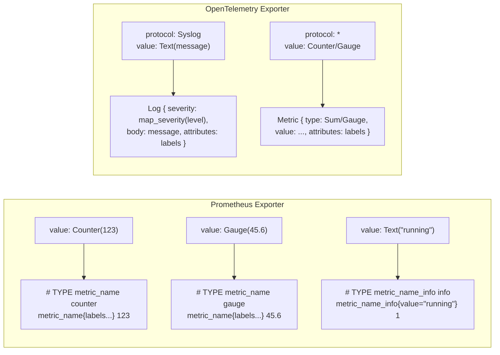

# ZenSight Architecture

This document describes the high-level architecture and component relationships in ZenSight.

## System Overview



All sensors reuse `zensight-sensor-core` (`SensorRunner`, `Publisher`) and `zensight-common`
(`TelemetryPoint`, config, serialization). Every key rides the ratified keyspace-v2
grammar `zensight/v1/<origin>/<class>/<producer>/<subject...>`, where `<origin>` is the
host's stable `h-<12hex>` id. The bus carries:

- `zensight/v1/<origin>/telemetry/<producer>/<metric...>` — telemetry data
- `zensight/v1/<origin>/state/<producer>/health` — sensor health
- `zensight/v1/<origin>/state/<producer>/device/<device>/liveness` — device liveness
- `zensight/v1/<origin>/state/<producer>/errors` — error reports
- `zensight/v1/<origin>/state/<producer>/sensor` — sensor registration
- `zensight/v1/<origin>/state/<producer>/evidence/**` — identity evidence (feeds the
  catalog, see below)
- `zensight/v1/<origin>/@media/parallax/<stream>/…` — opaque live media (H.264 +
  JPEG previews with CBOR `FrameMeta` attachments; produced on demand by
  `zensight-sensor-parallax`, viewed in the GUI — KEYSPACE.md)

## Crate Dependencies



## Data Flow



All sensors normalize their protocol-specific data into a common `TelemetryPoint` before
publishing:

```rust
TelemetryPoint {
    timestamp: 1704412800000,        // Unix epoch ms
    source: "router01",              // Device identifier
    protocol: Protocol::Snmp,        // Origin protocol
    metric: "system/sysUpTime",      // Metric path
    value: TelemetryValue::Counter(123456),
    labels: {"location": "dc1", "vendor": "cisco"},
}
```

## Key Expression Hierarchy

Everything rides `zensight/v1/<origin>/<class>/<producer>/<subject...>` with the
data classes `telemetry` / `state` / `events` and the verbatim planes `@rpc` /
`@media` / `@blob`; the identity catalog publishes under the verbatim `@catalog`
origin.

```
zensight/v1/
├── <origin>/                            # h-<12hex> — one subtree per host
│   ├── telemetry/<producer>/<metric...> # TelemetryPoint samples
│   │       Example: zensight/v1/h-3fa9c2d41b7e/telemetry/snmp/router01/interfaces/eth0/ifInOctets
│   ├── state/<producer>/                # LWW documents (its own late-joiner seed)
│   │   ├── health · errors · sensor · alive
│   │   ├── device/<device>/{liveness,alive}
│   │   ├── alert/<alert_key>            # Alert (firing/resolved)
│   │   └── evidence/{self,device/<device>,names/<ip-slug>}
│   ├── events/<producer>/<subject...>   # append-only records
│   ├── @rpc/<producer>/<procedure...>   # request/reply — <topic> read, <topic>/set write
│   ├── @media/<producer>/<stream>/…     # opaque live video
│   └── @blob/{artifact,tree,store}/…    # bulk content-addressed delivery
└── @catalog/                            # the identity catalog (verbatim origin)
    ├── state/{entity/<id>, alias/<old-id>, pdns/<ip-slug>, claim/<zid>, alive}
    └── @rpc/names?ip=<addr>
```

**[KEYSPACE.md](KEYSPACE.md) is the one-screen summary of the deployed profile**;
the normative spec is the RFC set in the [zenkey repo](https://github.com/p13marc/zenkey/blob/main/rfcs/00-index.md),
enforced by the `zenkey` registry + typed builders. This is only a sketch.

## Zenoh Transport & Pub/Sub Model

Every process (sensors, frontend, exporters) is an independent Zenoh app; how
they connect and how they publish/subscribe both matter for telemetry to flow.

### Connectivity — peers + an explicit local rendezvous

All processes run in `mode: "peer"`. Peers can discover each other two ways:

- **Multicast scouting** (Zenoh default) — works when every process shares a
  multicast-capable interface. It is **unreliable** on hosts with a VPN or
  several interfaces (tailscale, docker, …), where scouting may bind to the
  wrong interface and the GUI then forms no session and shows nothing.
- **Explicit endpoints** (`connect` / `listen`) — deterministic, no multicast.

`just run` therefore pins an explicit **loopback rendezvous**: the GUI
`listen`s on `tcp/127.0.0.1:7447` and every sensor `connect`s to it, so the
pieces always meet regardless of the network. Because the endpoints are pinned,
`just run` also sets `ZENSIGHT_ZENOH_SCOUTING=false` on every process to turn
**multicast scouting off** — it is redundant here, and on loopback it produces a
noisy `CONNECTION_TO_SELF` / "Attempt to establish transport to itself" error
storm as the hub locator gets scouted back and dialed. Gossip stays on (the two
are independent switches), so the hub's spokes still discover each other — this
is how the correlator finds the sensors' evidence. This is driven by environment
overrides applied on top of the file/settings config:

| Env var | Effect |
|---------|--------|
| `ZENSIGHT_ZENOH_MODE` | override `mode` |
| `ZENSIGHT_ZENOH_CONNECT` | override `connect` endpoints (comma-separated) |
| `ZENSIGHT_ZENOH_LISTEN` | override `listen` endpoints (comma-separated) |
| `ZENSIGHT_ZENOH_SCOUTING` | `false`/`true` sets multicast scouting explicitly |
| `ZENSIGHT_ZENOH_GOSSIP` | `false`/`true` sets gossip scouting explicitly |

When neither knob is set, the defaults are **mode-aware** (#626): a `client`
with explicit `connect` endpoints gets both switches **off** — it dials its
router and never needs discovery, and on an mTLS-only mesh every scouted or
gossiped peer locator is an unreachable-peer WARN every few seconds — while
peers (and connect-less clients, which need multicast to find a router at
all) keep Zenoh's on-defaults.

Implemented by `ZenohConfig::with_env_overrides()` (zensight-common), applied in
both the sensor session (`session::connect`) and the GUI.

### Publish/subscribe pairing — advanced telemetry, plain control-plane

The two key subtrees use **different** pub/sub machinery, and the publisher must
match the subscriber:

| Subtree | Publisher | Subscriber (frontend) |
|---------|-----------|-----------------------|
| **Telemetry** `zensight/v1/*/telemetry/**` | zenoh-ext **`AdvancedPublisher`** (per-key cache + miss/publisher detection) | zenoh-ext **`AdvancedSubscriber`** (`history` + `recovery` + late-publisher detection) |
| **State plane** `zensight/v1/*/state/**` | declared plain publisher `put` / `delete` | plain subscriber on `zensight/v1/*/state/**` (+ `zensight/v1/@catalog/state/entity/*`) |

- **Telemetry** flows through the base `Publisher`, which routes
  `publish`/`publish_to_key`/`publish_batch` through an
  `AdvancedPublisherRegistry` (one advanced publisher per key, created on first
  use, shared across `Publisher` clones). This matches the GUI's
  `AdvancedSubscriber` so delivery and late-joiner **history/recovery** work for
  **every** sensor — an advanced subscriber must be fed by an advanced publisher.
- **State** (`health`, `errors`, `alert/*`, `device/*/liveness`, `sensor`,
  `evidence/**`) is `put`/`delete` through declared plain publishers (one-shot
  `session.put` is banned by CI). The GUI reads it with a separate **plain**
  subscriber on `zensight/v1/*/state/**` — the classes are disjoint by
  construction, so the telemetry selector never sees state and vice versa.
  Runtime control is not a subtree at all: it is request/reply GETs on the
  verbatim `@rpc` plane (`<topic>` read, `<topic>/set` write).

> **Symptom → cause:** "the GUI shows no metrics/logs" is almost always one of
> these two — discovery (no session formed) or a plain-`put` telemetry publisher
> that doesn't pair with the advanced subscriber. Both are addressed above.

The two paths never merge: an `AdvancedSubscriber` only gets history/recovery from a matching
`AdvancedPublisher`, and the class split means a single telemetry subscription can never see
state documents — so each class needs its own publisher/subscriber pairing. (An un-versioned
`zensight/**` wildcard **does** reach v1 keys: the version chunk is plain, not verbatim —
see `zensight_keyspace::grammar::VERSION_CHUNK`. `cutover_e2e.rs` therefore checks that
nothing appears *outside* `zensight/v1/`, rather than relying on key algebra to hide us.)

```mermaid
sequenceDiagram
    participant Sensor
    participant AdvPub as AdvancedPublisher
    participant Bus as Zenoh Bus
    participant AdvSub as AdvancedSubscriber
    participant GUI as Frontend

    Note over Sensor,GUI: Telemetry — zensight/v1/*/telemetry/** (history + recovery + QoS)
    Sensor->>AdvPub: publish(TelemetryPoint)
    AdvPub->>Bus: per-key cache + publish
    Bus->>AdvSub: deliver (+ history/recovery for late joiners)
    AdvSub->>GUI: TelemetryPoint

    Note over Sensor,GUI: State plane — zensight/v1/*/state/** (declared plain put/delete)
    Sensor->>Bus: put / delete (health, alerts, liveness, evidence, registration)
    Bus->>GUI: plain subscribe on zensight/v1/*/state/**

    Note over Sensor,GUI: Control — @rpc plane (request/reply, no publications)
    GUI->>Bus: GET zensight/v1/&lt;origin&gt;/@rpc/&lt;producer&gt;/&lt;topic&gt;[/set]
    Bus->>Sensor: queryable replies (value or reply_err)
```

## Frontend Architecture



## Sensor Lifecycle



The `Running` phase's protocol/health/liveliness tasks run concurrently, all feeding the same
`Zenoh Publisher`, which emits `zensight/v1/<origin>/telemetry/<producer>/<metric...>` →
`TelemetryPoint`, `zensight/v1/<origin>/state/<producer>/health` → `HealthSnapshot`, and
`zensight/v1/<origin>/state/<producer>/device/<device>/liveness` → `DeviceLiveness`. RPC
queryables (including `@rpc/<producer>/introspect`) are declared **before** the liveliness
token, so "alive ⇒ callable" holds.

## Device Health Model

Effective status is `max_severity(sensor_reported_status, local_staleness_status)`: the
sensor's own `DeviceLiveness { status, last_seen, latency_ms }` report is combined with the
frontend's local staleness tracking to pick one of four states (rendered Online = green,
Degraded = orange, Offline = red, Unknown = gray in the GUI).



### Staleness Detection

Frontend tracks `last_received` timestamp per device. If no data arrives for longer than
`staleness_threshold` (default 30s):

- Device is marked as locally stale.
- Staleness combines with the sensor-reported status for the final determination.

## Exporter Data Transformation



Prometheus metric naming is `sanitize(protocol + "_" + metric)`, valid chars `[a-zA-Z0-9_:]`.

Syslog severity maps to OTEL severity as follows:

| Syslog Severity | OTEL Severity |
|---|---|
| 0 (Emergency) | FATAL |
| 1 (Alert) | FATAL |
| 2 (Critical) | FATAL |
| 3 (Error) | ERROR |
| 4 (Warning) | WARN |
| 5 (Notice) | INFO |
| 6 (Info) | INFO |
| 7 (Debug) | DEBUG |

Both exporters subscribe to telemetry on `zensight/v1/*/telemetry/**` (the classes are
disjoint, so this can never match state; the verbatim `@rpc`/`@media`/`@blob` planes are
unreachable by construction). With `export_alerts` enabled (the
default) each exporter **also** declares a dedicated subscriber on
`zensight/v1/*/state/*/alert/*` and mirrors firing sensor alerts out: Prometheus renders a
`<prefix>_alert` gauge (`1` while firing, series absent once resolved —
Alertmanager-compatible), and the OTel exporter emits OTLP log records on the
`zensight.alerts` scope. The rest of the state plane is not subscribed at
all. The sysinfo host metrics are additionally mapped to OpenTelemetry
host-metrics semantic conventions via `zensight_common::semconv` (see
[Keyspace §6](KEYSPACE.md#6-exporter-semconv-mapping--zensight_commonsemconv-100)).

## Directory Structure

Each crate carries its own `README.md` + `docs/` with the detailed layout and reference;
this is only the top level.

```
zensight/                            # Workspace root
├── Cargo.toml  CLAUDE.md  README.md  justfile
├── docs/                            # cross-cutting references (this directory)
│   ├── README.md                    # docs index / hub
│   ├── ARCHITECTURE.md              # this file
│   ├── KEYSPACE.md                  # deployed keyspace profile (one screen)
│   └── design/                      # archived design rationale
│
├── zensight/                        # Iced frontend            (see zensight/docs/)
├── zensight-common/                 # shared model             (see zensight-common/docs/)
├── (zenkey)                         # keyspace RFC + grammar/registry crate + zenctl — external repo: https://github.com/p13marc/zenkey
├── zensight-sensor-core/            # sensor framework         (see zensight-sensor-core/docs/)
├── zensight-sensor-{snmp,logs,netflow,modbus,sysinfo,gnmi}/   # protocol sensors
├── zensight-sensor-{netlink,netring,systemd}/                 # Linux / wire / systemd sensors
├── zensight-sensor-{netlink,sysinfo}-ebpf{,-common}/          # opt-in eBPF programs
├── zensight-correlator/             # identity correlator      (see zensight-correlator/docs/)
├── zensight-exporter-{prometheus,otel}/   # exporters
├── (zblob)                          # large-data transfer — external repo: https://github.com/p13marc/zblob
│
├── configs/                         # one example JSON5 config per crate
└── packaging/                       # .deb/.rpm + hardened systemd units
```

> For the full key tree see [KEYSPACE.md](KEYSPACE.md); for per-crate details see each
> crate's `README.md` + `docs/` (indexed in [README.md](README.md)).
