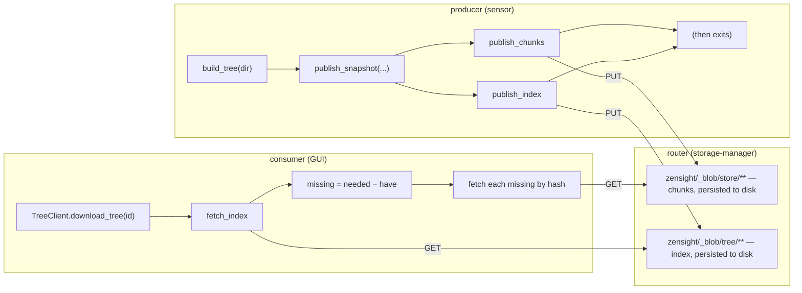

# Router-hosted Tier-2 chunk store

How to run a Zenoh **router** as the fleet-wide content store for `zenoh-blob`
Tier-2 directory sync. It complements the design rationale in
[`../../docs/design/large-data-transfer.md`](../../docs/design/large-data-transfer.md)
and the keyspace contract in [`../../docs/KEYSPACE.md`](../../docs/KEYSPACE.md).

## Why

Tier-2's default model runs a `TreeServer` inside the producer (a sensor): the
producer must stay alive for the whole transfer, each producer serves its own copy
of every chunk, and identical chunks across producers are transferred more than
once.

Pointing the store at a **router-hosted Zenoh storage** instead removes all three
limits:

- **Serverless transfers.** A producer PUTs its chunks + tree index into the
  storage and *exits*. The storage keeps serving them — no long-lived server.
- **Fleet-wide dedup.** A chunk key is its content hash, so a chunk PUT by *any*
  producer is reused by *every* consumer (and every other producer). Common files
  across hosts/versions move once.
- **Survives sensor restart.** The bytes live on the router (on disk, with the
  filesystem backend), independent of any sensor's lifetime.

Because chunk keys are **immutable** (`<prefix>/<algo>/<hash>` only ever maps to
one byte string), the storage's last-writer-wins reconciliation is a no-op and
re-publishing is idempotent — none of the timestamp/conflict concerns that
complicate a mutable storage (contrast the identity stores in
[`../../zensight-correlator/docs/storage.md`](../../zensight-correlator/docs/storage.md)).

## How it fits together



`zenoh-blob` provides the producer side:

- `publish_chunk` / `publish_chunks` — PUT content-addressed chunks.
- `publish_index` — PUT an encoded `TreeIndex`.
- `publish_snapshot` — chunks then index, after which the producer may exit.

The consumer side is **unchanged**: `TreeClient::download_tree` issues ordinary
GETs, which the storage answers exactly as a `TreeServer` would. Producer and
consumer only have to agree on the `store_prefix`, `tree_prefix`, and `Format`.

## Running it

```bash
zenohd -c configs/router-blob-storage.json5
```

See [`../../configs/router-blob-storage.json5`](../../configs/router-blob-storage.json5)
for an annotated config. The essentials:

- Requires the `zenoh-plugin-storage-manager` + filesystem backend
  (`zenoh-backend-fs`) plugins, shipped with a standard `zenohd`.
- Declares two storages — one on the **chunk** key range
  (`zensight/_blob/store/**`) and one on the **index** key range
  (`zensight/_blob/tree/**`) — both on a filesystem volume so they persist.
- The two `key_expr`s **must** match the `store_prefix` / `tree_prefix` the
  producer and consumer use.

A producer then publishes against the same prefixes:

```rust
let (index, chunks) = zenoh_blob::build_tree(dir, "snap-2026-06-29", &chunker)?;
zenoh_blob::publish_snapshot(
    &session,
    "zensight/_blob/store",
    "zensight/_blob/tree",
    &index,
    chunks,
    zenoh_blob::Format::Cbor,
).await?;
// producer may now exit; the router serves the snapshot
```

## Operational notes

- **Retention.** Content-addressed chunks accumulate. Size the volume for your
  retention window and prune out-of-band (e.g. by tree-index reachability) — the
  store itself does not garbage-collect.
- **Authorization.** A storage answers any GET in its key range and accepts any
  PUT. Gate writes/reads with Zenoh access control if the keyspace is sensitive.
- **Verification.** The serverless publish → (producer gone) → download path is
  covered by `zenoh-blob/tests/storage.rs`, which stands a minimal in-process
  storage in for `storage-manager` and reconstructs a tree from it with no
  `TreeServer` running.
