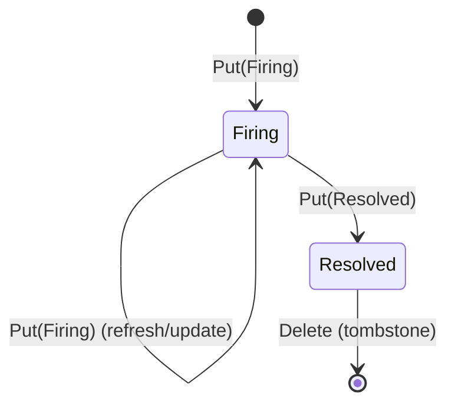

# Data model

The wire types every ZenSight component shares. All of these live in
`zensight-common` and are re-exported at the crate root.

## TelemetryPoint

The single unit of telemetry every sensor emits (`telemetry.rs`):

```rust
pub struct TelemetryPoint {
    pub timestamp: i64,               // Unix epoch milliseconds
    pub source: String,               // device/host identifier
    pub protocol: Protocol,           // origin protocol
    pub metric: String,               // metric name/path, e.g. "cpu/usage"
    pub value: TelemetryValue,        // the measured value
    pub labels: HashMap<String, String>, // extra context (skipped on the wire when empty)
    pub unit: Option<String>,         // UCUM-style unit ("By/s", "s", "%"); absent when unknown
}
```

Build one with `TelemetryPoint::new(source, protocol, metric, value)` (stamps the
current timestamp) and chain `.with_label(k, v)` / `.with_labels(map)` /
`.with_unit(u)`. `current_timestamp_millis()` is the shared clock helper.
The `unit` field is serde-defaulted in both directions (JSON and CBOR), so
old and new consumers interoperate; the OTel exporter forwards it as the
instrument unit.

### Protocol

`Protocol` enumerates the origin protocols and serializes to a lowercase wire
token via `as_str()`:

`Snmp`, `Logs` (token `logs`; unified syslog + journald), `Gnmi`, `Netflow`,
`Opcua`, `Modbus`, `Sysinfo`, `Netlink`, `Netring`, `Systemd`, `Parallax`.

`as_str()` is the keyspace token; `display_name()` is the title-cased UI label
(they differ only for `Logs`). `FromStr` is case-insensitive.

### TelemetryValue

A tagged enum (`#[serde(tag = "type", content = "value")]`) with five variants:

| Variant | Rust type | Wire tag | Use |
|---------|-----------|----------|-----|
| `Counter` | `u64` | `counter` | monotonically increasing |
| `Gauge` | `f64` | `gauge` | can go up or down |
| `Text` | `String` | `text` | string value |
| `Boolean` | `bool` | `boolean` | true/false |
| `Binary` | `Vec<u8>` | `binary` | raw bytes |

`From` conversions are provided for the obvious types. Note the deliberate
`i64` rule: a **non-negative** `i64` becomes `Counter` (no `f64` precision loss),
a **negative** one becomes `Gauge`.

## Alert model

Sensors publish durable, fully-formed alert decisions as LWW state documents on
`zensight/v1/<origin>/state/<producer>/alert/<alert_key>` (`alert.rs`). Unlike the
frontend's local threshold rules, an `Alert` is a decision the sensor/sentinel
already made.

```rust
pub struct Alert {
    pub timestamp: i64,
    pub source: String,
    pub protocol: Protocol,
    pub kind: AlertKind,
    pub rule: String,          // stable rule id, e.g. "ssh-listening"
    pub severity: AlertSeverity,
    pub state: AlertState,
    pub summary: String,       // human one-liner
    pub labels: HashMap<String, String>, // structured context (ip, port, sni, ...)
}
```

- **`AlertKind`** — `Anomaly` (a netring detector), `Expectation` (a machine-state
  expectation was violated), `SensorHealth` (the sensor's own health crossed a
  threshold).
- **`AlertSeverity`** — `Info` < `Warning` (default) < `Critical`.
- **`AlertState`** — `Firing` (default) or `Resolved`. The lifecycle is a
  `Put(Firing)` to raise/update, a `Put(Resolved)` then a Zenoh `Delete`
  tombstone to clear.



### alert_key

`Alert::alert_key()` is a thin wrapper over **`zenkey::alert::alert_key`**, the
normative RFC 11 §3.1 derivation (adopted in #736 — before that ZenSight had
its own, byte-different, recipe):

```text
input     = rule ++ ( "\n" ++ label_name ++ "=" ++ label_value )*
            for each discriminating label, ascending by name (byte order)
alert_key = lowercase_hex(fnv1a_64(utf8(input)))          16 chars, all 64 bits
```

FNV-1a-64 with offset basis `0xcbf29ce484222325` and prime `0x100000001b3` —
stable across runs and platforms, unlike `DefaultHasher`. Two alerts describing
the same condition on the same host share a key, so a `Put` replaces state in
place and a later `Resolved`/`Delete` clears exactly that alert. The RFC's test
vector, which `alert.rs` pins: rule `link_down`, labels
`{peer: r2, port: eth0, host: h-3fa9c2d41b7e}` → `a659f813308ad1da`.

Three rules:

- **The origin is *not* hashed** — the `<origin>` and `<producer>` key chunks
  already scope the key per host. That exclusion is what makes the *same alert
  on two hosts the same key under two origins*, which is the property the whole
  derivation exists for.
- **Host-scoped labels are excluded before sorting.** RFC 11 §3.1 excludes the
  label named `host` and "any label the producer documents as host-scoped".
  **ZenSight's host-scoped vocabulary is the `host.` annotation namespace**
  (`host.id`, `host.boot_id`, …) — declared in code as
  `zensight_common::alert::{HOST_SCOPED_PREFIX, is_host_scoped}`, which is what
  the wrapper filters on before calling the zenkey function. These are identity
  annotations stamped on for correlation, not part of what the alert is about,
  and keying on them would orphan a firing alert every time the identity
  envelope refreshed: the `Firing` would sit on the old key forever while the
  `Resolved` landed on a new one (#738,
  `zensight-sensor-core/tests/alert_reporter.rs`).
- **The wrapper is infallible.** `zenkey::alert::alert_key` refuses inputs that
  would break the framing's injectivity (a `\n` in a rule forges a label, an
  `=` in a label name forges a value). `Alert::alert_key()` is called from ~35
  places where a `Result` would buy nothing, so on refusal it replaces the
  offending bytes with `_`, logs a WARN naming the rule, and runs the normative
  derivation on that — deterministic, so a `Firing` and its `Resolved` still
  agree, which is the one property a key must never lose.

High-cardinality detail (offending IP, JA4, expected/actual) belongs in `labels`
/ `summary`, never in the key — so a 1000-port scan stays one alert.

## Health self-telemetry — `SelfStats` (#811)

`HealthSnapshot` (the `state/<producer>/health` doc) carries an optional
`self_stats: SelfStats` — the sensor measuring *itself*: `rss_bytes`,
`vsz_bytes`, `cpu_percent`, the declared `budget_bytes`, publish counters
(`published_total`/`published_bytes_total` — deliveries, counted after the
put succeeded, across **both** publish tiers, the baseline registry and the
advanced one (#1078, #1079); sensor-fed `dropped_total`/`evicted_total`), per-table occupancy (`tables: Vec<TableStats>` — name,
entries, bytes and capacities where the owner can say), and the sensor's own
cgroup-v2 memory context (`CgroupSelf`).

The discipline is the same as the media work established: **every field is
optional and serde-defaulted, and absent reads as *not measured*, never as
zero** — mixed-version fleets are normal, and an old sensor's payload simply
has no `self_stats`. Measurement happens on the producer's health tick
(`zensight-sensor-core/docs/framework.md`, "Self-telemetry"); the
`sensor-budget` alert grades RSS against the declared budget at 80 %.

## Runtime control — the `@rpc` plane

Commands do not exist in v1: runtime control is request/reply GETs on the
verbatim `@rpc` plane. `command.rs` provides the procedure key builders. A
"topic" namespaces a control surface (`filter` for logs, `expectations` for
the sentinel, `detectors` for netring):

| Builder | Key | Zenoh primitive |
|---------|-----|-----------------|
| `command_key(prefix, topic)` | `zensight/v1/<origin>/@rpc/<producer>/<topic>/set` | queryable (write procedure) |
| `status_key(prefix, topic)` | `zensight/v1/<origin>/@rpc/<producer>/<topic>` | queryable (read) |
| `query_key(prefix, topic)` | same key as `status_key` — reads are reads | queryable (on-demand bulk detail) |

Fleet callers select `zensight/v1/*/@rpc/…` (`fleet_rpc_key` /
`fleet_command_key` in `keyexpr.rs`) with query target `All`; failures ride
`reply_err` with namespaced `error/...` names. The payload type is
topic-specific. Wrap it in `Command<T>` when you need an optional correlation
`id` echoed back on a reply.

The artifact channel adds its own procedures (`artifact_request_key`,
`artifact_status_key`, `artifact_cancel_key` on `@rpc`, plus the `@blob`
`artifact` / `store` / `tree` delivery prefixes) — see
[artifacts in the sensor framework](../../zensight-sensor-core/docs/artifacts.md).

## Serialization

`serialization.rs` encodes with either format:

```rust
use zensight_common::{encode, decode, decode_auto, Format};

let bytes = encode(&point, Format::Cbor)?;      // Cbor is the default
let back: TelemetryPoint = decode(&bytes, Format::Cbor)?;
let sniffed: TelemetryPoint = decode_auto(&bytes)?; // detects format from first byte
```

- **`Format::Cbor` is the default** — compact binary, the right choice on
  bandwidth-sensitive links (a regression test pins CBOR at < 80% of JSON size).
- **`decode_auto`** sniffs the first byte: `{` or `[` ⇒ JSON, otherwise CBOR. Every
  consumer decodes via `decode_auto`, so JSON and CBOR senders stay interoperable
  during a rollout.

## QosClass

`qos.rs` maps each traffic class to a fixed Zenoh QoS profile, tuned for
low-bandwidth / unreliable links. Telemetry is loss-tolerant (a dropped sample is
superseded by the next), so it drops at low priority and never back-pressures a
sensor; control traffic must arrive, so it is reliable and blocks.

| `QosClass` | Reliability | Congestion | Priority |
|------------|-------------|------------|----------|
| `Telemetry` (default) | BestEffort | Drop | DataLow |
| `HealthLiveness` | BestEffort | Drop | Data |
| `Alert` | Reliable | Block | InteractiveHigh |
| `Command` | Reliable | Block | InteractiveHigh |
| `Evidence` | Reliable | Block | Data |
| `Entity` | Reliable | Block | Data |
| `Query` | Reliable | Block | DataLow |
| `LiveVideo` | BestEffort | Drop | InteractiveHigh |

`express` is **off for every class**: it disables batching to shave latency at a
bandwidth cost — the wrong trade on a constrained link, where priority already
orders control ahead of telemetry. Apply a class with the getters on a Zenoh
publisher/put/declare builder (`.congestion_control(q.congestion_control())`,
`.priority(q.priority())`, `.express(q.express())`, `.reliability(q.reliability())`).

## See also

- [Identity, evidence & entities](identity-evidence.md)
- [Keyspace helpers](keyspace-helpers.md) and [`../docs/KEYSPACE.md`](../../docs/KEYSPACE.md)
