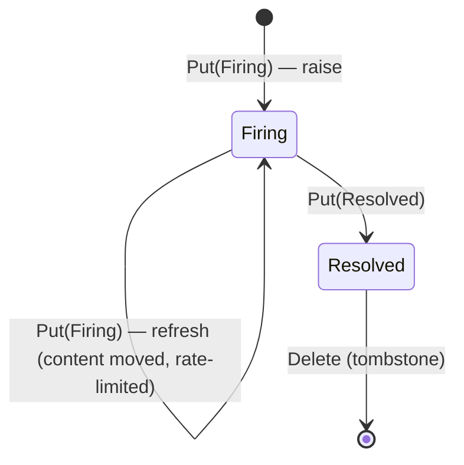

# Data model

The wire types every ZenSight component shares. All of these live in
`zensight-common` and are re-exported at the crate root.

## TelemetryPoint

The single unit of telemetry every sensor emits (`telemetry.rs`):

```rust
pub struct TelemetryPoint {
    pub timestamp: i64,               // Unix epoch milliseconds
    pub source: String,               // device/host identifier
    pub metric: String,               // metric name/path, e.g. "cpu/usage"
    pub value: TelemetryValue,        // the measured value
    pub labels: HashMap<String, String>, // extra context (skipped on the wire when empty)
    pub unit: Option<String>,         // UCUM-style unit ("By/s", "s", "%"); absent when unknown
}
```

Build one with `TelemetryPoint::new(source, metric, value)` (stamps the current
timestamp) and chain `.with_label(k, v)` / `.with_labels(map)` / `.with_unit(u)`.
`current_timestamp_millis()` is the shared clock helper.

**The producer is not in the payload** (#1255). It is chunk 4 of the key the
point rides on — `v1/<origin>/telemetry/<producer>/…` — and a consumer reads it
there with `keyexpr::producer_name(key)`, which strips the instance suffix
(`netring-2` → `netring`) and names an unregistered producer as readily as a
registered one. The point used to repeat it as `protocol: Protocol`, a closed
enum, which is what refused every producer a consumer had not been compiled
with. A `protocol` member in an older producer's payload is ignored on read.
The `unit` field is serde-defaulted in both directions (JSON and CBOR), so
old and new consumers interoperate; the OTel exporter forwards it as the
instrument unit.

### Protocol

`Protocol` enumerates the origin protocols and serializes to a lowercase wire
token via `as_str()`:

`Snmp`, `Logs` (token `logs`; unified syslog + journald), `Gnmi`, `Netflow`,
`Opcua`, `Modbus`, `Sysinfo`, `Netlink`, `Netring`, `Systemd`, `Parallax`,
`Hostspec`, `Bmc`, `Pve`, `Container`, `Probe`, `Historian` — and, since
#1202, the service tier's four process identities: `Correlator`,
`PolicyCompiler` (token `policy-compiler`), `ExporterPrometheus`
(`exporter-prometheus`) and `ExporterOtel` (`exporter-otel`). The hyphenated
tokens are `#[serde(rename)]`d, since `rename_all = "lowercase"` would have
written `policycompiler`, which no key carries.

`as_str()` is the keyspace token; `display_name()` is the title-cased UI label
(they differ for `Logs`, `Pve` and `Bmc`). `FromStr` is case-insensitive. The
enum is the framework's identity of a producer — `AlertReporter::new` takes
one, the runner's `sensor-budget` rule parses its own name as one — which is
why a process that is not a sensor is in it.

### TelemetryValue

A tagged enum (`#[serde(tag = "type", content = "value")]`) with six variants:

| Variant | Rust type | Wire tag | Use |
|---------|-----------|----------|-----|
| `Counter` | `u64` | `counter` | monotonically increasing |
| `Gauge` | `f64` | `gauge` | can go up or down |
| `Text` | `String` | `text` | string value |
| `Boolean` | `bool` | `boolean` | true/false |
| `Binary` | `Vec<u8>` | `binary` | raw bytes |
| `Histogram` | `HistogramValue` | `histogram` | a fixed-bucket distribution (#1151) |

**`Histogram`** is the registry's `kind = "histogram"` (RFC 08 §2 v1.36,
zenkey 0.9) spelled on the wire, and its payload shape is this profile's
(RFC 11 §4 leaves it here):

```json
{"type": "histogram",
 "value": {"buckets": [0.005, 0.01, 0.025],
           "counts":  [3, 10, 2, 1],
           "count": 16, "sum": 0.19}}
```

`buckets` are the upper bounds, strictly ascending and finite, `+Inf` implicit,
and **equal to the subject's declared `buckets` bit for bit** — the publish
site's guard (`registry::kind_matches`) and zenkey's `kind-mismatch` judge both
check it, because two producers of one subject are comparable only if their
bounds are. `counts` is **not** cumulative: `counts[i]` falls in
`(buckets[i-1], buckets[i]]` and the last entry is the `+Inf` overflow, so there
is one more count than bound (the OTLP explicit-bucket layout; Prometheus's
cumulative `le` view is derived). `count` is the sum of `counts`; `sum` the sum
of every observed value. The whole value is **cumulative since the producer
started**, like a counter, and a restart resets it — a consumer diffs two
values for a window (`HistogramValue::delta_since`, which returns `None` across
a reset). `quantile` and `summary` give an *estimate* by interpolation inside a
bucket, and anything rendering one marks it `≈`.

What each consumer does with it: both exporters export a real histogram
(see their references); the GUI renders the count, mean and estimated p50/p95;
the store, the historian and the rerun bridge skip it and count it — none of
them holds one number per instant that a distribution could honestly become —
and a threshold rule cannot target it, for the same reason.

`From` conversions are provided for the obvious types. Note the deliberate
`i64` rule: a **non-negative** `i64` becomes `Counter` (no `f64` precision loss),
a **negative** one becomes `Gauge`.

## Alert model

Sensors publish durable, fully-formed alert decisions as LWW state documents on
`zensight/v1/<origin>/state/<producer>/alert/<alert_key>` (`alert.rs`). Unlike the
frontend's local threshold rules, an `Alert` is a decision the sensor/sentinel
already made.

```rust
pub struct Alert {
    pub timestamp: i64,
    pub source: String,
    pub protocol: Protocol,
    pub kind: AlertKind,
    pub rule: String,          // stable rule id, e.g. "ssh-listening"
    pub severity: AlertSeverity,
    pub state: AlertState,
    pub summary: String,       // human one-liner
    pub labels: HashMap<String, String>, // structured context (ip, port, sni, ...)
}
```

- **`AlertKind`** — `Anomaly` (a netring detector), `Expectation` (a machine-state
  expectation was violated), `SensorHealth` (the sensor's own health crossed a
  threshold).
- **`AlertSeverity`** — `Info` < `Warning` (default) < `Critical`.
- **`AlertState`** — `Firing` (default) or `Resolved`. The lifecycle is a
  `Put(Firing)` to raise/update, a `Put(Resolved)` then a Zenoh `Delete`
  tombstone to clear.
- **`timestamp` / `observed_at_ms`** — the latest state *transition*, and (only
  on a content refresh) when the still-firing alert was last re-observed.
  Absent `observed_at_ms` reads as "not refreshed", never as "not observed";
  present, it is always `>= timestamp`. See the state diagram below.



**The two self-loops are different events, and the difference is `timestamp`**
(#1081). Until that issue the diagram claimed the refresh loop and it did not
happen — only the debounce elapsing or a severity change published anything, so
`sensor-budget` fired at "rss at 80 %", climbed to 94 % inside the same band,
and the operator's row stayed at 80 % until the severity finally moved.

- **Escalate** is a state transition: `timestamp` moves. It correctly
  un-acknowledges the alert (an ack applies while `timestamp <= fired_at`) —
  a Warning that became Critical should page again.
- **Refresh** is not: `timestamp` is carried over unchanged and the fresh
  reading goes in `observed_at_ms`. Three mechanisms depend on that. An ack
  would otherwise un-apply itself every interval, on every acked alert in the
  fleet; the historian derives a timeline row's uid from `timestamp`, so a
  frozen one corrects the existing row instead of appending an "alert fired"
  event every interval; and the correlator reads it as an incident's start and
  its TTL clock.

A refresh is rate-limited to `AlertReporter::with_content_refresh`
(30 s by default), since sensors sweep every 5-60 s and a drifting summary
would otherwise put one document on the bus per sweep. It is deliberately not
the `for:` window: that answers "how long before I believe it", this answers
"how often may I correct the text".

### alert_key

`Alert::alert_key()` is a thin wrapper over **`zenkey::alert::alert_key`**, the
normative RFC 11 §3.1 derivation (adopted in #736 — before that ZenSight had
its own, byte-different, recipe):

```text
input     = rule ++ ( "\n" ++ label_name ++ "=" ++ label_value )*
            for each discriminating label, ascending by name (byte order)
alert_key = lowercase_hex(fnv1a_64(utf8(input)))          16 chars, all 64 bits
```

FNV-1a-64 with offset basis `0xcbf29ce484222325` and prime `0x100000001b3` —
stable across runs and platforms, unlike `DefaultHasher`. Two alerts describing
the same condition on the same host share a key, so a `Put` replaces state in
place and a later `Resolved`/`Delete` clears exactly that alert. The RFC's test
vector, which `alert.rs` pins: rule `link_down`, labels
`{peer: r2, port: eth0, host: h-3fa9c2d41b7e}` → `a659f813308ad1da`.

Three rules:

- **The origin is *not* hashed** — the `<origin>` and `<producer>` key chunks
  already scope the key per host. That exclusion is what makes the *same alert
  on two hosts the same key under two origins*, which is the property the whole
  derivation exists for.
- **Host-scoped labels are excluded before sorting.** RFC 11 §3.1 excludes the
  label named `host` and "any label the producer documents as host-scoped".
  **ZenSight's host-scoped vocabulary is the `host.` annotation namespace**
  (`host.id`, `host.boot_id`, …) — declared in code as
  `zensight_common::alert::{HOST_SCOPED_PREFIX, is_host_scoped}`, which is what
  the wrapper filters on before calling the zenkey function. These are identity
  annotations stamped on for correlation, not part of what the alert is about,
  and keying on them would orphan a firing alert every time the identity
  envelope refreshed: the `Firing` would sit on the old key forever while the
  `Resolved` landed on a new one (#738,
  `zensight-sensor-core/tests/alert_reporter.rs`).
- **The wrapper is infallible.** `zenkey::alert::alert_key` refuses inputs that
  would break the framing's injectivity (a `\n` in a rule forges a label, an
  `=` in a label name forges a value). `Alert::alert_key()` is called from ~35
  places where a `Result` would buy nothing, so on refusal it replaces the
  offending bytes with `_`, logs a WARN naming the rule, and runs the normative
  derivation on that — deterministic, so a `Firing` and its `Resolved` still
  agree, which is the one property a key must never lose.

High-cardinality detail (offending IP, JA4, expected/actual) belongs in `labels`
/ `summary`, never in the key — so a 1000-port scan stays one alert.

## Health self-telemetry — `SelfStats` (#811)

`HealthSnapshot` (the `state/<producer>/health` doc) carries an optional
`self_stats: SelfStats` — the sensor measuring *itself*: `rss_bytes`,
`vsz_bytes`, `cpu_percent`, the declared `budget_bytes`, publish counters
(`published_total`/`published_bytes_total` — deliveries, counted after the
put succeeded, across **both** publish tiers, the baseline registry and the
advanced one (#1078, #1079); sensor-fed `dropped_total`/`evicted_total`), per-table occupancy (`tables: Vec<TableStats>` — name,
entries, bytes and capacities where the owner can say), and the sensor's own
cgroup-v2 memory context (`CgroupSelf`).

The discipline is the same as the media work established: **every field is
optional and serde-defaulted, and absent reads as *not measured*, never as
zero** — mixed-version fleets are normal, and an old sensor's payload simply
has no `self_stats`. Measurement happens on the producer's health tick
(`zensight-sensor-core/docs/framework.md`, "Self-telemetry"); the
`sensor-budget` alert grades RSS against the declared budget at 80 %.

## Runtime control — the `@rpc` plane

Commands do not exist in v1: runtime control is request/reply GETs on the
verbatim `@rpc` plane. `command.rs` provides the procedure key builders. A
"topic" namespaces a control surface (`filter` for logs, `expectations` for
the sentinel, `detectors` for netring):

| Builder | Key | Zenoh primitive |
|---------|-----|-----------------|
| `command_key(prefix, topic)` | `zensight/v1/<origin>/@rpc/<producer>/<topic>/set` | queryable (write procedure) |
| `status_key(prefix, topic)` | `zensight/v1/<origin>/@rpc/<producer>/<topic>` | queryable (read) |
| `query_key(prefix, topic)` | same key as `status_key` — reads are reads | queryable (on-demand bulk detail) |

Fleet callers select `zensight/v1/*/@rpc/…` (`fleet_rpc_key` /
`fleet_command_key` in `keyexpr.rs`) with query target `All`; failures ride
`reply_err` with namespaced `error/...` names. The payload type is
topic-specific. Wrap it in `Command<T>` when you need an optional correlation
`id` echoed back on a reply.

The artifact channel adds its own procedures (`artifact_request_key`,
`artifact_status_key`, `artifact_cancel_key` on `@rpc`, plus the `@blob`
`artifact` / `store` / `tree` delivery prefixes) — see
[artifacts in the sensor framework](../../zensight-sensor-core/docs/artifacts.md).

### Bounded replies — `Page<T>` (#1157)

A handler that scans is a handler that stops, and every one in the tree used to
stop silently. `logs/events` truncates a search at `MAX_SEARCH_SCAN` and a
truncated page is indistinguishable from no matches; `netlink/sockets` and
`sysinfo/processes` cap and say nothing; the historian's `RangeReply` grew its
own `truncated` and `next_cursor` and still cannot say what window a tier could
actually cover.

`page.rs` is the one envelope for all of them — RFC 05 §3.2, ratified upstream
(zenkey v1.31, shipped 0.8.0) from a row filed *from here*, so the spelling is
normative rather than a ZenSight habit:

```json
{ "items": [...], "next_cursor": "<opaque>" | null,
  "partial": false, "scanned": 4096, "covers_from": "<instant>" | null }
```

Four rules, each of which has a silent failure behind it:

- **`partial` is the required marker, and it is always on the wire.**
  `zenkey_fleet::CallAnswer::page_signal()` returns `None` unless the reply is a
  JSON object with a *boolean* field spelled exactly `partial`. A reply that says
  `truncated` instead is not read as a bad envelope — it is read as **no
  envelope**, invisible to `zenctl call` and to every RFC 13 judge.
- **`next_cursor` is a value, never a position.** The RFC names the reference
  historian's positional cursor as the defect that motivated the row: sorting
  keeps the *order* stable, not the *indices*, so a row interned between two
  pages makes the second repeat one or skip one.
- **`covers_from` is a string instant.** It is read with `as_str()`; epoch
  millis is read as absent by exactly the tooling that would catch the bug it
  reports.
- **`partial: true` with a null cursor is a contract violation** an observer MAY
  report (RFC 13 §3) — unless the reply says `covers_from`, because a gap in
  *time* has no next page and says why instead. `Page::is_contract_violation`
  computes the same predicate `PageSignal::is_contract_violation` does, so a
  handler can assert it before a live bus does.

The interop check lives in `zensight-conformance/tests/page_envelope.rs`, not
beside the type: `zensight-common` is linked by every sensor and so may never
link `zenkey-fleet` (see that crate's README, "The boundary").

Migration is retire-and-sibling, as ever: a new procedure replying with the
envelope beside the old one, the old one deprecated.

## Serialization

`serialization.rs` encodes with either format:

```rust
use zensight_common::{encode, decode, decode_auto, decode_with_encoding, Format};

let bytes = encode(&point, Format::Cbor)?;      // Cbor is the default
let back: TelemetryPoint = decode(&bytes, Format::Cbor)?;

// What a subscriber should call: the sample says what it is (RFC 08 §7).
let p: TelemetryPoint = decode_with_encoding(sample.encoding(), &bytes)?;

// The last resort, for bytes with no metadata attached.
let sniffed: TelemetryPoint = decode_auto(&bytes)?;
```

- **`Format::Cbor` is the default** — compact binary, the right choice on
  bandwidth-sensitive links (a regression test pins CBOR at < 80% of JSON size).
- **`decode_with_encoding`** reads the sample's declared `Encoding` and only
  sniffs when it declared nothing this build knows. That is RFC 08 §7's
  precedence in order, and until #1148 **nothing read it**: every producer
  stamped `Format::encoding()` on every put and every consumer threw it away.
- **`decode_auto`** sniffs the first byte, and **only two shapes decide**: `{`
  or `[` ⇒ JSON, `0x80`–`0xDB` (CBOR array, map or tag) ⇒ CBOR. Anything else is
  an `AmbiguousEncoding` error rather than a guess.

  The guess was not survivable. JSON `42` is `0x34`, which is a complete, valid
  CBOR negative integer, so `decode_auto::<i64>(b"42")` returned **−21** with no
  error anywhere. Everything this bus carries at the top level is a struct or a
  sequence, so refusing scalars costs nothing real; a caller that genuinely has
  one knows its format and should say so.

  The reverse mis-sniff survives and is fine: `0x7B` is both `{` and CBOR major
  3 / ai 27, so a top-level CBOR string reads as JSON and **fails**. A wrong
  answer that says it is wrong is a different class of problem.
- **Request bodies** on the `<topic>/set` seam go through `RpcRequest::decode`,
  which is `decode_auto` — so a caller whose session serialises CBOR is
  answered. Before #1148 that half was `serde_json::from_slice` alone, and every
  `expectations/set` and `rules/set` answered `error/invalid-args` to this
  tree's own default encoding.

## QosClass

`qos.rs` maps each traffic class to a fixed Zenoh QoS profile, tuned for
low-bandwidth / unreliable links. Telemetry is loss-tolerant (a dropped sample is
superseded by the next), so it drops at low priority and never back-pressures a
sensor; control traffic must arrive, so it is reliable and blocks.

| `QosClass` | Reliability | Congestion | Priority |
|------------|-------------|------------|----------|
| `Telemetry` (default) | BestEffort | Drop | DataLow |
| `HealthLiveness` | BestEffort | Drop | Data |
| `Alert` | Reliable | Block | InteractiveHigh |
| `Command` | Reliable | Block | InteractiveHigh |
| `Evidence` | Reliable | Block | Data |
| `Entity` | Reliable | Block | Data |
| `Event` | Reliable | Block | Data |
| `Query` | Reliable | Block | DataLow |
| `LiveVideo` | BestEffort | Drop | InteractiveHigh |

`express` is **on for `Alert` and off for everything else** (`qos.rs`,
`express()` is `matches!(self, QosClass::Alert)`, pinned by
`express_is_the_alert_class_alone`). It disables batching to shave latency at a
bandwidth cost, which is the wrong trade for bulk telemetry on a constrained
link — but an alert is the one class where the latency is the point, and the
ratified alert profile says so. This page claimed "off for every class" through
0.13, which was the blanket `false` the code had already moved away from.

### One key, one class (#1155)

A Zenoh publisher carries its congestion control, priority, reliability and
express flag **from the moment it is declared**, and they cannot be changed
afterwards. `PublisherRegistry` caches one publisher per key, so the *first*
class a key is published under is the one every later publication on that key
gets — whatever class it asked for.

That substitution used to be silent: `ensure` returned early on "a publisher
exists" without comparing the class. It is dangerous in one direction in
particular — a key first published as `Telemetry` (BestEffort, **Drop**) and
later as `Alert` keeps BestEffort and Drop, so the one class that exists to be
undroppable becomes droppable and nothing says so.

The registry now records the declared class beside the publisher and reports a
mismatch: a `warn!` naming the key and both classes, in release as well as
debug, plus a `debug_assert!` so a test hits it hard. The advanced tier
(`zensight_sensor_core::AdvancedPublisherRegistry`) records and reports the
same way since the `Publish` trait unified the two (#1155). The publisher is still
reused — tearing one down mid-flight would lose what is in flight and could not
un-send what has already gone — so **the rule is a caller's obligation**: pick
one class per key and keep it.

Apply a class with the getters on a Zenoh publisher/put/declare builder (`.congestion_control(q.congestion_control())`,
`.priority(q.priority())`, `.express(q.express())`, `.reliability(q.reliability())`).

## See also

- [Identity, evidence & entities](identity-evidence.md)
- [Keyspace helpers](keyspace-helpers.md) and [`../docs/KEYSPACE.md`](../../docs/KEYSPACE.md)
