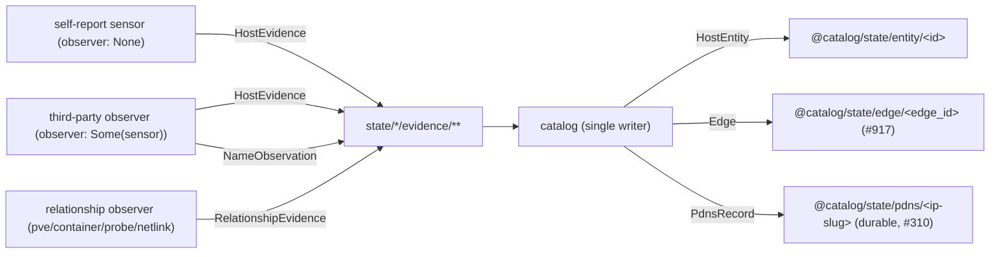

# Identity, evidence & entities

ZenSight keys telemetry by origin (`zensight/v1/<origin>/telemetry/…`, where
`<origin>` is a hashed host id) but still needs to know *which physical host*
each observed source/device belongs to. It solves this without re-keying
telemetry: sensors publish identity **evidence** as ordinary per-origin state,
and the single-writer **catalog** (the correlator service) fuses that evidence
into one **entity** per host under the verbatim `@catalog` origin. This page
describes the wire types in `zensight-common`; the exact keys are in
[`../docs/KEYSPACE.md`](../../docs/KEYSPACE.md).

## The pipeline



Evidence is a **claim, not a verdict**. Two provenance kinds, distinguished by the
`observer` field:

- **self-report** (`observer: None`) — a sensor reporting about the host it runs
  on. Strong.
- **third-party claim** (`observer: Some(sensor)`) — a sensor reporting a device it
  merely *observed* on the wire (netring assets, netlink neighbors, snmp
  sysName). Merge rules weigh these lower.

Evidence is TTL-scoped: consumers ignore any record whose `last_updated` is older
than the evidence TTL, so publishers must periodically refresh live claims (the
sensor framework re-emits self-reports every 60 s).

## HostEvidence

One host-identity claim (`evidence.rs`). Self-reports go to
`zensight/v1/<origin>/state/<producer>/evidence/self`; observed devices to
`zensight/v1/<origin>/state/<sensor>/evidence/device/<device-slug>` (built by
`host_evidence_key`, always under the **local** origin — the observed identity is
in the payload, not the key). Every optional
field is `skip_serializing_if`-elided, so a sparse claim stays small on the wire
and an old/minimal publisher still decodes with defaults.

```rust
pub struct HostEvidence {
    pub sensor: String,               // publishing sensor, e.g. "sysinfo"
    pub source: String,               // the source this claim is about
    pub observer: Option<String>,     // None = self-report; Some = third-party
    pub host_id: Option<String>,      // hashed machine-id (never raw); see the width note
    pub boot_id: Option<String>,
    pub hostname: Option<String>,
    pub fqdn: Option<String>,
    pub ips: Vec<String>,             // identifying
    pub macs: Vec<String>,            // merge evidence, not identity (VMs clone MACs);
                                      //   STABLE addresses only — see below
    pub vendor: Option<String>,       // descriptive / display-only
    pub platform: Option<String>,     // descriptive / display-only
    pub container_id: Option<String>, // #311 — host-scoped qualifier, never a merge key
    pub cloud: Option<CloudFacts>,    // #311 — authoritative when present
    pub last_updated: i64,
}
```

**`host_id` is 48 bits, not 256** (#1111). It is `h-` + the first 12 hex
characters of `sha256(machine_id + salt)` — the RFC 03 `h-<12hex>` origin chunk
— and the salt is a compile-time constant. So anyone able to choose a
container's `/etc/machine-id` can grind a collision and publish under another
host's origin, overwriting its LWW alert state. The keyspace is not an
authorization boundary and has never claimed to be (RBAC is out of scope per
#903); the point is that the docs used to say `sha256(machine_id + salt)` full
stop, which reads as 256 bits of separation. Raising the width is a `zenkey`
grammar change, not a ZenSight one.

**And it always equals the origin in that producer's keys.** When
`/etc/machine-id` is unreadable — a stripped container image, a read-only
rootfs, an image built before `systemd-machine-id-setup` — `HostId::mint` falls
back to a persisted random id, which is a perfectly valid `h-…` and goes into
every key. The payload used to report `None` in that case: keys confidently
claiming an identity beside a document saying "I do not know who I am", which
breaks the one equality this whole page is about.

**A MAC in this document is one the hardware came with** (#1110). Only `lo` was
excluded before, so every veth and bridge counted — and a veth's address is
*random per container start*. On a container host the whole set churned every
five minutes, on what is the catalog's strongest merge key after `host_id`: a
claim that changes under you is worse than one you never made. The filter reads
the kernel rather than guessing from a name (`veth`, `br-`, `docker` are
convention, renameable, and spelled differently by every runtime): an interface
qualifies when `addr_assign_type` is `0` — `NET_ADDR_PERM` — or, where that file
cannot be read, when it has a `device` symlink. Bonds and VLANs drop out and
lose nothing: they carry their underlying NIC's address, which is already in the
set.

An **observer** claiming MACs for another machine has the same obligation, and
the BMC sensor is the case that shows why: one Redfish service fronts every
blade in an enclosure, so a claim built from all of them asks the catalog to
fuse the enclosure into one host.

Merge strength of the identifying fields (strongest first): `host_id` >
`(cloud.provider, cloud.instance_id)` > `mac + ip` > `fqdn` > `hostname`. Notes:

- **`host_id`** is the first 48 bits of `sha256(machine_id + salt)` — the raw machine-id (confidential
  per the systemd docs) never leaves the host.
- **`container_id`** is host-scoped (only unique per host runtime), so it is a
  qualifier ("this sensor's view is from inside container X"), *never* a
  cross-host merge key.
- **`CloudFacts`** (`provider`, `instance_id`, optional `region` / `account`) is
  authoritative: cloned images duplicate machine-ids, but a cloud control plane
  never hands out an instance id twice.

### The descriptive pair, on a self-report (#935)

`vendor` and `platform` are joined on by nothing, which is why for the life of
the framework every sensor published them as `None` and nothing failed: the
catalog showed a self-reporting host with no vendor and no platform while
showing an SNMP-polled switch with both.

`zensight_sensor_core::hostfacts` fills them once at startup:

- **`vendor`** — DMI `sys_vendor` (`"QEMU"`, `"Dell Inc."`, `"VMware, Inc."`).
  On a virtual machine this is the most direct statement that it *is* one.
  Vendor placeholders (`"To Be Filled By O.E.M."`, `"System manufacturer"`,
  `"Default string"`) are refused: a placeholder in a vendor column looks like
  an answer and groups every unbranded machine in a fleet under one
  manufacturer that does not exist.
- **`platform`** — `<ID>-<VERSION_ID>` from `/etc/os-release` (`"debian-13"`,
  `"ubuntu-24.04"`), slugged so it does not depend on how a distribution
  capitalised its own name this release; `"proxmox-<version>"` when `/etc/pve`
  is present, because a PVE node's own os-release says `debian` and what a
  fleet needs to select on is that it is a hypervisor.

Only world-readable, descriptive DMI files are read. `product_uuid` and
`product_serial` are mode 0400 **and identifying** — they would be a second
machine identity travelling beside the hashed one, which is exactly what
`host_id` exists to avoid — and a test in that module fails if any code path
names them.

A self-report outranks a third-party claim for both fields (`merge::
representative`), so a host that can speak for itself is not described by
whatever happened to be polling it.

## RelationshipEvidence

The third thing under `evidence/**`, and the one that is **not about identity** (#915).
`relation.rs`; published on
`zensight/v1/<origin>/state/<producer>/evidence/relation/<relation_id>`.

A claim that two things are connected: a `kind`
(`hosts` · `runs` · `gateway_of` · `probes` · `l2_adjacent`) and two `EndpointClaim`s. Like
`HostEvidence` it carries what was *observed* — a vmid, a MAC, a gateway address, a target
name — and never an entity id: resolving a claim to an entity needs the union-find, and only
the catalog has run it. The catalog's output, `Edge`, is the resolved form, whose ends are
an entity id or an honest `External` for something the fleet can see and runs no sensor on.

`relation_id` derives from `(kind, from, to)` and nothing else — no timestamp, no publisher
— so a refresh is an idempotent LWW overwrite on one key rather than a document per
observation.

**A note for anyone writing a consumer of `evidence/**`.** That selector is a hand-spelled
union of several families, so *every* evidence subject reaches a subscriber of it, including
ones added after the subscriber was written. `HostEvidence` carries no
`deny_unknown_fields` and requires only `sensor` and `source`, both of which a relationship
claim has — so a handler that filters by key substring rather than by refined subject will
decode a relation document as a host-identity claim, cleanly and silently. Dispatch on the
subject, and ignore subjects you do not recognise.

## NameObservation

One passive-DNS name observation, published on
`zensight/v1/<origin>/state/<sensor>/evidence/names/<ip-slug>` (#307, e.g.
`state/netring/evidence/names/10-0-0-9`). A third-party claim
binding an observed IP to a name seen on the wire (DNS answer, PTR, TLS SNI, …),
so the correlator can attach names to entities that emit no telemetry of their
own. One observation per IP key (last-writer-wins); like `HostEvidence`, stale
records past the TTL are ignored.

```rust
pub struct NameObservation {
    pub observer: String,    // observing sensor, e.g. "netring"
    pub ip: String,          // observed IP this name binds to
    pub name: String,        // canonical, lowercased, no trailing dot
    pub provenance: String,  // dns_a, dns_cname, dns_ptr, sni, mdns, ...
    pub last_seen: i64,
}
```

## HostEntity — the catalog's output

The catalog merges every TTL-live `HostEvidence` claim into `HostEntity` docs
(`entity.rs`), published on `zensight/v1/@catalog/state/entity/<entity_id>`. An
entity is a **materialized view** — a pure, deterministic function of the current
evidence set — so a restarted catalog rebuilds byte-identical docs from the caches
with no local state.

```rust
pub struct HostEntity {
    pub entity_id: String,          // "h-<12hex>": the origin id (hashed machine-id prefix), else of sha256(best key)
    pub aliases: Vec<String>,       // prior entity_ids this one subsumed (upgrade/merge)
    pub host_id: Option<String>,    // identifying — joins allowed
    pub boot_id: Option<String>,
    pub ips: Vec<String>,           // union across members
    pub macs: Vec<String>,
    pub container_ids: Vec<String>, // descriptive union (#311)
    pub hostname: Option<String>,   // descriptive — display only
    pub fqdn: Option<String>,
    pub names: Vec<NameVal>,        // attached from the passive-DNS name map
    pub vendor: Option<String>,
    pub platform: Option<String>,
    pub members: Vec<MemberClaim>,  // the evidence claims merged in
    pub status: Option<String>,     // rolled-up device status, worst-of-members
    pub last_updated: i64,
}
```

- **`MemberClaim`** is one reversible membership: the `(sensor, source)` that was
  merged, the `rule` that bound it (`host_id` | `mac_ip` | `fqdn` | `hostname`),
  the `confidence` (after any observer down-weight), and `last_seen`. The
  `(sensor, source)` pair is the **join key back to per-protocol telemetry** —
  telemetry keys are never re-keyed on entity ids; the entity provides the join
  via `members[]`.
- **`NameVal`** is one provenance-tagged name (`name`, `provenance`, `last_seen`).
  Distinct from the wire-level `NameObservation`: the correlator accumulates
  *multiple* names per IP into `NameVal`s, since #307 publishes only one
  observation per IP key.
- Entity ids never silently swap: on a weak→`host_id` upgrade or a merge, the old
  id moves into `aliases`, is tombstoned, and re-pointed.
- `HostEntity::canonicalize()` sorts/dedups the multi-valued fields so two
  entities built from the same evidence in different input orders serialize
  identically; the correlator calls it before publishing.

### PdnsRecord (durable passive-DNS tier)

Separately, the catalog publishes its *full accumulated* per-IP `NameVal` set
as a `PdnsRecord` on `zensight/v1/@catalog/state/pdns/<ip-slug>` (#310), for
a router-hosted storage backend to capture the complete IP↔name history. Because
`@catalog` is a verbatim chunk, these records are invisible to both the telemetry
class selector (`zensight/v1/*/telemetry/**`) and the `*`-origin fleet state
selector (`zensight/v1/*/state/**`) — only the dedicated pdns selector
(`all_pdns_wildcard()`) captures them.

## Query seeds (late joiners)

State is its own seed: a late-joining consumer plain-GETs the entity state
selector `zensight/v1/@catalog/state/entity/*` and the catalog answers
storage-shaped (one reply per entity on its concrete key). On-demand name
resolution is a catalog procedure: GET
`zensight/v1/@catalog/@rpc/names?ip=<addr>` resolves names for an arbitrary IP
without flooding the bus. See [`../docs/KEYSPACE.md`](../../docs/KEYSPACE.md) and
the `keyexpr.rs` builders indexed in [keyspace-helpers.md](keyspace-helpers.md).
