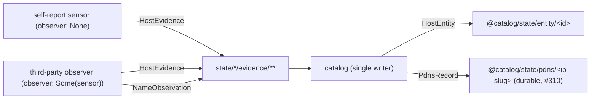

# Identity, evidence & entities

ZenSight keys telemetry by origin (`zensight/v1/<origin>/telemetry/…`, where
`<origin>` is a hashed host id) but still needs to know *which physical host*
each observed source/device belongs to. It solves this without re-keying
telemetry: sensors publish identity **evidence** as ordinary per-origin state,
and the single-writer **catalog** (the correlator service) fuses that evidence
into one **entity** per host under the verbatim `@catalog` origin. This page
describes the wire types in `zensight-common`; the exact keys are in
[`../docs/KEYSPACE.md`](../../docs/KEYSPACE.md).

## The pipeline



Evidence is a **claim, not a verdict**. Two provenance kinds, distinguished by the
`observer` field:

- **self-report** (`observer: None`) — a sensor reporting about the host it runs
  on. Strong.
- **third-party claim** (`observer: Some(sensor)`) — a sensor reporting a device it
  merely *observed* on the wire (netring assets, netlink neighbors, snmp
  sysName). Merge rules weigh these lower.

Evidence is TTL-scoped: consumers ignore any record whose `last_updated` is older
than the evidence TTL, so publishers must periodically refresh live claims (the
sensor framework re-emits self-reports every 60 s).

## HostEvidence

One host-identity claim (`evidence.rs`). Self-reports go to
`zensight/v1/<origin>/state/<producer>/evidence/self`; observed devices to
`zensight/v1/<origin>/state/<sensor>/evidence/device/<device-slug>` (built by
`host_evidence_key`, always under the **local** origin — the observed identity is
in the payload, not the key). Every optional
field is `skip_serializing_if`-elided, so a sparse claim stays small on the wire
and an old/minimal publisher still decodes with defaults.

```rust
pub struct HostEvidence {
    pub sensor: String,               // publishing sensor, e.g. "sysinfo"
    pub source: String,               // the source this claim is about
    pub observer: Option<String>,     // None = self-report; Some = third-party
    pub host_id: Option<String>,      // hashed machine-id (never raw), sha256(machine_id+salt)
    pub boot_id: Option<String>,
    pub hostname: Option<String>,
    pub fqdn: Option<String>,
    pub ips: Vec<String>,             // identifying
    pub macs: Vec<String>,            // merge evidence, not identity (VMs clone MACs)
    pub vendor: Option<String>,       // descriptive / display-only
    pub platform: Option<String>,     // descriptive / display-only
    pub container_id: Option<String>, // #311 — host-scoped qualifier, never a merge key
    pub cloud: Option<CloudFacts>,    // #311 — authoritative when present
    pub last_updated: i64,
}
```

Merge strength of the identifying fields (strongest first): `host_id` >
`(cloud.provider, cloud.instance_id)` > `mac + ip` > `fqdn` > `hostname`. Notes:

- **`host_id`** is `sha256(machine_id + salt)` — the raw machine-id (confidential
  per the systemd docs) never leaves the host.
- **`container_id`** is host-scoped (only unique per host runtime), so it is a
  qualifier ("this sensor's view is from inside container X"), *never* a
  cross-host merge key.
- **`CloudFacts`** (`provider`, `instance_id`, optional `region` / `account`) is
  authoritative: cloned images duplicate machine-ids, but a cloud control plane
  never hands out an instance id twice.

## NameObservation

One passive-DNS name observation, published on
`zensight/v1/<origin>/state/<sensor>/evidence/names/<ip-slug>` (#307, e.g.
`state/netring/evidence/names/10-0-0-9`). A third-party claim
binding an observed IP to a name seen on the wire (DNS answer, PTR, TLS SNI, …),
so the correlator can attach names to entities that emit no telemetry of their
own. One observation per IP key (last-writer-wins); like `HostEvidence`, stale
records past the TTL are ignored.

```rust
pub struct NameObservation {
    pub observer: String,    // observing sensor, e.g. "netring"
    pub ip: String,          // observed IP this name binds to
    pub name: String,        // canonical, lowercased, no trailing dot
    pub provenance: String,  // dns_a, dns_cname, dns_ptr, sni, mdns, ...
    pub last_seen: i64,
}
```

## HostEntity — the catalog's output

The catalog merges every TTL-live `HostEvidence` claim into `HostEntity` docs
(`entity.rs`), published on `zensight/v1/@catalog/state/entity/<entity_id>`. An
entity is a **materialized view** — a pure, deterministic function of the current
evidence set — so a restarted catalog rebuilds byte-identical docs from the caches
with no local state.

```rust
pub struct HostEntity {
    pub entity_id: String,          // "h-<12hex>": the origin id (hashed machine-id prefix), else of sha256(best key)
    pub aliases: Vec<String>,       // prior entity_ids this one subsumed (upgrade/merge)
    pub host_id: Option<String>,    // identifying — joins allowed
    pub boot_id: Option<String>,
    pub ips: Vec<String>,           // union across members
    pub macs: Vec<String>,
    pub container_ids: Vec<String>, // descriptive union (#311)
    pub hostname: Option<String>,   // descriptive — display only
    pub fqdn: Option<String>,
    pub names: Vec<NameVal>,        // attached from the passive-DNS name map
    pub vendor: Option<String>,
    pub platform: Option<String>,
    pub members: Vec<MemberClaim>,  // the evidence claims merged in
    pub status: Option<String>,     // rolled-up device status, worst-of-members
    pub last_updated: i64,
}
```

- **`MemberClaim`** is one reversible membership: the `(sensor, source)` that was
  merged, the `rule` that bound it (`host_id` | `mac_ip` | `fqdn` | `hostname`),
  the `confidence` (after any observer down-weight), and `last_seen`. The
  `(sensor, source)` pair is the **join key back to per-protocol telemetry** —
  telemetry keys are never re-keyed on entity ids; the entity provides the join
  via `members[]`.
- **`NameVal`** is one provenance-tagged name (`name`, `provenance`, `last_seen`).
  Distinct from the wire-level `NameObservation`: the correlator accumulates
  *multiple* names per IP into `NameVal`s, since #307 publishes only one
  observation per IP key.
- Entity ids never silently swap: on a weak→`host_id` upgrade or a merge, the old
  id moves into `aliases`, is tombstoned, and re-pointed.
- `HostEntity::canonicalize()` sorts/dedups the multi-valued fields so two
  entities built from the same evidence in different input orders serialize
  identically; the correlator calls it before publishing.

### PdnsRecord (durable passive-DNS tier)

Separately, the catalog publishes its *full accumulated* per-IP `NameVal` set
as a `PdnsRecord` on `zensight/v1/@catalog/state/pdns/<ip-slug>` (#310), for
a router-hosted storage backend to capture the complete IP↔name history. Because
`@catalog` is a verbatim chunk, these records are invisible to both the telemetry
class selector (`zensight/v1/*/telemetry/**`) and the `*`-origin fleet state
selector (`zensight/v1/*/state/**`) — only the dedicated pdns selector
(`all_pdns_wildcard()`) captures them.

## Query seeds (late joiners)

State is its own seed: a late-joining consumer plain-GETs the entity state
selector `zensight/v1/@catalog/state/entity/*` and the catalog answers
storage-shaped (one reply per entity on its concrete key). On-demand name
resolution is a catalog procedure: GET
`zensight/v1/@catalog/@rpc/names?ip=<addr>` resolves names for an arbitrary IP
without flooding the bus. See [`../docs/KEYSPACE.md`](../../docs/KEYSPACE.md) and
the `keyexpr.rs` builders indexed in [keyspace-helpers.md](keyspace-helpers.md).
