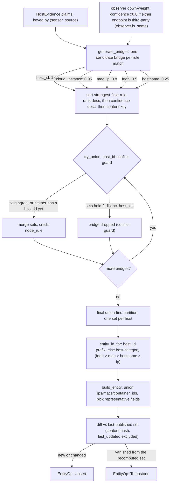

# The correlation model

How the correlator turns a stream of `HostEvidence` claims into one `HostEntity`
per physical host. This is the operational how-it-works; for the full rationale
(why these rules, ranks, and confidences) see
[`../../docs/design/correlation.md`](../../docs/design/correlation.md).

## The merge is a pure function of the evidence set

Every `HostEvidence` claim is keyed by `(sensor, source)`; the store keeps the
latest claim per key (`store.rs`). On recompute, the engine snapshots the
**TTL-live** evidence and hands it to `merge::correlate` (`merge.rs`), a pure
module with no Zenoh, tokio, or clock. Given the same evidence set in *any* input
order it produces **byte-identical** entities (ids, member order, ip/mac order).
That determinism is what makes the correlator stateless and restart-recoverable:
after a restart the sensors' cached self-reports rebuild the identical entity set.

## Union-find over ranked identity rules

Each claim is a node. A disjoint-set (union-find) groups nodes that a rule says
are the same host. Rules generate candidate **bridges** `(a, b, rule, confidence)`
that are applied **strongest-first**:

| Rule | Condition | Base confidence |
|------|-----------|-----------------|
| `host_id` | both have `host_id` and they are equal | 1.0 |
| `cloud_instance` | both have equal cloud `(provider, instance_id)` | 0.95 |
| `mac_ip` | share ≥1 MAC **and** share ≥1 IP | 0.8 |
| `fqdn` | equal non-empty FQDN (case-insensitive) | 0.5 |
| `hostname` | equal non-empty hostname (case-insensitive) | 0.25 |

Each rule is a kill-switch in config (`rules.{host_id,cloud_instance,mac_ip,fqdn,
hostname_enabled}`, all default true). Disable the weak `hostname` rule on
networks full of duplicate names like `MacBook-Pro.local`.

Key safety properties, all pinned by tests in `merge.rs`:

- **IP alone is never a bridge** (DHCP/NAT reuse) — only a hint.
- **MAC alone is never a bridge** (VMs clone MACs) — only MAC **and** IP together.
- **`cloud_instance` is authoritative per provider** (#311): a cloud control
  plane never hands out the same instance id twice, so it merges almost as
  strongly as `host_id`, and rescues cloned images that lost their machine-id.
  The same instance id on *different* providers does **not** merge.
- **`container_id` is never a merge key** — container ids are unique only per
  host runtime. It is unioned onto the entity descriptively, never used to join.

Bridges are sorted by a **content-derived** key (never input index), so the
applied order — and the resulting partition — is independent of arrival order.



## host_id-conflict guard

Two nodes with *different* `host_id`s must never land in one set, no matter what
weaker rule would otherwise bridge them (`UnionFind::try_union`). A host_id is
aggregated per set; any union that would place two distinct host_ids together is
dropped. So a shared hostname or shared cloud instance can never override two
machines that are provably distinct by machine-id — `host_id` stays the top
authority.

## Operator assertions: `link` and `unlink`

The guard above is right, and it is also the reason a **reinstall** looks like two
hosts. Same box, new `/etc/machine-id`, new origin — while the old origin's
evidence is still live. The catalog cannot tell that from two machines, so it
refuses to merge, and it is correct to refuse. Only an operator knows.

So the operator says so (RFC 06 §5.4, gated behind `allow_operator_assertions`):

```bash
zenctl service call @catalog "" link --param old=h-1111aaaa2222 --param new=h-3333bbbb4444
```

**A `link` is a rewrite of `host_id`, not a special kind of bridge.** Before any
bridge is generated, every node's `host_id` is canonicalized through the link
chain (`Assertions::canon`). The old origin *becomes* the new one, so:

- the ordinary `host_id` bucket rule merges them, at full confidence;
- the conflict guard sees one id, not two, and has nothing to object to;
- `entity_id_for` returns the new origin, so the entity is known by the id the
  machine actually publishes under today;
- the retired origin lands in `aliases`, which is what makes the publisher emit
  the `alias/<old>` record a consumer holding the stale id needs.

There is no second code path through the merge, and no guard bypass to get wrong.

`unlink` is the veto: these are **not** the same machine. It retires a `link` (and
tombstones its document, so a correlator restarting from a storage does not
re-seed a revoked one). A veto also wins over any link chain that would route
around it — `link a→c` plus `link b→c` would otherwise merge a vetoed pair
transitively, so `Assertions::new` breaks the chain rather than let that happen.

**The assertions live on the bus** (`@catalog/state/assertion/<id>`), not in a
config file or a side table. The catalog is a pure function of live bus state
(RFC 06 §5: "no private database, no migration state"), and an operator override
is state that is not evidence. Publishing it as a registered state subject is what
keeps the property: a restarted correlator, a replica, or a storage-backed router
re-seeds the operator's decisions through the same path as every other document.
The correlator therefore subscribes to what it publishes — which looks circular
and is exactly the point.

Assertions name **origin ids** (`h-<12hex>`), never the weaker evidence-derived
entity ids: an id computed from a hostname or a MAC changes shape when the set it
names changes, so an assertion keyed on one would dangle the moment it took
effect.

## Observer weighting

If *either* endpoint of a bridge is a third-party claim (`observer.is_some()` —
e.g. netring/netlink reporting a host they merely *saw* on the wire), the bridge
confidence is multiplied by **0.8**. Self-reports (`observer == None`) are also
preferred when choosing an entity's representative descriptive fields (hostname,
fqdn, vendor, platform): a self-report beats an observed value.

## Entity-id derivation

Ids are stable and order-independent (`entity_id_for`):

1. If any member has a `host_id` (the guard guarantees at most one distinct value
   per set), the id is `h-<first 12 hex of that host_id>` — and when the payload
   `host_id` is already origin-shaped (`h-<12hex>`, RFC 06 §2) it **is** the id,
   so the entity id equals the host's `<origin>` key chunk.
2. Otherwise, take the **highest-priority category any member has** —
   `fqdn` > `mac` > `hostname` > `ip` — and within it the
   lexicographically-smallest value, and the id is `h-<first 12 hex of
   sha256(value)>`. Picking the category before comparing values keeps the choice
   independent of member order.
3. If a set has none of those, fall back to `sha256` of the smallest member
   `sensor\u{1f}source` key — every node always has one, so an id always exists.

`fqdn`/`hostname` are lowercased before hashing, so casing can't split an id.

### Id upgrades and aliases

An observed asset can start life with a fallback id (e.g. fqdn-derived) and later
merge with a self-report that brings a `host_id`, producing a *new* id. The engine
detects this: an old id that shares ≥1 member with a new entity but is no longer a
current id is recorded in the new entity's `aliases` and its old id is tombstoned
(`apply_upgrades` in `engine.rs`).

## Debounced recompute, 60 s liveness re-emit

The async engine (`engine.rs`) coalesces bursts: an incoming claim arms a
debounce timer (`recompute_debounce_ms`, default 500 ms); recompute runs once the
bus goes idle for that gap. Each recompute:

1. sweeps evidence + name stores past their TTL (`evidence_ttl_secs`, default
   900 s),
2. runs the pure merge over live evidence,
3. injects passive-DNS **names** for the entity's IPs and rolls **device-liveness**
   up onto `entity.status` (worst-of-members: offline > degraded > online >
   unknown; gated by `status_from_liveness`),
4. diffs against the last published set using a `last_updated`-excluded content
   hash and emits `Upsert`/`Tombstone` ops for real changes only.

Separately, every `reemit_secs` (default 60 s) it re-publishes **every** current
entity with a fresh `last_updated` but unchanged content. This doubles as
correlator liveness (the frontend marks an entity stale after ~3× this period)
and reseeds a late-restarted bus. Because content is unchanged, re-emits are not
counted as changes by the diff.

## Tombstones

An entity is retired (a `DELETE` on its key) when it vanishes from the recomputed
set — because its evidence aged out past the TTL, was explicitly removed (an
evidence `DELETE` becomes `RemoveHost`, dropping the claim immediately rather than
waiting for the TTL), or was subsumed into an alias by an id upgrade.

## Relationships are a second output, not a second input

The catalog resolves relationship claims into `@catalog/state/edge/<edge_id>` (#917), and
the merge above **never sees them**. That is a deliberate boundary, not an accident of
layering: an edge cannot make two machines the same machine, and a claim that could would be
an identity claim wearing a different hat. Entangling the two would mean anyone touching
either has to reason about both, and the merge's determinism is what every other guarantee
here rests on. A test greps `merge.rs` to keep it true.

Resolution runs strictly **after** `recompute`, reading the union-find's finished answer, and
ranks signals the same way the merge does — `host_id`, then device slug through the entity's
member sources, then IP, then MAC, then name — so a weaker signal cannot override a stronger
one. Ends that resolve to nothing *known* become `Endpoint::External`, the honest answer for
an upstream router; ends that named nothing at all drop the edge, because half an edge looks
like a discovery.

`L2Adjacent` is the one kind no sensor publishes: it is derived here from the observed-device
identity claims already on the bus ("the sensor on this host saw that device" is a statement
about a link-layer segment). It is expressed as synthetic `RelationshipEvidence` and pushed
through the same resolver as every real claim — a second construction path would be a second
place for `edge_id` to be computed differently.

Determinism is the acceptance: same evidence in any order ⇒ byte-identical edge set; a
restart with unchanged evidence publishes nothing; a refresh that moved only a timestamp
publishes nothing.

## Names accumulate (they don't replace)

The `NameStore` is the one store that accumulates. Passive-DNS publishes one
`NameObservation` per IP (last-writer-wins on the wire), so the distinct names an
IP resolves to (an A record, a PTR, a TLS SNI) arrive as *separate* samples over
time. Replacing on each sample would keep only the latest name; instead each
observation add-or-refreshes a `(name, provenance)` entry (bumping `last_seen`
in place, capped per IP and globally). `entity.names` and the names queryable
return the ranked full set.

## Incidents, acknowledgement and silence (#900)

The catalog also answers *"what is on fire, whose problem is it, and is anyone
on it"* — because it is the only participant that has run the union-find, and
therefore the only one that can say *this alert and that one are about the same
machine*.

```
@catalog/state/incident/{incident_id}    firing alerts grouped BY ENTITY
@catalog/state/ack/{alert_ref}           an operator has this one
@catalog/state/silence/{id}              a suppression window
```

### Why here and not a new service

A `zensight-incidents` would need its own service origin, claim protocol,
storage stanza and package, for a **bounded** subscription: alert keys are LWW
and a host publishes a handful. The revisit trigger is incidents needing HA
independent of the catalog.

It lives strictly *beside* the merge, never inside it. `incidents.rs` has its
own store, its own pass and its own output channel, and a grep test pins that
`merge.rs` never learns alerts exist — the same isolation `edges.rs` has, for
the same reason: the identity merge is a pure function of host evidence, and an
alert that could make two machines the same machine would be an identity claim
wearing a different hat.

**An alert leaves the firing store when its publisher says so, or when its
publisher is gone** (#1101) — never because it is old. A firing alert's
`timestamp` is the transition instant and does not move while it fires, so the
first version, which swept the store on `evidence_ttl_secs` like evidence,
tombstoned every incident older than fifteen minutes mid-fire: the Prometheus
mirror lost `zensight_incident`, the OTel mirror emitted a false resolution, and
the operator's ack was retired. The sweep now keeps any alert whose origin's
liveliness token is present; an origin that is dead — or was never seen alive,
so no liveliness event will ever arrive for it — ages out on the TTL as before.

### Three passes, in order

`recompute` → `recompute_edges` → `recompute_incidents`. Each reads the
finished answer of the one before, so an incident can never name an entity
retired in the same pass or attribute through an edge that no longer exists.
All three carry a content-hash gate: a restart with an unchanged fleet
publishes **nothing**, rather than looking to every subscriber like the whole
fleet changing at once.

### Grouping by entity, and the join that makes it possible

An incident is `inc-<entity_id>`, or `inc-<origin>` where the origin resolves to
no entity. A host that publishes under three origins — its own sensors, a
hypervisor polling it, a prober checking it — is **one** incident.

The join is a **read of `HostEntity.origins`** (#1007, RFC 06 §5.1). The
origin is a key chunk and appears in no payload field, so the merge is handed
it alongside each claim and publishes the set it resolved — self-reports only.
Third-party claims contribute nothing: a hypervisor observing a guest publishes
under the *hypervisor's* origin, and treating that as "this origin is the
guest" would file the hypervisor's own alerts under the guest it happens to
watch.

That this is a published field rather than a derivation is the whole point.
Before #1007 every consumer reconstructed it, by walking the **evidence**
subtree and matching `(sensor, source)` against `members[]` — a heuristic
(which member matched decides the answer) over a subscription far larger than
the entity family, which a headless consumer holding only entity documents does
not have at all. The RFC had named the field since v1.0 and required it since
v1.2; it simply never existed.

The reconstruction is still in `origins_by_entity`, as the fallback for an
entity published by a catalog older than #1007 — `origins` is
`serde(default)`, so an old document arrives as absence rather than as an
error, and the fallback runs for exactly those entities. A test pins the two
paths to the same answer, because trading a heuristic for a *different* answer
would not be an improvement.

The fallback is `inc-<origin>`, never `inc-<source>` — two unfused machines
sharing a `source` name would otherwise merge into one incident.

### `symptom_of`, and why liveliness is subscribed

Attribution (`impact::attribute`, #918) needs to know which entities are
**down**, and a machine that stopped answering publishes no alert of its own —
the absence of its liveliness token is the only evidence it is the cause. So
the catalog subscribes the liveliness plane and maps dead origins to entities
through the same join the incidents use, which is what stops "this entity is
down" and "this alert belongs to this entity" disagreeing about who is who.
That the two share one join is why it was worth publishing rather than
deriving twice.

An incident is a symptom only when **every** member is. One unexplained alert
means an operator still has to look; an incident filed under "caused by the
hypervisor" that also carries a failing disk is how the disk gets missed.

### Ack and silence

Both are operator writes on `@catalog/@rpc`, behind the same
`allow_operator_assertions` gate as `link`/`unlink` and on the same audited
seam — "who silenced this, and when" is exactly what an incident review asks.

An **ack** names an occurrence: `fired_at` is the alert's timestamp, and the
projection rule every consumer applies is *"an ack applies only while a firing
alert with `timestamp <= fired_at` exists"*. Two things follow. An orphan left
by a dead catalog is **inert** rather than a silent suppression, and a **re-fire
pages again**. `ack` refuses with `error/catalog/not-firing` when nothing is
firing, because an ack for a problem nobody has is a suppression waiting to
apply the next time that alert fires.

A **silence** is the other thing and holds across re-fires — that is what a
maintenance window means. It matches on origin / producer / source / rule /
`labels.*` with `Eq` or `Regex`, and is validated before it applies: at least
one matcher (an empty set matches **nothing** here — the vacuous reading is how
one typo mutes a fleet), every field matchable, every regex compiling,
`ends_at` after `starts_at`, and an author from `?actor=` and never from the
body.

The catalog owns both lifecycles: a sweep tombstones acks whose occurrence
ended or re-fired, and silences past `ends_at`. A silence also stops applying
at the instant it ends whether or not the sweep has run, so a partitioned
reader cannot keep an expired suppression alive.

### Reading them back: the seed queryables

Each of the three families answers a **storage-shaped GET** on its own state
selector — one reply per document on its concrete key, stamped inside the state
lock:

| GET | answered by |
|---|---|
| `@catalog/state/entity/*` | `serve_entities` |
| `@catalog/state/incident/*` | `serve_incidents` |
| `@catalog/state/ack/*` | `serve_acks` |
| `@catalog/state/silence/*` | `serve_silences` |

This is not a convenience. It is the half of epic #900 that gives the epic its
name, and it was missing until #925: acks and silences reach a live subscriber
through the `put`, but `publish_ack` uses a plain publisher that is dropped at
the end of the call, so there is no publisher cache for a subscriber's
`history()` to recover from, and the deployment the `configs/` ship has no
router storage either. A frontend opened *after* an ack was made — a second
operator joining a running incident, or the same operator after a restart —
issued its seed GET, received nothing, and rendered every acknowledged alert as
unacknowledged. Nothing failed and nothing logged; a second operator simply
started work someone was already doing, which is the exact failure the epic
exists to remove.

All four selectors are in `main.rs`'s `callable` list, so `alive ⇒ callable`
(RFC 04 §5) covers them: the catalog does not announce presence until it can
answer a seed. `zensight-correlator/tests/ack_survives_a_restart.rs` pins the
property end to end over two real sessions — write the ack from one, close it,
and read it back from a session that never saw the write.

### Not built, on purpose

Notification routing, escalation, on-call rotations, repeat intervals. zenkey's
zenwatch (#387–#390) scoped those out deliberately — *"if a deployment needs
those it needs an on-call product, and webhook is how it gets there."* These
families are the documents such a tool would read.
