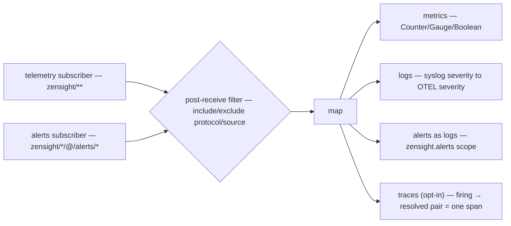

# OpenTelemetry exporter reference

The exporter subscribes to ZenSight telemetry over Zenoh and exports it via OTLP
(gRPC on 4317 or HTTP/protobuf on 4318) to any OpenTelemetry-compatible backend.
It emits up to four signals — **metrics**, **logs**, **alerts** (as logs), and an
opt-in **traces** signal — each independently toggled. Config lives in
[`../../configs/otel-exporter.json5`](../../configs/otel-exporter.json5); this page
is the mapping/behavior reference.

Resource attributes: `service.name` (default `zensight`), optional
`service.version`, plus any `resource` map from config. At least one of
`export_metrics` / `export_logs` / `export_alerts` / `traces.enabled` must be on.

## Subscription

Two subscribers, same split as the Prometheus exporter:

- **Telemetry** on `filters.key_expr` (default `zensight/**`); narrow it to tame
  the firehose at the subscription. The telemetry wildcard does **not** match
  `@/` control keys.
- **Alerts** on `zensight/*/@/alerts/*` (when `export_alerts` or `traces.enabled`).

`include_protocols` / `exclude_protocols` / `include_sources` / `exclude_sources`
apply as a post-receive filter.

## Metrics

Emitted on the `zensight` meter scope. Metric names follow
`zensight.{protocol}.{metric_path}`; host-metrics keys covered by the OTel
semantic-conventions map (#100) factor state/direction/device/cpu out of the name
into attributes.

| `TelemetryValue` | OTEL metric |
|------------------|-------------|
| `Counter(u64)` | Sum (monotonic) |
| `Gauge(f64)` | Gauge |
| `Boolean(bool)` | Gauge (0/1) |
| `Text(String)` | not exported as a metric |
| `Binary(Vec<u8>)` | not exported |

Every data point carries `source` and `protocol` attributes plus the point's own
labels. Export is periodic/batched every `export_interval_secs` (default 10 s),
bounded by `timeout_secs`.

## Logs (syslog → OTLP)

Only `Syslog`/`logs`-protocol points with `Text` values become OTLP log records,
on the `zensight.syslog` scope. Syslog severity (numeric or name) maps to OTEL
severity (`logs.rs`):

| Syslog severity | OTEL severity |
|-----------------|---------------|
| Emergency, Alert | Fatal |
| Critical, Error | Error |
| Warning | Warn |
| Notice, Informational | Info |
| Debug | Debug |

Log attributes: `hostname` (source), `syslog.severity`, and `syslog.facility` /
`syslog.appname` when present.

## Alerts (as OTLP logs)

With `export_alerts` on (default), alerts from `zensight/<protocol>/@/alerts/*` are
exported as OTLP log records on the `zensight.alerts` scope (event name
`zensight.alert`). Severity is mapped from the alert severity; `alert.*`
attributes carry source, rule, and state. The dedicated alert subscriber exists
because the telemetry wildcard skips `@/` keys.

## Traces (synthesized from alert lifecycles)

Opt-in via `traces: { enabled: true }` (default off). Sensors do not propagate
trace context, so the exporter *synthesizes* spans from the alert lifecycle it
already observes: each firing → resolved transition becomes exactly one span
`alert:<rule>` on the `zensight.alerts` scope, with start = firing timestamp and
end = resolved timestamp — the span duration is *how long the condition was
violated*. Alert flap patterns, durations, and overlaps become first-class in a
tracing backend (Tempo/Jaeger) with no sensor-side changes.

- Trace/span ids are derived **deterministically** from the alert key + firing
  timestamp (FNV-1a with domain separation), so re-processing the same lifecycle
  (e.g. an exporter restart replaying history) yields the same ids instead of
  duplicate spans. This is *synthesis, not propagation* — the ids correlate
  replays of the same lifecycle; they do not link to any sensor-side trace.
- A refresh `Put` of an already-firing alert does not move the span start.
- Pending firings are bounded (`MAX_PENDING`); new firings past the bound are
  dropped with a warning.
- Artifact-transfer spans are intentionally **not** synthesized — the exporter
  does not subscribe to `@/artifact/status`, only `@/alerts/*`.
