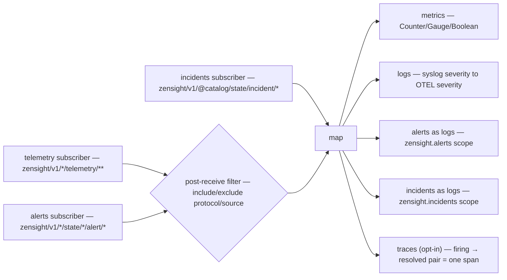

# OpenTelemetry exporter reference

The exporter subscribes to ZenSight telemetry over Zenoh and exports it via OTLP
(gRPC on 4317 or HTTP/protobuf on 4318) to any OpenTelemetry-compatible backend.
It emits up to five signals — **metrics**, **logs**, **alerts** (as logs),
**incidents** (as logs, #926), and an
opt-in **traces** signal — each independently toggled. Config lives in
[`../../configs/otel-exporter.json5`](../../configs/otel-exporter.json5); this page
is the mapping/behavior reference.

Resource attributes: `service.name` (default `zensight`), optional
`service.version`, plus any `resource` map from config. At least one of
`export_metrics` / `export_logs` / `export_alerts` / `traces.enabled` must be on.

## Subscription

Two subscribers, same split as the Prometheus exporter:

- **Telemetry** on `filters.key_expr` (default `v1/*/telemetry/**`,
  the v1 telemetry class selector — the class chunk *is* the filter, so state
  and the `@rpc`/`@media`/`@blob` planes never arrive and nothing is discarded
  client-side); narrow it — e.g. `v1/*/telemetry/netring/**` — to
  tame the firehose at the subscription.
- **Alerts** on `v1/*/state/*/alert/*` (when `export_alerts` or
  `traces.enabled`) — alerts are state-class keys the telemetry selector
  cannot see.

`include_protocols` / `exclude_protocols` / `include_sources` / `exclude_sources`
apply as a post-receive filter.

## Incidents (#926)

The catalog groups firing alerts **by entity** and publishes the result
(RFC 06 §5.5). With `export_alerts` on, each incident document becomes one log
event on its **own scope**, `zensight.incidents`:

| attribute | |
|---|---|
| `incident.id` | `inc-<entity_id>`, or `inc-<origin>` for an unfused origin |
| `incident.entity` | the entity, when the catalog resolved one |
| `incident.origins` | every origin contributing a firing alert, comma-joined |
| `incident.severity` | worst across members |
| `incident.alerts` / `.acked` / `.silenced` | member counts |
| `incident.open` | members neither acknowledged nor silenced — an operator's actual queue |
| `incident.symptom_of` | the entity this is downstream of, when attributed |
| `incident.impacted` | entities downstream of this one, when it is a root |

**Its own scope, not `zensight.alerts`.** An incident is the catalog's
conclusion about a *group* of alerts on one entity; a backend that wants one
and not the other should say so with a scope filter rather than by inspecting
event names.

**Resolution is an explicit event**, `incident.state="resolved"`, and this is
the one place this exporter deliberately differs from the Prometheus one. There,
absence *is* the resolve signal and a tombstone simply removes the series. A log
stream has no notion of a series vanishing, so an incident ending has to be an
event or it is nothing at all.

**No startup seed, deliberately** — and this is the second place the two
exporters disagree on the same key, for the same underlying reason. Prometheus
renders an incident as a *gauge* and `acked` as a *label*, so an exporter that
misses the current state is actively wrong until the next re-emit and must seed.
Here an incident is a log record per transition, and a resolution needs no prior
state to emit. Seeding would re-emit "incident opened" for every incident an
earlier incarnation already shipped: duplicated history, not recovered history.
The traces seed above makes the same call for the same reason — it primes the
tracker precisely so it does *not* re-emit what it primes.

## Metrics

Emitted on the `zensight` meter scope. Metric names follow
`zensight.{protocol}.{metric_path}`; host-metrics keys covered by the OTel
semantic-conventions map (#100) factor state/direction/device/cpu out of the name
into attributes.

| `TelemetryValue` | OTEL metric |
|------------------|-------------|
| `Counter(u64)` | Sum (monotonic) |
| `Gauge(f64)` | Gauge |
| `Boolean(bool)` | Gauge (0/1) |
| `Text(String)` | not exported as a metric |
| `Binary(Vec<u8>)` | not exported |

Every data point carries `source` and `protocol` attributes plus the point's own
labels. Export is periodic/batched every `export_interval_secs` (default 10 s),
bounded by `timeout_secs`.

## Logs (syslog → OTLP)

Only `Syslog`/`logs`-protocol points with `Text` values become OTLP log records,
on the `zensight.syslog` scope. Syslog severity (numeric or name) maps to OTEL
severity (`logs.rs`):

| Syslog severity | OTEL severity |
|-----------------|---------------|
| Emergency, Alert | Fatal |
| Critical, Error | Error |
| Warning | Warn |
| Notice, Informational | Info |
| Debug | Debug |

Log attributes: `hostname` (source), `syslog.severity`, and `syslog.facility` /
`syslog.appname` when present.

## Alerts (as OTLP logs)

With `export_alerts` on (default), alerts from
`zensight/v1/*/state/*/alert/*` are
exported as OTLP log records on the `zensight.alerts` scope (event name
`zensight.alert`). Severity is mapped from the alert severity; `alert.*`
attributes carry source, rule, and state. The dedicated alert subscriber exists
because the telemetry class selector cannot match state keys.

## Traces (synthesized from alert lifecycles)

Opt-in via `traces: { enabled: true }` (default off). Sensors do not propagate
trace context, so the exporter *synthesizes* spans from the alert lifecycle it
already observes: each firing → resolved transition becomes exactly one span
`alert:<rule>` on the `zensight.alerts` scope, with start = firing timestamp and
end = resolved timestamp — the span duration is *how long the condition was
violated*. Alert flap patterns, durations, and overlaps become first-class in a
tracing backend (Tempo/Jaeger) with no sensor-side changes.

- Trace/span ids are derived **deterministically** from the publishing origin,
  the alert key and the firing timestamp (FNV-1a with domain separation), so
  re-processing the same lifecycle (e.g. an exporter restart replaying history)
  yields the same ids instead of duplicate spans. This is *synthesis, not
  propagation* — the ids correlate replays of the same lifecycle; they do not
  link to any sensor-side trace.

  The **origin** is part of the identity, and the lifecycle map is keyed by it
  too. Since epic #453 the alert key excludes the source, so two hosts firing
  the identical rule share an `alert_key`: keyed by the hash alone, the second
  host's firing edge was swallowed, the first host's resolve consumed the only
  entry, and the second host's incident synthesized **no span at all**.
- A refresh `Put` of an already-firing alert does not move the span start.
- At startup the exporter GETs the alerts selector once and **primes** the
  tracker with every alert already firing (no log record is re-emitted for
  those — that transition was shipped by an earlier incarnation). Without the
  seed an alert in flight across an exporter restart would resolve without a
  span, and since #882 a restarted *producer* adopts its firing set rather
  than re-publishing it, so nothing else re-supplies the firing edge.
- Pending firings are bounded (`MAX_PENDING`); new firings past the bound are
  dropped with a warning.
- Artifact-transfer spans are intentionally **not** synthesized — the exporter
  does not watch artifact status (the `@rpc`/`@blob` planes), only the alert
  state selector.
