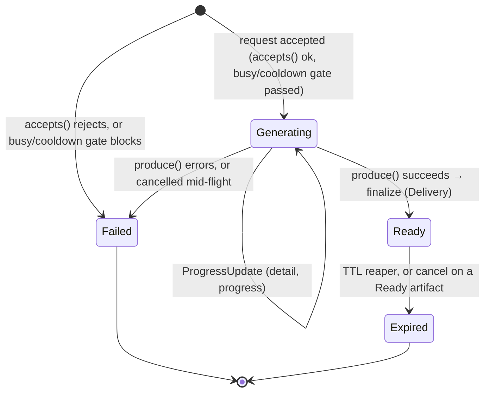
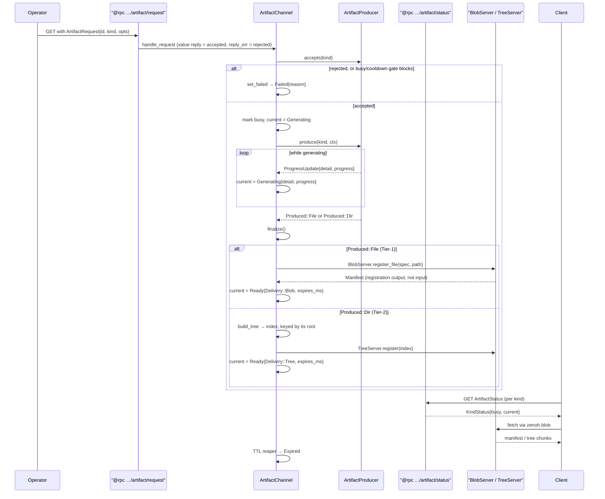

# Artifacts — on-demand large-data transfer

Some data is too big and too rare to stream on the telemetry bus: a sosreport-style
debug bundle, a config directory snapshot, an ad-hoc packet capture. The artifact
channel serves these **on demand** — an operator asks a sensor to produce one, the
sensor builds it off the poll/capture path, and the client fetches the bytes over
`zenoh-blob`. One channel (`artifact.rs`) subsumes what used to be separate
`@/report` and `@/snapshot` surfaces and hosts new kinds as pluggable producers.

See [`../../docs/design/large-data-transfer.md`](../../docs/design/large-data-transfer.md) for the
transfer-tier rationale and [`../../docs/KEYSPACE.md`](../../docs/KEYSPACE.md)
for the `@rpc` artifact procedures and `@blob` delivery tiers.

## The control plane

A sensor enables the channel with `SensorRunner::with_artifacts(producers)` (a
no-op if no producer is enabled in config). The channel owns three `@rpc`
procedures (RFC 05's long-running-operation pattern — all queryables,
request/reply, no publications):

| Key | Primitive | Purpose |
|-----|-----------|---------|
| `…/@rpc/<producer>/artifact/request` | queryable (write procedure) | GET with an `ArtifactRequest` body; value reply `{ id }` = accepted, failures ride `reply_err` |
| `…/@rpc/<producer>/artifact/status` | queryable (read) | GET the per-kind `ArtifactStatus` (lifecycle) |
| `…/@rpc/<producer>/artifact/cancel` | queryable (write procedure) | GET with the artifact id (ULID) to abort/free early |

Delivery servers are spun up only for the tiers actually registered, on the
verbatim `@blob` plane (`zensight/v1/<origin>/@blob/…` — `zenoh-blob` itself
stays prefix-agnostic):

- **Tier-1 (`Blob`)** — a `zenoh-blob` `BlobServer` under `…/@blob/artifact`.
- **Tier-2 (`Tree`)** — a `TreeServer` + in-memory chunk store over
  `…/@blob/store/<algo>/<hash>` (content-addressed, cacheable) and the index at
  `…/@blob/tree/<id>`.

The keys are origin-scoped, but a fleet caller may fan a request out on the
`*`-origin `@rpc` selector; a request's `opts.target_source` disambiguates which
host answers — the channel drops a request whose `target_source` isn't its own
source id.

## Lifecycle

A request drives a per-kind state machine, surfaced in the status queryable:



- On request the channel resolves the producer by kind slug, calls
  `accepts()` for validation/authorization, then applies a **per-kind busy +
  cooldown gate** — so a long capture never blocks a quick debug bundle.
  Production runs off the select loop so status stays responsive; the producer
  streams `ProgressUpdate`s that are republished as `Generating`.
- On success the produced file/dir is finalized into a `Delivery` and held until
  its TTL; a periodic reaper expires it, and `cancel` aborts an in-flight
  production or frees a `Ready` artifact early. Only one live artifact per kind is
  kept (a new one replaces the prior).

### Request → produce → deliver → status



## The ArtifactProducer trait

A producer is registered per kind; the channel drives it and the producer **never
touches Zenoh**. It only validates and produces a file or directory:

```rust
#[async_trait]
pub trait ArtifactProducer: Send + Sync + 'static {
    fn kind(&self) -> &'static str;            // slug: "report" | "snapshot" | "capture"
    fn common(&self) -> &CommonArtifactLimits; // cooldown / TTL / max_bytes / chunk_size
    fn delivery_kind(&self) -> DeliveryKind;   // Blob or Tree
    fn advert(&self) -> KindAdvert;            // what the GUI needs to render the request
    fn accepts(&self, kind: &ArtifactKind) -> Result<(), String>; // validate + authorize
    fn tree_max_files(&self) -> Option<u64> { None }              // Tree only
    async fn produce(&self, kind: ArtifactKind, ctx: ProduceCtx) -> anyhow::Result<Produced>;
}
```

`produce` returns a `Produced::File { path, filename }` (→ `Delivery::Blob`) or
`Produced::Dir { path }` (→ `Delivery::Tree`); the variant must match the declared
`delivery_kind`. `ProduceCtx` supplies a `workdir` (currently the shared system
temp dir — it is **not** per-request and the channel cleans up only the final
artifact, not intermediate files a producer leaves there), a `CancelToken` a
long-running producer must poll, and a `progress` sender.

## Built-in producers

| Producer | Slug | Delivery | Produces |
|----------|------|----------|----------|
| `ReportProducer` | `report` | `Blob` | a redacted debug bundle (config + health + counters), a single `tar.zst` |
| `SnapshotProducer` | `snapshot` | `Tree` | an allowlisted directory, content-addressed |
| *(netring)* capture | `capture` | `Blob` | a bounded on-demand `pcap[.zst]` off a live packet tap |

`SnapshotProducer` only snapshots an **allowlisted** logical directory name — never
an arbitrary path; that allowlist is the authorization boundary. The `capture`
producer is defined by the netring sensor (it needs the live tap), but its request
params live in the shared `ArtifactKind::Capture` so both ends stay typed. An
unknown kind degrades cleanly to `ArtifactKind::Unsupported` / a `Failed` state.

## Wire types

`ArtifactRequest`, `ArtifactKind`, `ArtifactStatus` / `KindStatus`, `Delivery`,
`TreeSummary` and the re-exported `zenoh-blob` `Manifest` / `TreeIndex` / `Entry`
all live in `zensight-common` (`artifact.rs`) so the GUI, sensor, and any client
share one definition. `ArtifactRequest.id` (a ULID) correlates the request,
status, and delivery.

## See also

- [Framework](framework.md) — `with_artifacts` and the runner lifecycle.
- [`../../docs/KEYSPACE.md`](../../docs/KEYSPACE.md) — the artifact `@rpc`
  procedures and `@blob` tier contract.
