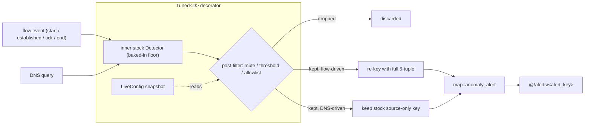

# netring detectors, threat-intel & asset inventory

netring's NDR surface runs three families off the same tracked flow / DNS
stream: **built-in anomaly detectors** (`anomalies.*`), **threat-intel**
(`threat.*`), and the **passive asset inventory** (`collect.assets`). Every hit
becomes an `Alert` on `zensight/netring/@/alerts/<alert_key>` through one uniform
drain (`ChannelSink → to_view → map::anomaly_alert`), so they share the same
lifecycle, labelling, and cardinality discipline.

Sources: this crate's `src/detectors.rs` (the `Tuned` registry), `src/map.rs`
(the anomaly→alert mapping and ATT&CK table), and `telemetry.md`.

---

## Cardinality discipline

An alert is **bucketed** by `(rule, <key>)` via the labels that feed `alert_key`
(a stable FNV-1a hash of `source + rule + sorted-labels`). Detectors deliberately
key on a *stable* subject so activity that rotates its ephemeral fields collapses
to one series:

- **Port scan** keys on the **source host** — a 1000-port scan is one alert, not
  one-per-port.
- **Beaconing** keys on the **host-pair** `(src, dst, dst-port)` — a beacon that
  rotates its source port each connection stays one series (#324).
- **DNS-tunnel / NOD / DGA** key on `(src, SLD)`.
- The offending 5-tuple, score, and detail ride in **labels** — never in a metric
  series name.

Every alert that maps cleanly also carries:

- a MITRE ATT&CK `technique` label (rendered as a badge, grouped by tactic in the
  GUI Security view), and
- a Community ID v1 `community_id` label when the full 5-tuple is known (the
  de-facto cross-tool flow key emitted by Zeek/Suricata/Wireshark, so a ZenSight
  flow matches their records by string compare).

Each detector also publishes a monotonic `anomaly/<kind>/total` counter on the
telemetry bus (#254) — the `<kind>` slug equals the alert `rule`, so the streamed
count and the alerts correlate.

---

## Built-in detectors (`anomalies.*`)

| Detector | `anomalies` switch | Slug (`rule`) | ATT&CK | Notes |
|---|---|---|---|---|
| Port scan (TRW) | `port_scan` | `PortScanTRW` | T1046 | Threshold Random Walk; fires on a `Scanner` verdict, keyed on source host |
| Beaconing (CV) | `beaconing` | `BeaconCv` | T1071 | coefficient-of-variation periodicity; `beacon_threshold` (default 0.8) |
| Beaconing (RITA) | `rita_beacon` | `BeaconRita` | T1071 | robust Bowley-skewness + MAD, bit-faithful to RITA — catches jittered C2 (e.g. Cobalt Strike jitter) the CV detector misses; `rita_beacon_threshold` (default 0.9) |
| Beaconing (FQDN, #308) | `rita_beacon_fqdn` | `RitaBeaconFqdn` | T1071 | same RITA stats keyed by the destination's best **forward** DNS name, so C2 rotating IPs behind one domain accumulates a single series; needs `collect.dns` + `names` |
| DNS tunnel | `dns_tunnel` | `DnsTunnel` | T1071.004 | fires on distinct subdomain-label cardinality per `(src, SLD)` ≥ `dns_tunnel_distinct` (50) **or** a single qname ≥ `dns_tunnel_qname_len` bytes (100); needs `collect.dns` |
| Newly-Observed Domain | `nod` | `NewlyObservedDomain` | T1568 | Info-severity, first sight of an SLD (bounded LRU seen-set); needs `collect.dns` |
| DGA | `dga` | `DgaScorer` | T1568.002 | bigram log-likelihood per query SLD below `dga_threshold` (default −8.0); needs `collect.dns` |
| Connection flood | `connection_flood` | `ConnectionFlood` | T1499 | many TCP connections to one `(dst,port)` per window ≥ `flood_threshold` (100) — distinct from a port scan (many ports) |
| Encrypted-DNS bypass (#326) | `encrypted_dns_bypass` | `encrypted_dns_bypass` | T1572 | a DoT/DoQ/DoH session to a resolver not on `dns_resolver_allowlist` (empty ⇒ fall back to netring's known-public-resolver set); needs `collect.encrypted_dns` |
| ICMP flow error | *(from `collect.icmp`)* | `IcmpFlowError` | — | an ICMP error that terminated a live flow (e.g. port-unreachable / admin-prohibited); keyed on `dst` |

### Opt-in detectors (extra build features)

| Detector | Switch + feature | Slugs | ATT&CK | Notes |
|---|---|---|---|---|
| Lateral movement | `anomalies.lateral_movement` + `--features lateral` | `LateralSmb` / `LateralRdp` / `LateralKerberos` | T1021.002 / T1021.001 / T1558 | SMB admin-share / `IPC$` service-pipe access, RDP connection requests, Kerberos kerberoast / weak-etype / brute-force; a no-op without the feature (pulls the SMB/RDP/Kerberos parsers) |
| Data exfiltration | `anomalies.data_exfil` | `DataExfil` | T1048 | per-source EWMA baseline of outbound flow volume; flags a flow exceeding it by `exfil_sigma` stddevs (default 4.0) above the `exfil_min_bytes` floor (default 10 MiB); needs `collect.flows` |
| Cleartext SNMP | `collect.snmp_cleartext` + `--features snmp` | `cleartext-snmp` | T1040 | SNMP v1/v2c community strings sent in cleartext (credential-exposure signal); community + version ride as labels |

`anomalies.allowlist` (case-insensitive substring against dst/src/domain)
suppresses noisy destinations/SLDs for the noisy detectors (beaconing telemetry
agents, DGA-scored CDN/randomised-but-benign SLDs).

---

## Runtime detection tuning — `@/commands/detectors` (#121)

The `detectors` command channel (status on `@/status/detectors`) hot-swaps the
allowlist and each detector's **mute / threshold** without a restart — surfaced
in the GUI Security view's *Detection Tuning* panel.

The mechanism (`src/detectors.rs`): netring/flowscope ship a
`DetectorRegistry<FlowKey>` of stock detectors that bake their thresholds in at
construction and can't be muted. ZenSight wraps every stock detector in a
**`Tuned<D>`** decorator over a `LiveConfig` (`Arc<ArcSwap<AnomalyConfig>>`) that:

1. delegates all `Detector` hooks to the inner stock detector;
2. **post-filters** each emitted anomaly against the current `LiveConfig`
   snapshot — a muted detector drops its anomaly, a runtime threshold above the
   anomaly's score drops it, an allowlisted target drops it;
3. **re-keys** flow-driven anomalies with the triggering flow's full 5-tuple so
   `src:port` / `proto` / Community ID survive on the alert (the `HostPair` /
   `SrcHost` the detector state is keyed on has no source port).

Stock gates are constructed at the **lowest sensible floor** — below the runtime
defaults — so a runtime command that *lowers* a threshold still lets
sub-default-score events through (the stock detector must emit them for `Tuned`
to have anything to keep). The floor is not literally zero: detectors with a
per-source cooldown (exfil, flood, dns-tunnel) keep a sane floor so benign noise
can't trip the cooldown and mask a real event.

**Restart caveat:** a detector that was *off at startup* isn't built into the
pipeline at all, so enabling it still needs a restart. Tuning and mute/unmute of
**built** detectors are immediate.

---

## Threat-intel (`threat.*`)

Hits become alerts on `@/alerts` via the same drain as the built-in detectors.

| Arm | Config | Notes |
|---|---|---|
| Flow-risk scoring | `threat.flow_risk` | nDPI-style passive scoring — obsolete TLS, cleartext HTTP credentials (`cleartext_http_credentials` → T1040). Needs the `tls`/`http` collectors for the respective arms |
| IOC matching | `threat.ioc.{ips,domains,ja4,ja3,files}` | bad IPs (vs flow src/dst), domains (subdomain-aware, vs DNS qname / TLS SNI / HTTP Host), JA3/JA4 client fingerprints; `files` are newline-separated external IOC feeds (`#` comments). `ioc_match` → T1071 |
| Sigma rules | `threat.sigma.{enabled,dir}` + `--features sigma` | evaluate `.yml` Sigma rules over flow observations; no-op without the feature |
| YARA scanning | `threat.yara.file` + `--features yara` | scan reassembled flow payloads against a compiled `.yar`/`.yara` rule set |

### Runtime threat-intel reload — `@/commands/threat_intel` (#328)

The `threat_intel` command channel (status on `@/status/threat_intel`) hot-swaps
the live **IOC** set (`set_ioc` / `reload_ioc_files` / `clear_ioc`) and **YARA**
rules (`set_yara`, `--features yara`) without a restart — surfaced in the GUI
Security view's *Threat Intel* panel. A bad YARA source is rejected with a compile
error in the status reply and the previous rules keep scanning.

**Arming:** the matchers are frozen at build time, so set `threat.reload = true`
(or provide startup indicators / a `threat.yara.file`) to always build the IOC
(and YARA) matchers into the monitor even if empty at startup. Otherwise a reload
of an unarmed matcher is a reported no-op.

---

## Passive asset inventory (`collect.assets`)

Discovers hosts on the wire from L2/L3 discovery traffic (ARP / NDP / LLDP, + CDP
via `collect.asset_cdp`) into a MAC-keyed inventory — covering hosts that emit no
telemetry of their own. It streams only a low-cardinality `assets/discovered`
count; the per-asset detail is served on `@/query/assets` (principle: keep the
bus low-cardinality).

Records carry MAC / IPs / hostname set / vendor / platform / capabilities /
seen-via, plus (netring 0.29) a classified **role** (router / switch /
access-point / phone / iot / host), **first-seen** + **source-count** confidence,
per-parser **fingerprints** (JA3 / JA4 / HASSH / p0f) for cross-pivoting to the
fingerprint explorer, and (on `ja4plus` builds) x509 subject/SANs. The GUI
Inventory view adds a role filter, first-seen sort, and fingerprint pivots.

**Prefilter note:** arming the discovery hooks narrows the kernel prefilter
accordingly, but CDP rides 802.3 LLC/SNAP which can't be expressed as a BPF
term — so `asset_cdp` forces a capture-all (fail-open) prefilter and is opt-in on
top of `assets`.

With `evidence` on, the asset inventory and passive-DNS cache are republished as
identity evidence for the correlator (see [telemetry.md](telemetry.md#identity-evidence--zensight_metaevidence-307)).

---

## Capture-health alerts

Not anomaly detectors, but they share the `@/alerts` channel as
`AlertKind::SensorHealth`:

- **`capture-overload`** (#71) — the windowed capture drop-rate crossing the
  hysteresis threshold: Critical on the debounced Normal → Emergency transition
  ("the sensor is silently losing your packets"), resolved on recovery. Tunable
  under `overload`. With active shedding (`overload.shed`) the firing alert
  carries a `shedding=true` + policy label (the loss is intentional/sampled, not
  opaque kernel loss).
- **`capture-leg-asymmetry`** (#226) — a flow whose two directions arrived on
  mismatched capture legs (tap miswire or asymmetric routing; flow direction /
  volume may be unreliable). Carries the bound source-leg indices.
