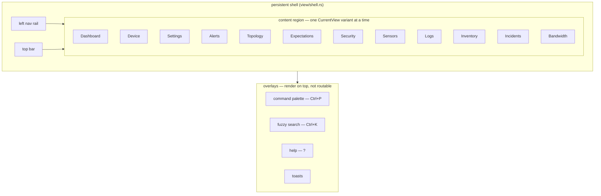

# Views & the view/state pattern

The frontend is an [Iced 0.14](https://iced.rs/) application. This page explains
how views are structured, how the persistent shell and overlays fit together,
and gives a one-paragraph tour of each routable view.

## The view/state pattern

Each view owns a plain state struct that holds everything it renders, and a free
`*_view(&state) -> Element<Message>` function that renders it. State is mutated
only in the app's `update` loop in response to a `Message`; view functions are
pure (state in, widgets out), which is what makes them testable in isolation
(see [`testing.md`](testing.md)). Representative state structs:

| State | View | Holds |
|-------|------|-------|
| `DashboardState` | Dashboard | Device/host list, connection status, sensor-health summary. |
| `DeviceDetailState` | Device | Selected device's metrics and chart data. |
| `AlertsState` | Alerts | Alert rules, triggered alerts, external anomalies/expectations. |
| `SecurityState` | Security | NDR/anomaly lens over alerts (ATT&CK tactic rollup). |
| `TopologyState` | Topology | Graph nodes, edges, force-directed layout. |
| `SettingsState` | Settings | Zenoh connection settings. |

Views that need per-protocol drill-downs live under `view/specialized/`
(`netlink`, `netring`, `sysinfo`, `syslog`, …), each pairing an overview module
with a `*_detail.rs` tabbed detail panel. Cross-protocol summary panels live
under `view/overview/`.

## Routing: `CurrentView`

`CurrentView` (in `src/app.rs`) enumerates the routable views:

```
Dashboard, Device, Settings, Alerts, Topology, Expectations,
Security, Sensors, Logs, Inventory, Incidents, Bandwidth
```

The active variant decides which `*_view` the app renders. `Dashboard`,
`Alerts`, `Topology`, `Expectations`, `Security`, `Sensors`, `Logs`,
`Inventory`, `Incidents`, and `Bandwidth` are reachable from the nav rail;
`Device` and `Settings` are entered contextually (clicking a host/device card,
opening settings) and are marked `#[serde(skip)]` so they are not persisted as a
landing view.

## The persistent shell

`view/shell.rs` wraps every routable view with a persistent chrome:

- a **left nav rail** that switches `CurrentView`, and
- a **top bar** (connection status, theme toggle, global affordances).

The shell is always present; only the content region swaps as you navigate.

## Overlays (not routable)

Three surfaces render *on top of* the current view rather than replacing it, so
they are overlays, not `CurrentView` variants:

- **Command palette** (`view/palette.rs`, **Ctrl+P**) — navigation + actions,
  filtered with the shared fuzzy matcher in `view/search.rs`.
- **Global metric search** (`view/search.rs`, **Ctrl+K**) — a two-tier fuzzy
  match (substring tier, then subsequence tier) across all devices/metrics.
- **Help overlay** (`view/help.rs`, **`?`**) — keyboard-shortcut reference.

Toast notifications (`view/toast.rs`) are a fourth transient overlay surface.



## View tour

**Dashboard** (`view/dashboard.rs`) — the fleet overview and landing view. Host
cards group each host's per-protocol facets under one composite-health card, and
a sensor-health summary bar lists every connected sensor with its status, device
counts (total / responding / failed), last poll duration, and error count in the
last hour. Click a card to drill into the host or a device.

**Device** (`view/device.rs`) — per-device detail: a searchable/filterable metric
table with current values, plus a time-series chart for the selected metric
(booleans rendered as 0/1 step series, log rates as trend lines) with min/max/avg
/current statistics and a configurable time window. Entered contextually, not
from the nav rail.

**Alerts** (`view/alerts.rs`) — threshold alert rules alongside sensor- and
sensor-external alerts (anomalies/expectations). Severity and source filter pills
plus saved filter presets narrow the list; alerts move through a
firing → resolved lifecycle.

**Security** (`view/security.rs`) — an NDR/anomaly lens over alerts of kind
`Anomaly`, rolled up by MITRE ATT&CK tactic and by source. `view/detection_tuning.rs`
adds a runtime detector allowlist/threshold panel. Anomalies pivot into flow
drill-downs.

**Expectations** (`view/expectations.rs`) — authors sentinel expectations (over
sockets/links/routes) and pushes them to the netlink sensor at runtime via the
`@/commands` channel; the sensor hot-swaps its evaluator and replies on
`@/status`.

**Topology** (`view/topology/`) — an interactive map of the monitored network
(redesign epic #395, layout/performance overhaul epic #439; design report
[`docs/TOPOLOGY-REDESIGN.md`](../../docs/TOPOLOGY-REDESIGN.md)). The default
arrangement is the **tiered hierarchy** (`tiered.rs`, pure and unit-tested):
Internet aggregate on top, then gateways/infrastructure (barycenter-ordered so
each gateway sits above the subnet it serves), then hosts banded by /24 subnet,
then unclassified passively-discovered devices at the bottom — deterministic
(within-band order by role/label/id, never by rates), so the map reads like a
network diagram and never shuffles between refreshes or sessions. Structural
changes tween nodes to their new slots over 400 ms; captioned band backdrops
name each row. `model.rs` is the pure, unit-tested graph model: typed nodes
(`NodeRole` router/switch/ap/phone/iot from the netring asset inventory,
`Provenance` monitored/wire-only, `NodeHealth` healthy/degraded/down/stale from
liveness + host-scoped `@/health` + entity staleness) and typed edges
(`EdgeKind`): **Flow** edges are directed and rate-weighted from the netring
traffic matrix (`@/query/matrix`, bytes/sec; arrowheads only where a rate was
observed; flows are the fallback + cumulative-stat enrichment), **L2Adjacency**
edges come from netlink neighbor tables (dotted), and **Gateway** edges from
the `routes/default_v4_gw` metric (dashed; unresolved gateways become wire-only
router nodes). `layout.rs` holds the optional force-directed mode: stepped on
a gated ~30 fps frame subscription with d3-style alpha cooling while settling
(self-terminating — a settled graph burns no frames), alloc-free O(n²) core.
`graph.rs` renders on a canvas with node/edge hit-testing, drawing a pure
`RenderGraph` derived by `build_render_graph`; the render graph and canvas
cache are change-gated, so idle seconds cost no rebuilds or redraws. Nodes
show live ↓rx/↑tx rates (hot-ring counter deltas, patched into the render
graph in place), a health ring, a role glyph, and alert-severity tint; the
four topology queries re-issue every ~10 s while the view is open and land as
one batched message (one edge rebuild per batch). Off-LAN traffic aggregates
into an "Internet" pseudo-node (public unmapped matrix endpoints).

Presentation (#392): **lenses** (Traffic / Security / L2 / Health) switch
emphasis via a `LensSpec` table — edge kinds shown, tint source, passive
emphasis, dimming; an edge-label mode picker (rate / packets / protocol /
none); **grouping** (subnet /24, role, device group) collapses buckets into
meta-nodes with aggregated edges (click to expand, "Regroup" re-collapses);
**focus mode** isolates a node's 1–3-hop neighborhood (node panel "Focus"
button, breadcrumb to exit); filters (hide idle / passive / external, flow
top-N with an honest "showing top N of M flows" label); search supports
`find:`/`hide:` with `role:`/`alert:`/`health:` predicates. Lens/grouping/
label/filter prefs persist in settings.json5. Supports zoom, pan (+ `f`
zoom-to-fit), and manual node positioning — pinned positions persist across
restarts. Polish (#394): hovering a node dims everything outside its 1-hop
neighborhood; active flow edges animate a marching dash (uncached overlay,
double-gated subscription); a toggleable legend explains the active lens (and
the tier order under the tiered layout); layout modes tiered (default) /
force / ranked grid / circular, persisted under the `topology_layout_v2`
settings key.

Details on demand (#393, `view/topology/panel.rs`): selecting a node or edge
opens a 320 px side panel fetched on selection (never on tick, stale replies
dropped). The node panel shows correlator identity/evidence (member claims
with rule+confidence, passive-DNS names), vitals with a 1 h CPU sparkline,
top talkers, and listen sockets; the edge panel shows per-direction rates,
backing flows with per-flow process attribution (#309 join,
`AttributionTarget::Topology`), and community-id copy. Both pivot to the
netring flow table and device detail.

**Parallax live video** (`view/specialized/parallax.rs` +
`parallax_detail.rs`, #408) — the media-plane viewer for a parallax device.
The stream catalogue is fetched on open from the host-scoped
`@/query/streams` queryable (`Fetch` lifecycle, mock-served in demo mode);
Open sends `open_stream` (codec `mjpeg`) and spawns one **abortable**
`Task::stream` per tile — a plain subscriber on the exact
`@media/<stream>/preview/jpeg` key, latest-frame-wins, CBOR `FrameMeta`
attachment, JPEG→RGBA decoded off the UI thread. Video tiles (`--features
h264`) subscribe with the profile chunk as a single-chunk wildcard
(`@media/<stream>/video/h264/*`) — the sensor's `video.profile` is
configurable and the catalogue doesn't carry it (KEYSPACE §3.3). Tiles render
newest-frame images with a seq/fps caption. Each tile carries a
**generation** (monotonic per open); frames and end reports from a replaced
subscriber task (older generation) are ignored, a large in-generation
sequence regression re-anchors instead of freezing (sensor pipeline restart),
and a sensor `StreamStatus{open: false}` transition (via the host-scoped
control subscriber) flags a tile still waiting for its first frame as a
failed open. Close (and every way of leaving the device view: deselect,
Escape, dashboard, navigating to any other view, selecting another device,
disconnect, session replacement) aborts the subscriber tasks and batches
`close_stream` commands — view changes funnel through one choke point in
`App::update`; the stored `abort_on_drop` handles make dropping the state
itself kill the subscribers, which is the sensor's falling-edge teardown
backstop. Switching a preview tile to video sends `close_stream` **before**
`open_stream(h264)` (ordered on one publisher) so the preview refcount never
leaks. Clicking a tile's frame **expands** it into a near-fullscreen overlay
(#436): a scrim layer in the root `Stack` showing the tile's newest frame
scaled (`ContentFit::Contain`) with a caption + Close button. Expand upgrades
a preview tile to the video profile when the build and the stream support it
(same balanced switch); Escape / backdrop click / Close collapses and
restores the pre-expand profile. The expansion lives on
`ParallaxDetailState` (`expanded`), so every teardown choke point above
dismisses it with the tiles.

**Logs** (`view/specialized/syslog.rs` and related) — structured log drill-down
with a MESSAGE_ID catalog, follow/pause, and a boot lens. Seeds from the cold
store on open (`Message::LogHistoryLoaded`; see [`local-store.md`](local-store.md)).
Supports local filtering (severity, facility, patterns) via `SyslogFilterState`.

**Inventory** (`view/inventory.rs`) — a passive asset inventory and fingerprint
explorer (JA3/JA4/JA4H/SNI/HASSH), joined against correlated host entities.

**Bandwidth** (`view/bandwidth.rs`) — a live bandwidth-by-process/service monitor
(bmon/nethogs style).

**Incidents** (`view/incident.rs`, `view/groups.rs`) — the unified Incident
object: related alerts grouped into one incident with a timeline and evidence
pivots.

**Sensors** (`view/sensors.rs`) — the sensor registry and per-instance health
detail (from `_meta/sensors/**` registrations and the host-scoped
`<proto>/<source>/@/health` snapshots). One card per sensor **instance**
(`sysinfo @ hostA`), keyed by `sensor@source`, so N machines running the same
protocol each keep their own card; the card's artifact downloads set
`target_source` so only that host produces the artifact.

An in-flight artifact job shows two-phase progress under its status line
(`view/artifact_fetch.rs`): while the sensor is **producing**, the request poll
streams the producer's own `Generating` updates (a capture's
`"capturing 12s/30s · … MiB · … pkts"` line plus its elapsed/duration
fraction); while **downloading**, `zenoh-blob` chunk counts drive the same bar
(`components::fraction_bar`). Both surfaces that render the shared job state —
the Sensors-page card and the netring Capture tab — get the bar.

Card status follows Zenoh liveliness, not just snapshots: when a sensor's
`<proto>/<source>/@/alive` token disappears (clean shutdown, or lease expiry
after a crash), its card flips to **Offline** — a dead sensor publishes no
further snapshots, so without this the last-reported status would stick
forever. When the token reappears, an Offline card lifts to **Starting** until
the next real `@/health` snapshot lands; liveliness never overrides a live
sensor's own reported status. Legacy (non-host-scoped) `<proto>/@/alive`
tokens can't distinguish hosts and flip every instance of that protocol.

**Settings** (`view/settings.rs`) — Zenoh connection mode (peer/client/router),
connect/listen endpoints, stale threshold, and theme; persisted to
`~/.config/zensight/settings.json5`.
