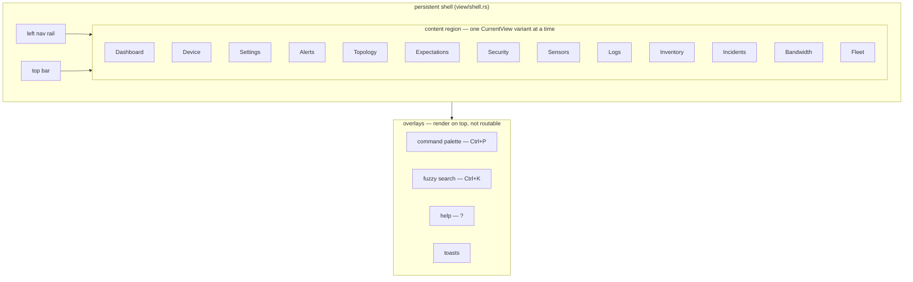

# Views & the view/state pattern

The frontend is an [Iced 0.14](https://iced.rs/) application. This page explains
how views are structured, how the persistent shell and overlays fit together,
and gives a one-paragraph tour of each routable view.

## The view/state pattern

Each view owns a plain state struct that holds everything it renders, and a free
`*_view(&state) -> Element<Message>` function that renders it. State is mutated
only in the app's `update` loop in response to a `Message`; view functions are
pure (state in, widgets out), which is what makes them testable in isolation
(see [`testing.md`](testing.md)). Representative state structs:

| State | View | Holds |
|-------|------|-------|
| `DashboardState` | Dashboard | Device/host list, connection status, sensor-health summary. |
| `DeviceDetailState` | Device | Selected device's metrics and chart data. |
| `AlertsState` | Alerts | Alert rules, triggered alerts, external anomalies/expectations. |
| `SecurityState` | Security | NDR/anomaly lens over alerts (ATT&CK tactic rollup). |
| `TopologyState` | Topology | Graph nodes, edges, force-directed layout. |
| `SettingsState` | Settings | Zenoh connection settings. |

Views that need per-protocol drill-downs live under `view/specialized/`
(`netlink`, `netring`, `sysinfo`, `syslog`, …), each pairing an overview module
with a `*_detail.rs` tabbed detail panel. Cross-protocol summary panels live
under `view/overview/`.

## Routing: `CurrentView`

`CurrentView` (in `src/app.rs`) enumerates the routable views:

```
Dashboard, Device, Settings, Alerts, Topology, Expectations,
Security, Sensors, Logs, Inventory, Incidents, Bandwidth, Fleet
```

The active variant decides which `*_view` the app renders. `Dashboard`,
`Alerts`, `Topology`, `Expectations`, `Security`, `Sensors`, `Logs`,
`Inventory`, `Incidents`, `Bandwidth`, and `Fleet` are reachable from the nav rail;
`Device` and `Settings` are entered contextually (clicking a host/device card,
opening settings) and are marked `#[serde(skip)]` so they are not persisted as a
landing view.

## The persistent shell

`view/shell.rs` wraps every routable view with a persistent chrome:

- a **left nav rail** that switches `CurrentView`, and
- a **top bar** (connection status, theme toggle, global affordances).

The shell is always present; only the content region swaps as you navigate.

## Focus mode (one host instead of the fleet)

The v1 grammar made a single host expressible as one selector — `v1/<origin>/**`
— so the host detail header carries a **Focus this host** button (#476). Focusing
sets `LinkConfig.focus = Some(origin)`; `subscription.rs` then swaps the fleet
data-plane selectors for that origin's telemetry, state, alerts and liveliness. On
a constrained link this is the difference between one host's samples and the whole
fleet's firehose.

Two consequences worth knowing:

- **The fleet dashboard empties while focused.** That is the feature, but it looks
  exactly like an outage, so the shell renders a persistent banner naming the
  focused host with a one-click **Exit focus**.
- **Toggling re-declares the Zenoh session.** Iced hashes `LinkConfig` in
  `Subscription::run_with`, so a change tears the subscription down and rebuilds
  it — a second or two of `Connecting…`, not a free switch.

The `@catalog` entity subscription deliberately stays fleet-wide: it is tiny, and
it is what lets you un-focus, or focus straight onto a different host. Focus is
runtime-only — it is not persisted to `settings.json5`, and the configured
`subscription_scope` is left untouched underneath it.

## Overlays (not routable)

Three surfaces render *on top of* the current view rather than replacing it, so
they are overlays, not `CurrentView` variants:

- **Command palette** (`view/palette.rs`, **Ctrl+P**) — navigation + actions,
  filtered with the shared fuzzy matcher in `view/search.rs`.
- **Global metric search** (`view/search.rs`, **Ctrl+K**) — a two-tier fuzzy
  match (substring tier, then subsequence tier) across all devices/metrics.
- **Help overlay** (`view/help.rs`, **`?`**) — keyboard-shortcut reference.

Toast notifications (`view/toast.rs`) are a fourth transient overlay surface.



## View tour

**Dashboard** (`view/dashboard.rs`) — the fleet overview and landing view. Host
cards group each host's per-protocol facets under one composite-health card, and
a sensor-health summary bar lists every connected sensor with its status, device
counts (total / responding / failed), last poll duration, and error count in the
last hour. Click a card to drill into the host or a device.

**Device** (`view/device.rs`) — per-device detail: a searchable/filterable metric
table with current values, plus a time-series chart for the selected metric
(booleans rendered as 0/1 step series, log rates as trend lines) with min/max/avg
/current statistics and a configurable time window. Entered contextually, not
from the nav rail.

**Alerts** (`view/alerts.rs`) — threshold alert rules alongside sensor- and
sensor-external alerts (anomalies/expectations). Severity and source filter pills
plus saved filter presets narrow the list; alerts move through a
firing → resolved lifecycle. External alert rows show a **generic label-context
block** (`alert_detail_pairs`, #558) — unit / burn ratio / template / coredump
details / … — which degrades cleanly for any protocol. Log-sourced alerts add a
**"view logs →"** pivot (`Message::PivotToLogsFromAlert`) that opens the Logs
view pre-filtered to the alert's unit + pattern, with a "Filtered from alert
&lt;rule&gt;" breadcrumb (one-click clear).

**Security** (`view/security.rs`) — an NDR/anomaly lens over alerts of kind
`Anomaly`, rolled up by MITRE ATT&CK tactic and by source. `view/detection_tuning.rs`
adds a runtime detector allowlist/threshold panel. Anomalies pivot into flow
drill-downs.

**Expectations** (`view/expectations.rs`) — authors sentinel expectations (over
sockets/links/routes) and pushes them to the netlink sensor at runtime as an
`@rpc` write: a GET on the fleet selector
`zensight/v1/*/@rpc/netlink/expectations/set` (query target `All`); the sensor
hot-swaps its evaluator and acks in the reply (refusals arrive as `reply_err`
`{error, message}` payloads). The current config reads back with a GET on
`…/@rpc/netlink/expectations`.

**Topology** (`view/topology/`) — an interactive map of the monitored network
(redesign epic #395, layout/performance overhaul epic #439; design report
[`docs/TOPOLOGY-REDESIGN.md`](../../docs/TOPOLOGY-REDESIGN.md)). The default
arrangement is the **tiered hierarchy** (`tiered.rs`, pure and unit-tested):
Internet aggregate on top, then gateways/infrastructure (barycenter-ordered so
each gateway sits above the subnet it serves), then hosts banded by /24 subnet,
then unclassified passively-discovered devices at the bottom — deterministic
(within-band order by role/label/id, never by rates), so the map reads like a
network diagram and never shuffles between refreshes or sessions. Structural
changes tween nodes to their new slots over 400 ms; captioned band backdrops
name each row. `model.rs` is the pure, unit-tested graph model: typed nodes
(`NodeRole` router/switch/ap/phone/iot from the netring asset inventory,
`Provenance` monitored/wire-only, `NodeHealth` healthy/degraded/down/stale from
liveness + per-producer `state/*/health` documents + entity staleness) and
typed edges (`EdgeKind`): **Flow** edges are directed and rate-weighted from
the netring traffic matrix (the `@rpc` procedure
`zensight/v1/*/@rpc/netring/matrix`, bytes/sec; arrowheads only where a rate was
observed; flows are the fallback + cumulative-stat enrichment), **L2Adjacency**
edges come from netlink neighbor tables (dotted), and **Gateway** edges from
the `routes/default_v4_gw` metric (dashed; unresolved gateways become wire-only
router nodes). `layout.rs` holds the optional force-directed mode: stepped on
a gated ~30 fps frame subscription with d3-style alpha cooling while settling
(self-terminating — a settled graph burns no frames), alloc-free O(n²) core.
`graph.rs` renders on a canvas with node/edge hit-testing, drawing a pure
`RenderGraph` derived by `build_render_graph`; the render graph and canvas
cache are change-gated, so idle seconds cost no rebuilds or redraws. Nodes
show live ↓rx/↑tx rates (hot-ring counter deltas, patched into the render
graph in place), a health ring, a role glyph, and alert-severity tint; the
four topology queries re-issue every ~10 s while the view is open and land as
one batched message (one edge rebuild per batch). Off-LAN traffic aggregates
into an "Internet" pseudo-node (public unmapped matrix endpoints).

Presentation (#392): **lenses** (Traffic / Security / L2 / Health) switch
emphasis via a `LensSpec` table — edge kinds shown, tint source, passive
emphasis, dimming; an edge-label mode picker (rate / packets / protocol /
none); **grouping** (subnet /24, role, device group) collapses buckets into
meta-nodes with aggregated edges (click to expand, "Regroup" re-collapses);
**focus mode** isolates a node's 1–3-hop neighborhood (node panel "Focus"
button, breadcrumb to exit); filters (hide idle / passive / external, flow
top-N with an honest "showing top N of M flows" label); search supports
`find:`/`hide:` with `role:`/`alert:`/`health:` predicates. Lens/grouping/
label/filter prefs persist in settings.json5. Supports zoom, pan (+ `f`
zoom-to-fit), and manual node positioning — pinned positions persist across
restarts. Polish (#394): hovering a node dims everything outside its 1-hop
neighborhood; active flow edges animate a marching dash (uncached overlay,
double-gated subscription); a toggleable legend explains the active lens (and
the tier order under the tiered layout); layout modes tiered (default) /
force / ranked grid / circular, persisted under the `topology_layout_v2`
settings key.

Details on demand (#393, `view/topology/panel.rs`): selecting a node or edge
opens a 320 px side panel fetched on selection (never on tick, stale replies
dropped). The node panel shows correlator identity/evidence (member claims
with rule+confidence, passive-DNS names), vitals with a 1 h CPU sparkline,
top talkers, and listen sockets; the edge panel shows per-direction rates,
backing flows with per-flow process attribution (#309 join,
`AttributionTarget::Topology`), and community-id copy. Both pivot to the
netring flow table and device detail.

**SNMP device detail** (`view/specialized/snmp.rs`, #530) — built on the
typed `InterfaceTable` state doc the sensor publishes per device on
`state/snmp/<device>/interfaces` (#529); the old `if/<index>/<column>`
metric-string parsing is gone. The doc arrives on the state subscriber
(`Message::SnmpInterfaceTable`, LWW into `DeviceDetailState::snmp_detail`,
rows pre-joined for borrowing). The interface table is a shared `DataTable`
(sortable: status/name/speed/in/out/util/errs-per-s) showing per-second
rates (#527) humanized via `format_rate`, utilization % against link speed
(warning >70, danger >90), decoded RFC 2863 status LEDs, and a sparkline
per interface; clicking an interface name opens the history chart on its
best raw-tree octet metric (rate preferred, any naming scheme). System
metrics render processor/storage gauges from profile (`cpu/<i>/load`,
`storage/<i>/…`) or legacy names, with sparklines. Uptime under ten minutes
flags "rebooted recently".

**Parallax live video** (`view/specialized/parallax.rs` +
`parallax_detail.rs`, #408) — the media-plane viewer for a parallax device.
The stream catalogue is fetched on open with a GET on the single-host `@rpc`
key `zensight/v1/<origin>/@rpc/parallax/streams` (`Fetch` lifecycle,
mock-served in demo mode); Open sends `open_stream` (codec `mjpeg`) as an
`@rpc` write on `…/@rpc/parallax/stream/set` and spawns one **abortable**
`Task::stream` per tile — a plain subscriber on the exact
`zensight/v1/<origin>/@media/parallax/<stream>/preview/jpeg` key,
latest-frame-wins, CBOR `FrameMeta`
attachment, JPEG→RGBA decoded off the UI thread. Video tiles (`--features
h264`) subscribe with the profile chunk as a single-chunk wildcard
(`…/@media/parallax/<stream>/video/h264/*`) — the sensor's `video.profile` is
configurable and the catalogue doesn't carry it (RFC 07). Tiles render
newest-frame images with a seq/fps caption. Each tile carries a
**generation** (monotonic per open); frames and end reports from a replaced
subscriber task (older generation) are ignored, a large in-generation
sequence regression re-anchors instead of freezing (sensor pipeline restart),
and a sensor `StreamStatus{open: false}` transition (a per-stream
`state/parallax/stream/<stream>` document on the state subscriber) flags a
tile still waiting for its first frame as a
failed open. Close (and every way of leaving the device view: deselect,
Escape, dashboard, navigating to any other view, selecting another device,
disconnect, session replacement) aborts the subscriber tasks and batches
`close_stream` commands — view changes funnel through one choke point in
`App::update`; the stored `abort_on_drop` handles make dropping the state
itself kill the subscribers, which is the sensor's falling-edge teardown
backstop. Switching a preview tile to video sends `close_stream` **before**
`open_stream(h264)` (the two `stream/set` calls are chained) so the preview
refcount never leaks. Clicking a tile's frame **expands** it into a near-fullscreen overlay
(#436): a scrim layer in the root `Stack` showing the tile's newest frame
scaled (`ContentFit::Contain`) with a caption + Close button. Expand upgrades
a preview tile to the video profile when the build and the stream support it
(same balanced switch); Escape / backdrop click / Close collapses and
restores the pre-expand profile. The expansion lives on
`ParallaxDetailState` (`expanded`), so every teardown choke point above
dismisses it with the tiles.

**Logs** (`view/specialized/syslog.rs` and related) — structured log drill-down
with a MESSAGE_ID catalog, follow/pause, and a boot lens. Seeds from the cold
store on open (`Message::LogHistoryLoaded`; see [`local-store.md`](local-store.md)).
Supports local filtering (severity, facility, patterns) via `SyslogFilterState`.

**Inventory** (`view/inventory.rs`) — a passive asset inventory and fingerprint
explorer (JA3/JA4/JA4H/SNI/HASSH), joined against correlated host entities.

**Bandwidth** (`view/bandwidth.rs`) — a live bandwidth-by-process/service monitor
(bmon/nethogs style).

**Fleet** (`view/fleet.rs`) — what each host's build actually says it serves. Fans
the `introspect` procedure out across every registered producer (`QueryTarget::All`;
`@catalog` takes its own key, since a verbatim `@` chunk is structurally unmatchable
by a `*` fleet selector) and diffs each reply against the registry slice this GUI
compiled in. Answers, without SSH: what does this host speak, is it the same build
as us, is it serving anything deprecated, and does its registry match reality — RFC
08 §6 calls a disagreement here a *finding*, not an ambiguity. A producer that is
alive on the bus but answers no `introspect` is listed as `silent` rather than
omitted; fanning out alone cannot distinguish "not deployed" from "deployed and not
answering", and the second is the one you need to see.

## Streamed rollups vs pulled records

Several specialized views show the same shape twice, and it is deliberate
(RFC 08 §4). A quantity that is **bounded** is streamed as telemetry; a
quantity with **unbounded cardinality** is a record you pull from an `@rpc`
procedure, never a key you publish. Three of these were served by the sensors
from the day of the keyspace cutover and had no caller until #469:

- **SNMP trap/event feed** (#536) — the GUI subscribes to the events plane
(`v1/*/events/**`, narrowed under focus) with a startup GET on the same
selector that backfills history when a Zenoh storage is aligned on the
events tree. Decoded `EventRecord`s land newest-first (ULID-ordered,
deduped) in a fleet ring (`DashboardState::snmp_events`, cap 500) and the
open SNMP device's own ring; the device view renders an Events card
(time, severity-colored kind, translated varbind fields) and the fleet
overview shows a Recent Traps section with the loudest senders (trap-storm
spotting). Local redb persistence of events is a follow-up — restart
continuity currently comes from the storage backfill.

**SNMP fleet overview** (`view/overview/snmp.rs`, #533) — fleet-wide
aggregation over the typed `InterfaceTable` docs (stored per device in
`DashboardState::snmp_interfaces`): top talkers ranked by *current* in+out
rate with utilization coloring, an admin-up/oper-down hotlist, error
hotspots by error/discard rate, and headline tiles (devices, interfaces,
UP/DOWN, erroring, total throughput). The old lifetime-counter rankings and
`if/<index>/<column>` string parsing are gone.

**NetFlow** (`view/specialized/netflow.rs`) — `flows_total` / `bytes_total` /
  `by_proto/{proto}/flows` stream; individual flows come from
  `@rpc/netflow/flows`. Until this was wired, the view *reconstructed* flows
  from telemetry labels the sensor does not emit (it publishes
  `labels: HashMap::new()`), so every row it drew read `0.0.0.0:0 → 0.0.0.0:0`.
  Fields now come from the exporter's template, and a field the template omits
  renders `—` rather than being invented.
- **sysinfo latency** (`@rpc/sysinfo/latency`) — eBPF run-queue and block-I/O
  histograms, shown as percentiles beneath the PSI panel. PSI says how much time
  was lost to contention; the histograms say how long one wait actually was, and
  the tail is the finding. The sensor declares the queryable even without the
  `ebpf` feature (replying `available: false`), so "cannot measure it" and
  "nothing answered" stay distinguishable — and the view says which.
- **netring encrypted DNS** (`@rpc/netring/encrypted_dns`) — the DoT/DoQ/DoH
  *destinations* behind the streamed `dns/encrypted/*` counts. An unrecognised
  resolver is called out, because that is what a DNS tunnel looks like from the
  wire.

## Zero, absent, and unreadable are three different things

The latency panel above can say `available: false` because it *asks* a question
and the sensor answers. Streamed telemetry has no such channel: a subject that
stops publishing looks exactly like a subject that never could. The **Fans &
power** panel (`view/specialized/sysinfo.rs`, #515) is where that bites, and it
is worth stating how it resolves, because the naive rendering is wrong in both
directions.

- **A fan at 0 RPM is a reading.** Laptops stop their fans at idle, so the
  collector publishes the zero deliberately rather than leaving a hole (a hole
  would make "idle" indistinguishable from "dead"). The panel renders `0 RPM`
  plainly — never hidden, never `-`, and never threshold-styled, since a muted or
  red zero reads as absence. A fan pinned at 0 *under load* is the finding.
- **Absent RAPL watts are not `0 W`.** `power/rapl/{zone}/watts` is usually
  missing: `/sys/class/powercap/*/energy_uj` has been root-only since
  CVE-2020-8694, so an unprivileged sensor reports fans, battery and entropy and
  no watts. The panel says so in words instead of inventing a measurement, and it
  names all three causes it cannot tell apart — no RAPL hardware, no permission,
  or a sensor that has only just started (watts are a rate derived from an energy
  delta, so the first poll interval legitimately has none).
- **The panel opens on `system/entropy_avail`.** That coupling is load-bearing,
  not incidental. Fans, batteries and RAPL are each hardware- or
  permission-dependent and legitimately empty on a normal server; entropy is the
  only subject the power collector publishes unconditionally, so it is the sole
  on-wire evidence that the collector *ran*. Without it, the one host that most
  needs the explanation — fanless, batteryless, `energy_uj` root-only — would
  render no panel at all, which is indistinguishable from `collect.power: false`.

Gates here parse the subject rather than matching a prefix. `has_temperatures`
did the latter, and fans publish `sensors/{chip}/{label}/rpm` under the same
`sensors/` prefix — so every host running `collect.power` without
`collect.temperatures` grew a Temperatures card reading "No temperature sensors
found". `ui_tests.rs` pins the fan-0 and RAPL-absent renderings in both
directions.

**Incidents** (`view/incident.rs`, `view/groups.rs`) — the unified Incident
object: related alerts grouped into one incident with a timeline and evidence
pivots.

**Sensors** (`view/sensors.rs`) — the sensor registry and per-instance health
detail (from the `zensight/v1/<origin>/state/<producer>/sensor` registration
documents and the `…/state/<producer>/health` snapshots, both riding the one
state subscriber). One card per sensor **instance**
(`sysinfo @ hostA`), keyed by `sensor@source`, so N machines running the same
protocol each keep their own card; the card's artifact downloads set
`target_source` so only that host produces the artifact.

An in-flight artifact job shows two-phase progress under its status line
(`view/artifact_fetch.rs`): while the sensor is **producing**, the request poll
streams the producer's own `Generating` updates (a capture's
`"capturing 12s/30s · … MiB · … pkts"` line plus its elapsed/duration
fraction); while **downloading**, `zenoh-blob` chunk counts drive the same bar
(`components::fraction_bar`). Both surfaces that render the shared job state —
the Sensors-page card and the netring Capture tab — get the bar.

Card status follows Zenoh liveliness, not just snapshots: when a sensor's
`zensight/v1/<origin>/state/<producer>/alive` token disappears (clean
shutdown, or lease expiry
after a crash), its card flips to **Offline** — a dead sensor publishes no
further snapshots, so without this the last-reported status would stick
forever. When the token reappears, an Offline card lifts to **Starting** until
the next real health snapshot lands; liveliness never overrides a live
sensor's own reported status. The origin chunk in the token distinguishes
hosts, so N instances of the same protocol never flip together (the catalog's
own `@catalog/state/alive` service token is recognized and excluded).

**Settings** (`view/settings.rs`) — Zenoh connection mode (peer/client/router),
connect/listen endpoints, stale threshold, and theme; persisted to
`~/.config/zensight/settings.json5`.
