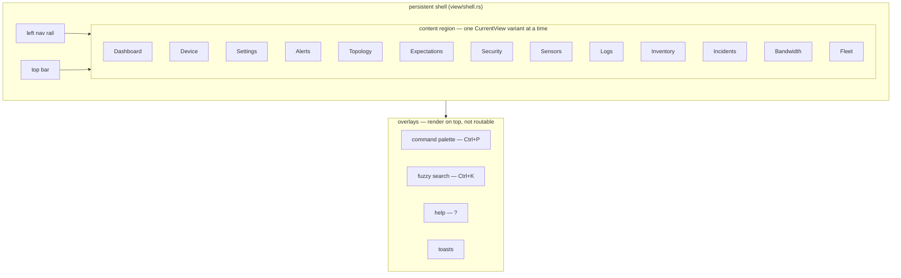

# Views & the view/state pattern

The frontend is an [Iced 0.14](https://iced.rs/) application. This page explains
how views are structured, how the persistent shell and overlays fit together,
and gives a one-paragraph tour of each routable view.

## The view/state pattern

Each view owns a plain state struct that holds everything it renders, and a free
`*_view(&state) -> Element<Message>` function that renders it. State is mutated
only by the app's `update` loop in response to a `Message` — either directly,
or through the view's own `State::update(Action) -> Effect` (below), which is
pure and unit-tested; view functions are pure (state in, widgets out), which is
what makes them testable in isolation (see [`testing.md`](testing.md)).
Representative state structs:

| State | View | Holds |
|-------|------|-------|
| `DashboardState` | Dashboard | Device/host list, connection status, sensor-health summary. |
| `DeviceDetailState` | Device | Selected device's metrics and chart data. |
| `AlertsState` | Alerts | Sensor-published alerts: anomalies, expectation violations, operator thresholds. |
| `SecurityState` | Security | NDR/anomaly lens over alerts (ATT&CK tactic rollup). |
| `TopologyState` | Topology | Graph nodes, edges, force-directed layout. |
| `SettingsState` | Settings | Zenoh connection settings. |

Views that need per-protocol drill-downs live under `view/specialized/`
(`netlink`, `netring`, `sysinfo`, `syslog`, …), each pairing an overview module
with a `*_detail.rs` tabbed detail panel. Cross-protocol summary panels live
under `view/overview/`.

### Actions and effects (#1306)

A view's interactions are one `Message` variant carrying the view's own
`Action` enum, not one variant each. The view module declares the `Action`
(one variant per interaction, typed payloads) and an `Effect` naming what the
app has to do about it in the view's terms; the state applies the action and
hands the effect back, so the state change is pure and unit-tested without the
app, and the app's arm is one line:

```rust
Message::Groups(action) => {
    if self.groups.update(action) == groups::Effect::Persist {
        self.save_groups();
    }
}
```

An effect is a persist hook (`Persist`), a named outcome the app turns into a
`Task` (`chart::Effect::LoadRange { from, to }` → the store range query), or
the words for a toast (`chart::Effect::InvalidRange`). The sub-enum never sees
a `Task`, the session or another view's state; a clock-needing action takes
`now_ms` as an argument. The groups that have moved:

| View | `Action` | `Effect` variants |
|------|----------|-------------------|
| chart (on `DeviceDetailState::apply_chart`) | `chart::Action` — select/add/remove/toggle series, windows, ranges, zoom/pan/drag, the filter | `Favorite { metric, now_fav }`, `LoadRange { from, to }`, `InvalidRange` |
| groups (`GroupsState::update`) | `groups::Action` — panel, filter, the two forms, delete, membership | `Persist` |
| expectations (`ExpectationsState::set`) | `expectations::Field` — target, host, the kinds, the form's inputs | `TargetChanged`, `HostChosen` (each a sentinel read) |
| settings (`SettingsState::set`) | `settings::Field` — the Zenoh endpoints, link profile, scope, the limits | none |
| security (`SecurityState::update`, takes the tuning state) | `security::Action` — the tuning inputs, the host, the Info toggle, the anomaly drill-down | `ReadStatus`, `FetchCaptures` |
| dashboard (`DashboardState::update`) | `dashboard::Action` — producer/status filters, search, paging, grid/table | none |
| trap feed (`EventFilterState::update`, takes `now_ms`) | `overview::snmp::Filter` — the facets, search, clear | none |
| alerts (`AlertsState::update`) | `alerts::Action` — severity/source/protocol filters, presets, clear focus | `Persist` (presets) |
| inventory (`InventoryState::update`) | `inventory::Action` — sort, role, fingerprint kind | none |
| bandwidth (`BandwidthState::update`) | `bandwidth::Action` — mode, sort, filter | `RebuildServices`, `FetchProcesses` |
| fleet (`FleetState::update`) | `fleet::Action` — findings, sort, filter | none |
| topology (`TopologyState::update`, takes the entity store and `now_ms`) | `topology::Action` — the canvas (select, drag, pan, zoom, hover, fit), the toolbar (lens, labels, grouping, focus, filters, layout, pins, legend, search, close), the panel (open device, open flows, copy), the ticks and the data batch | `PersistPrefs`, `Close`, `AskListenSockets`, `AskEdgeFlows`, `OpenDevice`, `OpenFlows`, `Copy` |
| explorer (`ExplorerState::update`, takes `visible`) | `explorer::Action` — the pump's started/tick/stopped/error, the watch input and submit, unwatch, tree toggle, key select, stop | none — the state holds the pump's handle and sends the command itself |
| artifacts (the state machine stays in the app) | `artifact_fetch::Action` — request, capture-blob download, confirm/holder/pause/resume/cancel, the capture forms; `artifact_fetch::Event` — the kinds sweep, the request/poll stream, the download stream, the dialogs | n/a — the app matches the two sub-enums directly |
| parallax live view (the app applies it: seven actions open, close or write through its session helpers) | `parallax_detail::Action` — open/close a tile, the tier buttons and auto, expand/collapse, keyframe request; the tile streams' frame / receiver report / ended; the stream-status transition; the report outcome | n/a |
| logs (`SyslogFilterState::update`, takes `now_ms`) | `syslog::Action` — the panel and stats toggles, severity, time range, the facility/unit/boot lenses, row drill-down, follow/pause, the text filters, export format, paging | `RefreshHistory` (under the app's in-flight gate), `LoadOlder` (the app holds the cursor) |

Kept as top-level variants by design: navigation (`Open*`/`Close*`), wire
ingress, `Call`/`Reply`/`Batch`/`Arm`/`Confirm`/`Written`, and the few
app-wide toggles (`ToggleTheme`, `ToggleGroupByHost`, `SetFocusHost`) whose
effect is the app's own state.

### Producer-agnostic intake (#1256)

A device is named by its **producer** — chunk 4 of every key it publishes —
not by the closed `Protocol` enum: `DeviceId { producer: String, origin,
source }`. The enum is asked only where a bespoke surface exists
(`DeviceId::protocol()` / `is()`): the specialized view dispatch, a tab's
prefetch, an icon. Everything generic keys on the name, so a producer this
GUI was not compiled with — a newer sensor, a third party's — gets a device,
a dashboard card, an overview tab (`icons::for_producer` renders the generic
mark; the tab label is the producer's own name) and the generic device view,
instead of being dropped at decode.

Its state documents are held too. `decode_sample` tries the compiled
registry's parse direction first and, when that names nothing — an
unregistered producer, or a registered producer's subject the GUI maps to no
type — decodes the payload **structurally** into `Message::Document` (state)
or `Message::Event` (events). The framework vocabulary still means what it
means everywhere: an unregistered producer's `health` and `sensor` documents
take the typed arms; its `alert/{key}` is tried as an `Alert` and held as a
document when its `protocol` is outside the enum. A payload that is neither
JSON nor CBOR is the one thing still dropped, and it is logged.

Documents are judged **at fold time**, in `update`, against the **runtime
registry**: every `introspect` reply of the last fleet sweep as a
`zenkey_fleet::SliceSet`, and every producer's `describe` reply as its
`SchemaSet` (fetched after each sweep for the producers not yet described,
`Message::SchemasLoaded`). `intake::judge` answers three things per
document — the declared type, the schema verdict (the shared three-state
badge: valid, invalid with the violation named, or *why* it was not checked)
and whether the subject is declared at all — and `intake::declared` answers
the last for every telemetry subject a device publishes. Fold time rather
than decode time is what makes the late joiner work: the subscriptions are up
before the first sweep answers, so a document that arrives before its slice
is re-judged when the slice lands.

What the generic device view then says (gate 4 of #1254, the honesty gate):
a **not declared** marker beside every metric whose subject the producer's
own slice does not declare, with a banner listing them; a banner when the
producer **declares no slice** at all (a finding about the fleet, worded as
such, and only once a sweep has answered — before that "no slice" is "not
asked yet"); a **Documents** section, one card per held document with its
subject, type or "untyped", verdict badge and declared/no-slice badge above
the value; and an **Events** section of caption rows. Documents attach to a
device when `(origin, producer)` match and the subject is under the device's
source, or when the device is the only one its producer has on that origin.
Documents never create a device.

Every gate of the system-view ratchet in `app::system_view_tests` passes
since #1262: a producer this GUI was never compiled with is seen, modelled,
rendered, judged, defined and subscribed to from its slice alone.

### The family model (#1257)

`view::family` derives rows and columns from a producer's slice, with no
Iced in it (design §5.3). A **family** is the longest common prefix of paths
sharing the same variables, ending at the last variable —
`{chassis}/thermal/{sensor}` — or, for a var-less path, everything but its
last chunk (`cluster/quorate` → `cluster`, a facts family). Its **fields** are
the literal tails (`celsius`, `upper_critical_c`), each carrying its
`SubjectDecl`: `kind` decides the presentation (`Rate` for a counter,
`Absolute`, `State`, `Label`), `unit` the display unit (`By` on a counter is
`By/s`), `cardinality`, `ttl_s` (stale after twice it, or nothing when none is
declared) and `description`. A trailing rest variable (`{metric...}`, the
proxy producers' device trees) makes an **open** family whose field is named
by the live tail. `FamilyModel::instances` folds a device's metric map into
one **instance** per variable binding (`rack7/inlet`) with the latest point
per field; `bind` is the private binder over zenkey's `SubjectPattern` with
its precedence (literals before variables before rest), to be replaced by
`RegistrySlice::bind` when zenkey #460 lands — not kept beside it.

Two families may share a variable name and not a prefix — pve's
`guest/{vmid}` and `backup/{vmid}` — and they stay two families; joining them
by binding is the view definition's business (§6.3). The three hand-written
folds (`bmc::fold`, `pve::backup_rows`, `probe::target_rows`) are each pinned
against the derivation on their own fixture: same row set, same readings.

### The default renderers (#1258)

`generic_device_view` reads the model (design §5.4): above the flat metric
list, `device::family_panels` derives one panel per family the device has
instances of — a **table** for a family with variables (a row per instance, a
cell per field) and a **facts** list for a var-less one — and `render_families`
draws them. Kinds and units are formatted from the slice: a gauge as
`41.5 Cel`, a bool as `yes`/`no`, a counter as a rate in `<unit>/s` from the
last two points (the live history, or the hot ring's samples the view is
seeded with on open — a detail view opens populated now, not "as new data
arrives") and, with one point, a cell that says the rate comes after the next
sample rather than a number.

**Grading is the publisher's, or nothing.** With no definition loaded the only
rule is `family::default_grading`: a sibling field named `upper_critical_*` /
`critical_*` is a critical limit, `upper_warning_*` / `warning_*` a warning
limit, and they grade the family's one remaining absolute reading — a row
then carries the `LimitVerdict` word in its colour. Two candidate readings, or
no limit-named sibling (bmc's `capacity_watts` beside `input_watts`), and
there is no verdict: `None` is "no limit declared", never "ok" (#1126–#1128 by
construction). A definition's `[panel.grade]` (#1259) says what names cannot.

The panels are data first (`FamilyPanel`/`FamilyRow`/`FamilyCell`), so the
ratchet's gate 3 asserts on them and on the rendered text; the common
families (health, errors, alerts) stay on their hand-written views. The
`family` on `DeviceDetailState` is the slice the fleet served for the
producer, or this build's compiled-in one when the sweep has not answered.

### View definitions — `views.toml` (#1259)

A producer can say how its families are best shown. The vocabulary is
`zensight_common::views::ViewSet` (design §6.1): `[view]` with the producer
and a title, then `[[panel]]`s of kind `table` / `facts` / `document` (the
rest of the vocabulary — `chart`, `reply`, `custom`, `link`, `action` — parses
and renders a line saying it is not rendered yet), each with a `scope` (a
family, optionally extended by literal chunks that select a field subtree:
`{unit}/uplink`), a `join` (a second family sharing a variable, left-joined:
pve's guests to their backups), `fields`/`hide`/`top_n`, and the
presentation slots: `label`, `show`, `note`, `sort`, `format.<field>` — each
a literal (`$var` substituted) or `{ rhai = "…" }`. **`[panel.grade]` names
fields only** (`reading`, `warning`, `critical`, `absent`); the one literal
allowed is `{ const = N, declared_by = "gui" }`, and a verdict from it carries
"limit N is the gui's, not the producer's" on the row.

`view::definition` compiles a document once (`Definition::compile`) and
renders it over the family model (`definition::render` → the same
`FamilyPanel` rows the default renderer uses, plus every script failure
once). Scripts run under design §6.4's limits — an operation budget, a
20 ms wall-clock budget through `on_progress` (a `loop {}` terminates and is
reported), a call-level cap, string/array/map caps, the `unchecked` feature
off — with `row` (the scoped fields, the join partner under its head or
`()`), the bound variables and `decl` in scope, and three pure host functions
(`fmt_age`, `fmt_bytes`, `fmt_unit`); no clock. **A broken view looks
broken**: a script that fails to compile or run renders the slot's fallback
and a `view script failed: …` line under the panels, never a silently empty
cell.

**Where a definition comes from**, in order: what the producer serves at
`@rpc/<producer>/views` (`Message::ViewsLoaded`, fetched on the fleet
sweep's repeating querier), the bundled copy compiled into `zensight-common`
from `registry/views/<producer>.toml`, or nothing — then the default renderer
above. A bespoke Rust view still wins at runtime when one exists.

### bmc, pve, probe and container are documents (#1260)

`specialized/{bmc,probe}.rs` and `overview/{pve,probe,containers}.rs` are
gone; their `views.toml` renders them, and the simulator tests written for
the hand-built views run unchanged against the declarative renderer in
`zensight/tests/declarative_views.rs` — that file is the format's regression
suite. What the renderer grew to pass them, all of it the host's look rather
than the document's vocabulary:

- **unit styles** (`definition::unit_style`): a declared token becomes a
  suffix and a precision on screen — `Cel` → `58.5°C`, `W` → `750 W`, `By/s`
  → `B/s`; the default renderer keeps the raw token (`41.5 Cel`) because it
  is the honest spelling of a slice nobody curated;
- the **limit line** beside a graded reading (`warn 75.0°C · crit 89.0°C`),
  **not metered** for a graded reading nobody published, **absent** when
  `grade.absent` says the bay is empty — the `LimitRow` rules (#1127) as
  `FamilyRow.limits` and cell text;
- **`group_by`**: one card per binding of the variable (`FamilyPanel.group`),
  so a two-chassis enclosure reads as two cards;
- **`fmt_fixed(v, decimals)`** beside the three host functions, for the
  sentences a note builds (`timed out after 20.0s`);
- the **fleet render** (`definition::render_fleet`) for the overview tabs:
  every device of the producer folded together, a var-keyed instance keyed
  `host/id` so `redis` on two hosts is two containers, a var-less family kept
  apart per host with `host` bound on every row;
- the **`aggregate` slot**: a `facts` panel whose script sees `rows` — the
  array of row maps — and returns a map of fact → value; pve's "one node
  reporting `quorate = 0` outweighs the rest" and the container fleet's
  "unchecked is not current" are this, not last-writer-wins.

What did not fit, stated: a **floor grade**. The vocabulary's limits are
ceilings (`reading >= limit`), and "an expired certificate" is a floor, so
probe's expiry carries no grade — the finding is the note, `EXPIRED 3 days
ago`, and a verdict of `ok` on a dead certificate is a lie the document will
not tell. A floor is a vocabulary follow-up, not a threshold to fake.

**The lint** (`definition::lint`) runs as a test over every bundled document
and the system-view fixture: each `scope` and `join` is a family of the
producer's slice, every field named is declared, every script compiles, and
every identifier a script uses is a declared field (`row.<field>`), a bound
variable, `row`/`decl`, or a host function. It is lexical over the script
text and names the file, the panel and the field in each message.

### The subscription follows the definition (#1262)

`view::plan::derived_scope` is a pure function — the served definitions, the
fleet's slices, what is visible, who is alive → key expressions — and
`ZenSight::link_for_stream` feeds it into `LinkConfig.scope` in place of the
empty-scope firehose default; a change to the link restarts the stream, as
it always did. Focus mode and an operator-configured scope are explicit
decisions and still win. **No script runs to decide a subscription**: a
panel's needs are its `fields` plus the fields its scripts and its grade
name, which the #1259 lint extracts lexically.

The **overview** subscribes to the union over every producer the GUI can
name (the fleet's slices, this build's registries, whatever is alive) of what
its definition needs — each field's declared path with variables as `*`
(`v1/*/telemetry/fake-sensor/*/temp/*/celsius`), a `document` panel's subject
on the state class — or, for a producer with a slice and no definition, that
producer's `telemetry/<producer>/**`; the same for a producer known only from
its liveliness token, which is then rendered with the "no slice" finding. The
**device detail** widens to that origin's `telemetry/<producer>/**` on top,
so an undeclared subject is seen there and wears the #1256 finding. The
common families keep their own wildcards in `subscription.rs`.

What narrowing costs, stated: an undeclared subject from a *defined*
producer is not fetched on the overview. "Never drop what arrives" is the
rule, not "fetch everything"; what a producer publishes beyond its slice is
the bus explorer's and the conformance judges' job. `zensight
--print-subscription` prints the overview's plan from this build's registries
and bundled definitions alone, which is what `scripts/demo-verify.sh` reads
to say the GUI does not fetch the firehose.

### Calls and replies (#1261)

An on-demand panel used to be a pair of messages (`FetchX` / `XReceived`), a
typed fetch function, a `*DetailState` field and an `update` arm per producer
— and a producer the GUI was not compiled with could not be asked anything.
The wire needs none of it: a read procedure is a GET on
`@rpc/<producer>/<procedure>?<params>`, and its reply is a value whose type
the producer's `describe` names. So there is one message to ask with,
`Message::Call { procedure, params }`, on the selected device, and one to
land with, `Message::Reply { device, procedure, params, result }`. The answer
lives in `DeviceDetailState::calls` (`call::Calls`), keyed by procedure, as
the JSON value the producer sent plus the RFC 05 §3.2 page signal when the
reply was an envelope.

Three rules, each a bug the old shape had:

- **a reply lands only where it was asked.** It carries the device and the
  params; `Calls::apply` keeps it only when the device is still selected and
  those params are the ones in flight. A slow answer to an old sort no longer
  overwrites the new one, and a deselected device's answer is dropped.
- **a bespoke view decodes once and borrows.** `Reply::decoded::<T>()`
  memoises the typed projection in the reply, so a `DataTable` can borrow its
  rows for as long as the element lives; the JSON stays beside it for the
  default renderer. A wrong-typed answer is a failure on screen ("Fetch
  failed: invalid type: map, expected a sequence"), never an empty table.
  One reply, one type: a second type asked of the same reply is an error.
- **the default view offers every callable procedure.** `FamilyModel`
  carries the slice's procedures; `callable()` is every `kind = read`
  declaration without a `request` type, minus the framework's own
  (`introspect`, `describe`, `views`, `artifact/*`). The generic device view
  draws a *Procedures* section: a card per procedure with its reply type,
  description and a **Call** button, and the answer as the reply's own shape
  (`reply_panel`) — rows of objects as a table keyed by `id`/`pid`/`name`,
  one object as facts, a scalar as one `value` row, capped at 200 rows, the
  envelope's `partial` stated in the producer's words. That is what a sensor
  the GUI has never heard of can be asked, today.

The on-demand tables' UI state (sort, filter, page) moved with it:
`DeviceDetailState::tables` by the name the view gives each, driven by
`DetailTableSort`/`DetailTableFilter`/`DetailTableMore { table }`. A pivot
into a device (#313) is `DeviceDetailState::pivot` — `Pivot::Process { pid,
start_time }` for the process explorer's pid filter, cleared by `ClearPivot`.

A view reads an answer as `state.calls.answer::<Vec<Record>>("routes")` —
an `Answer<'_, T>`: `Idle`/`Loading`/`Ready(&T)`/`Error` — or
`answer_with(procedure, normalise)` when it wants its rows in an order
before the table's own sort (newest first, worst peer first): the
normalisation runs once, at decode, where the old fetch arms ran it on
arrival. A view's own filter controls — the socket explorer's state chip,
port substring and sort — are `DeviceDetailState::filters`, keyed
`<table>/<key>`, set by `SetDetailFilter { table, key, value }` (which resets
the table's page, so a narrowed filter never hides matches behind "more").
A tab's prefetch is a list the view owns (`netlink::tab_procedures(tab)`) and
`app::prefetch_calls` asks for each once — an answered, failed or in-flight
procedure is not asked again.

A call is a `call::Request`: the procedure and its params, and — when a
view needs them — the surface it lands on, the producer it asks and the key
it is filed under. By default a call keys its answer by procedure, so one
answer per procedure at a time: the unit drill-down's `unit?name=<u>` and
`unit/file?name=<u>` replace each other as the selection moves, which is
what the old single `Fetch` slot did. A caller that needs two answers to one
procedure keys them itself (`Request::keyed`): the flow↔process join asks
`netlink/sockets?ip=<a>` and `?ip=<b>` for one flow and files each under
`attribution:<flow>#<endpoint>` (`specialized::attribution::ask`, one
`Message::Batch` of two `Call`s from one press), and reads them back at
render time (`attribution::lookup`), so the join is a reduction over two
replies and not a state slot of its own. A request that names another
producer (`Request::of`) is asked fleet-wide — the host that can answer a
netring flow's socket is the endpoint's, not the one whose view is open —
and lands on the surface it named (`CallSurface::{Device, Security,
Topology}`): the two hand-written surfaces (design §5.6) hold a `Calls` of
their own (`SecurityState::calls`, `PanelData::calls`), and a reply is
routed by surface, then by device. `ForgetCall { procedure }` clears one
key (the unit file's "Hide"). The app's own calls — a pivot, a refresh after
an action — go through `app::call_now`, which marks the call in flight the
way the `Call` arm does.

**Retired so far**: sysinfo (`processes`, `latency`; `SysinfoDetailState`,
`ProcessSort` now lives in `specialized/sysinfo.rs` and round-trips through
the call's params), netflow (`flows`; `NetflowDetailState`), netlink (the
eleven `@rpc/netlink/*` topics; `NetlinkDetailState`, `NetlinkDetailData`,
`NetlinkTable` and the nine netlink messages — `netlink_detail.rs` keeps the
record types, `NetlinkDetailTopic` as the procedure vocabulary, the socket
filter and `fetch_records`, which netring and the app's joins still use)
and systemd's read side (`units`, `timers`, `events`, `cgroups`, `actions`,
`action/capability`, `unit?name=`, `unit/file?name=`; the unit chips are
`units/state` and `units/type` filters, the open drill-down `units/selected`,
the gate a free `action_gate(capability, inflight, unit)` over the probe's
answer). What `SystemdDetailState` still holds is the **action machine** —
an armed action, one in flight, the job counter the auto-refresh watches —
and `SystemdSelectUnit`, `SystemdUnitAction{Arm,Cancel,Confirm,Result}`
stay with it: the write path goes through the audited seam and its form is
the request-schema step of #1261, not a read call. **netring**: its thirteen
`@rpc/netring/*` procedures (`NetringTopic`, with `params()` carrying the
`top=50` of the ranked channels) — the twelve tables keyed by procedure, the
tab prefetch the view's `tab_procedures`, the matrix→flows pivot a filter on
the `flows` table plus one `call_now`. `NetringDetailState` keeps what is
not an answer to a call: the anomalies projected onto the device and the
flow↔process join slot; the `fetch_*` helpers stay for the fleet-wide
topology and Security joins, which land elsewhere than a device.
**parallax**: the stream catalogue is the `streams` call's answer
(`parallax_detail::catalogue(state)`, empty until it lands); the tier
resolver and the controller take it as an argument instead of reading a
field, and demo mode answers it from `mock::demo_reply` — the app's generic
call path asks the mock instead of a session, so demo keeps mirroring the
wire contract without a per-producer arm. **snmp**: the outlet probe is the
`action/capability` call and the gate takes its answer; the interface table
is `tables["interfaces"]`. Every fetch pair is gone. **parallax's tiles**
were the last per-producer messages: they are one `Message::Parallax(
parallax_detail::Action)` now (#1306) — the tile and tier controls, the
expand/collapse overlay, the keyframe request, the tile streams' frame /
report / ended, the stream-status transition. What remains per-producer is
navigation, the write paths and their state machines (systemd's action,
snmp's outlet, netring's captures and tuning), and the projections that are
not answers to a call; nothing per-producer remains in `Message`.

**Writes** are the other half (#1261, design §5.5). A write procedure is a
GET with a body on `@rpc/<producer>/<procedure>`, answered through the
producer's audited seam (#957): a value reply is the outcome, an
`error/gated` reply error the refusal, naming the switch that refused. The
GUI arms one — `Message::Arm(call::Armed { procedure, request, label,
confirmation, timeout })`, the request being the type the registry declares
— the row swaps to its confirmation (`Confirmation::Click`, or
`Confirmation::Typed { expected }` for an action that cuts power, where
typing the outlet's own name is the confirmation), and `Message::Confirm`
sends it only when the confirmation holds, checked again in the app.
`call::write` addresses the device's own origin and nothing else — there is
no fleet spelling of a write here — with the deadline the view chose (past
systemd's own job wait), and tells "nobody serves it" from "still running"
by elapsed time, the same heuristic the old arms used. The outcome lands as
`Message::Written` in `DeviceDetailState::writes` (`armed`, `inflight`, the
`last` outcome per procedure), is toasted in the producer's own words
(`specialized::write_outcome` — systemd's job results and snmp's outlet
outcome keep their phrasing; anything else reads the reply's `accepted`,
`error`, `reason`, `result`), and re-calls what it moved
(`specialized::after_write` — systemd's units and the open unit). What is
left of the two action machines is nothing.

**Projections and prefetch** are generic too (#1261). A device's firing
alerts — its source and its producer, from the alert set — are
`DeviceDetailState::alerts`, projected by the app whenever the alert set
changes; netring's Security tab and anomaly strip read the `Anomaly` ones.
What a tab asks for when it opens is the view's own list
(`specialized::tab_calls(producer, tab)`, each asked once), and a streamed
counter a tab watches — systemd's Units tab re-pulls `units` when
`events/job_removed_total` moves, because some unit changed on the host
whether ZenSight caused it or not — is `specialized::refresh_when_moves`
over `DeviceDetailState::counters_seen`, seeded on first sight. On open, the
producer's prefetch list is keyed by name. `SystemdDetailState` is gone.

**A state document is read as a type where a view needs one** (#1261).
The intake's document store lives on the dashboard state
(`DashboardState::documents`, per `(origin, producer)` and by subject,
fleet-wide), and `DocumentState::decoded::<T>()` decodes a document once
and lends it out from then on, the way `Reply::decoded` does for a call —
so the generic Documents card keeps showing the value as it came while a
bespoke view reads its type. snmp's joined interface table
(`<device>/interfaces`) is the first: the typed `SnmpInterfaceTable` arm is
gone, the document arrives through the structural path like any other, the
overview ranks the fleet's interfaces straight from the store
(`overview::snmp::interface_documents`, a walk per frame and never a parse),
and the device view rebuilds its joined rows when its documents change
(`specialized::on_documents` → `snmp::project_documents`). A retired
device's documents go with it (`forget_documents`, the rule `documents_for`
reads by).

**And an events record, the same way** (#1261). The intake's ring is on the
dashboard state too (`DashboardState::events`, fleet-wide, newest first by
the subject's last chunk — the record's id, a ULID for every events subject
the registry declares — deduped on the key, cap 500), and
`EventState::decoded::<T>()` decodes a record once. snmp's traps were the
last typed events arm: `<device>/trap/<ulid>` now arrives as a
`Message::Event` like any other producer's record, the overview's trap feed
reads the fleet's records straight from the ring
(`overview::snmp::event_records`), and the device view rebuilds its trap
card when its events change (`specialized::on_events` →
`snmp::project_events`, scoped by origin *and* source, which the old
per-device seed by source alone was not). A retired device's events go with
it (`forget_events`). The cold store keeps the row with its key
(`zensight_store::StoredEvent`: origin, producer, subject, value) so a boot
backfill (`Message::EventHistory`) puts each record back on the device that
published it.

**The flow↔process join is two calls, not a slot** (#1261). netring's
`NetringDetailState` held one thing: the last-asked flow's attribution. It
is gone, and so are `FetchFlowAttribution`/`FlowAttributionReceived` and
`AttributionTarget`: every "who?" — the device's flows table, the Security
pivot rows, the topology edge panel — sends the same `attribution::ask`,
and each row's cell reads its own answer, so several rows may be attributed
at once where one replaced the next before.

**A write is addressed to one host, everywhere** (#1261). An `Armed` write
names the surface that armed it, the producer and the host it goes to; a
host it cannot name is the surface's own — the drilled-in device's origin,
the Security pane's chosen netring host — and a write with no host is
refused with the reason, never broadcast. The last fleet-wide writes are
gone: netring's tuning (detectors, thresholds, allowlist, capture filter,
threat intel) reads its three statuses from and writes to **one host**,
chosen in the pane's header the way #1114 made the expectations pane do
(`SecurityState::{host, hosts, writes}`, `detection_tuning::{status_request,
tuning_write}`, one armed bar for every control) — a fleet fan-in's first
reply used to be rendered as the config and edited back to every capturing
host; the device's capture-to-disk controls arm on the device; the syslog
filter's "Apply to Sensor" is offered on a host's Logs view and not on the
fleet's; the inventory's "allowlist" arms to the Security pane's host and
confirms in its row; parallax's stream controls refuse a host they cannot
name instead of falling back to the fleet. One write is armed at a time,
app-wide, so `Confirm` is never ambiguous. What remains per producer on the
device state is parallax's tiles and controllers, and snmp's projected rows
and records.

## Routing: `CurrentView`

`CurrentView` (in `src/app.rs`) enumerates the routable views:

```
Dashboard, Device, Settings, Alerts, Topology, Expectations,
Security, Sensors, Logs, Inventory, Incidents, Bandwidth, Fleet
```

The active variant decides which `*_view` the app renders. `Dashboard`,
`Alerts`, `Topology`, `Expectations`, `Security`, `Sensors`, `Logs`,
`Inventory`, `Incidents`, `Bandwidth`, and `Fleet` are reachable from the nav rail;
`Device` and `Settings` are entered contextually (clicking a host/device card,
opening settings) and are marked `#[serde(skip)]` so they are not persisted as a
landing view.

## The persistent shell

`view/shell.rs` wraps every routable view with a persistent chrome:

- a **left nav rail** that switches `CurrentView`, and
- a **top bar** (connection status, theme toggle, global affordances).

The shell is always present; only the content region swaps as you navigate.

## Focus mode (one host instead of the fleet)

The v1 grammar made a single host expressible as one selector — `v1/<origin>/**`
— so the host detail header carries a **Focus this host** button (#476). Focusing
sets `LinkConfig.focus = Some(origin)`; `subscription.rs` then swaps the fleet
data-plane selectors for that origin's telemetry, state, alerts and liveliness. On
a constrained link this is the difference between one host's samples and the whole
fleet's firehose.

Two consequences worth knowing:

- **The fleet dashboard empties while focused.** That is the feature, but it looks
  exactly like an outage, so the shell renders a persistent banner naming the
  focused host with a one-click **Exit focus**.
- **Toggling re-declares the Zenoh session.** Iced hashes `LinkConfig` in
  `Subscription::run_with`, so a change tears the subscription down and rebuilds
  it — a second or two of `Connecting…`, not a free switch.

The `@catalog` entity subscription deliberately stays fleet-wide: it is tiny, and
it is what lets you un-focus, or focus straight onto a different host. Focus is
runtime-only — it is not persisted to `settings.json5`, and the configured
`subscription_scope` is left untouched underneath it.

**Everything outside the new scope is dropped, not kept** (#1116). The other
forty-nine hosts' alerts and devices had no subscriber that could retire them
while focused, so they were frozen at whatever value they held the moment focus
was entered — and un-focusing did not fix it, because the liveliness replay
covers only tokens that are *currently alive*: a sensor that died during focus
has no transition left to deliver.

Dropping is the honest answer. A projection the GUI is no longer subscribed to
is not *stale*, it is **unobserved**, and showing an unobserved value as though
it were current is the failure this whole crate is arranged against. The
re-declared subscription re-seeds immediately, so the host in scope fills in at
once.

## The freshness verdict is ours, the "as of" is theirs (#1117)

The top bar carries two clocks and they must not be confused.

| | whose clock | what it decides |
|---|---|---|
| **as of HH:MM:SS** | the **sensor's** — a monotone max over publishers | nothing; it is displayed |
| **Live / Stale** | **ours**, at decode | the verdict, and device health and eviction |

The verdict used to be computed from the sensor's timestamp, and the arithmetic
is why that could not work: `now - ts` on a point stamped *in the future* is
negative, and `saturating_sub` floors it at zero — which is inside every
window. So **one** host an hour ahead pinned the indicator at "Live", and it
stayed pinned after every sensor on the fleet had died. A VM resumed from a
snapshot, or a box whose NTP never started, is enough; the probe sensor's
`ntp_offset_ms` exists precisely because those are common.

The same clock fed `DeviceState.last_update`, so a skewed host's devices were
permanently healthy and **never evicted** — the age that decides eviction never
arrived. `DeviceState` keeps both now: `last_update` is what the sensor said and
is shown as "as of"; `last_seen` is when we heard it and is what staleness,
health and eviction key on.

**Skew is its own indicator, not a modifier of the verdict.** A skewed clock is
not staleness — the data is arriving fine — and reporting it as staleness would
say the wrong thing about a fleet that is working. What it does mean is that
that host's "as of" cannot be compared with any other's, so the bar says "clock
skew on N hosts" beside the verdict. The bound is sixty seconds in either
direction: generous enough that ordinary network and scheduling delay never
trips it, tight enough that the cases it exists for — minutes to hours out —
always do.

The disagreement is **recorded, not corrected** (`DeviceState.clock_skew_ms`).
Silently rewriting a sensor's own timestamp would hide the thing worth knowing.

## One clock, and it says which zone (#1123)

Every wall-clock timestamp goes through `view::formatting::format_wall_clock`
(or `format_clock`, the same thing without the date): **local time, with the
UTC offset**.

There were three formatters and they disagreed — the top bar's hand-rolled
`(secs / 3600) % 24` was UTC with no suffix, the systemd detail was
`chrono::Local`, the chart range was UTC and said so. An operator in UTC+2 read
"as of 13:42" in one and "15:42:10" in the other and concluded the feed was two
hours behind.

Local, because the question is "was that before or after I did the thing" and
an operator knows when they did the thing in their own zone. The offset,
because a screenshot pasted into a ticket has to stay unambiguous. The **range
picker** reads local for the same reason: everything a timestamp is read
*from* is local, so typing a UTC instant into one field on a page of local ones
is a conversion nobody should be doing in their head.

DST is handled rather than assumed away: an ambiguous fall-back hour resolves
to the earlier instant, and a spring-forward wall clock that never existed is
**refused** rather than silently moved an hour.

## Reconnect reconciles (#1116)

A seed is a **snapshot of a class**, so it replaces one.

That was true of `EntitySeed` and of nothing else. `AlertsSeed` and the
catalog's ack / silence / incident seeds only *added*, so a two-minute blip left
the GUI permanently wrong: an alert resolves while disconnected, its `Resolved`
sample and tombstone go to a subscriber that no longer exists, and the seed on
reconnect returns only what is *still* firing. The resolved one stayed in
`alerts.external` for the life of the process — counted by the badge, drawn on
the topology overlay, grouped into incidents, un-acknowledgeable.

Three things make it work:

- **the seed is yielded even when empty.** `if !seeded.is_empty()` was the bug's
  other half: an empty snapshot is the answer *"nothing is firing"*, and it has
  to replace just as loudly as a full one;
- **the acks, silences and incidents arrive as one snapshot per class**
  (`CatalogSeed`) rather than as a stream of additive `*Received` messages;
- **the live subscriber is declared before the seed GET is issued**, so a sample
  that arrives while the GET is in flight is delivered *after* the seed and
  re-adds itself. That is what makes replacing safe.

The reconnect also **invalidates the fleet sweep**, whose answer is a build
property asked once on open and is a pre-disconnect inventory the moment the
session drops; and it is marked in the freshness indicator for two minutes,
because a reconnected GUI otherwise looks exactly like one that has been
watching all along.

## Overlays (not routable)

Three surfaces render *on top of* the current view rather than replacing it, so
they are overlays, not `CurrentView` variants:

- **Command palette** (`view/palette.rs`, **Ctrl+P**) — navigation + actions,
  filtered with the shared fuzzy matcher in `view/search.rs`.
- **Global metric search** (`view/search.rs`, **Ctrl+K**) — a two-tier fuzzy
  match (substring tier, then subsequence tier) across all devices/metrics.
- **Help overlay** (`view/help.rs`, **`?`**) — keyboard-shortcut reference.

Toast notifications (`view/toast.rs`) are a fourth transient overlay surface.



## View tour

**Dashboard** (`view/dashboard.rs`) — the fleet overview and landing view. Host
cards group each host's per-protocol facets under one composite-health card, and
a sensor-health summary bar lists every connected sensor with its status, device
counts (total / responding / failed), last poll duration, and error count in the
last hour. Click a card to drill into the host or a device.

**Device** (`view/device.rs`) — per-device detail: a searchable/filterable metric
table with current values, plus a time-series chart for the selected metric
(booleans rendered as 0/1 step series, log rates as trend lines) with min/max/avg
/current statistics and a configurable time window. Entered contextually, not
from the nav rail.

**Alerts** (`view/alerts.rs`) — everything the sensors publish: anomalies,
expectation violations, and the operator's threshold rules (#931).

**Acknowledgement and silence are projections of the bus** (#925). They were
`acknowledged_external: HashSet<String>` and `silenced_sources: HashMap<String,
i64>` — an ack that died with the window, invisible to a second GUI, and
indistinguishable from a new alert to either exporter. The view now subscribes
`@catalog/state/{ack,silence,incident}/*` (with a late-joiner seed GET) and
writes through the gated `@rpc/@catalog/{ack,unack,silence,unsilence}`.

Three consequences worth knowing:

- **The projection rule is applied on read**, in `is_external_acked`: an ack
  applies only while a firing alert with `timestamp <= fired_at` exists
  (RFC 06 §5.5). So an orphan from a dead catalog is inert, and a re-fire is
  not acknowledged — the ingest path no longer has to remember to prune, which
  is what it used to do incompletely (it could see a resolve, not a re-fire).
- **Silences are matched per alert, not per source.** A `Silence` matches on
  origin / producer / source / rule / `labels.*`; collapsing that to "is this
  source muted" would throw away every matcher that made the window worth
  opening. The per-source Mute button still opens a single-`source` matcher,
  and only those appear in `silenced_sources_at` — a window matching a rule
  across a rack is not a "silenced source", and offering an Unmute for it
  would lift far more than it named.
- **The catalog is the only writer, so its absence disables both buttons**,
  with "catalog offline — cannot acknowledge or silence" beside them. An
  unknown state counts as absent: a GUI that has just started and heard
  nothing must not offer to write. A control that silently does nothing is
  worse than one that refuses, because the operator believes someone is on it.

An alert whose publishing origin the GUI never saw has **no `AlertRef`**, so it
is skipped rather than acknowledged: the ref is built from the origin (the key),
the producer (the protocol) and the hash — never from the payload's `source`,
which for a proxy sensor is the polled device (#883). An ack addressed to a
guessed origin is an ack for somebody else's alert.

Incidents prefer the catalog's documents, which are keyed by **entity** — a
host publishing under three origins is one incident there and three in the
local fallback. `group_incidents` stays as that fallback, because a GUI with no
catalog must still show what is on fire, one join weaker.

There is nothing local here any more (#934). This view used to carry a second
alerting authority: a rule form, a rule list and an alert history evaluated in
this process, persisted to one laptop, with a flat 60-second cooldown keyed on
`protocol/source/metric` — origin-blind, so two hosts sharing a `source` name
shared one slot. Its alerts reached **nothing**: not the bus, not the
exporters, not the notifier. An operator who set a threshold there had made a
note to themselves that looked like monitoring. Thresholds are authored on the
sensor now, through the Expectations view's `thresholds` target (#933), and
what comes back is on the bus where everything else can see it.

The unacknowledged badge counts firing bus alerts; the "Max alerts to keep"
setting is gone with the history it bounded. Severity and source filter pills
plus saved filter presets narrow the list; alerts move through a
firing → resolved lifecycle. External alert rows show a **generic label-context
block** (`alert_detail_pairs`, #558) — unit / burn ratio / template / coredump
details / … — which degrades cleanly for any protocol. Log-sourced alerts add a
**"view logs →"** pivot (`Message::PivotToLogsFromAlert`) that opens the Logs
view pre-filtered to the alert's unit + pattern, with a "Filtered from alert
&lt;rule&gt;" breadcrumb (one-click clear).

**Security** (`view/security.rs`) — an NDR/anomaly lens over alerts of kind
`Anomaly`, rolled up by MITRE ATT&CK tactic and by source. `view/detection_tuning.rs`
adds a runtime detector allowlist/threshold panel. Anomalies pivot into flow
drill-downs.

**Expectations** (`view/expectations.rs`) — authors sentinel expectations (over
sockets/links/routes) and pushes them to the netlink sensor at runtime as an
`@rpc` write: a GET on **the chosen host's** procedure
`zensight/v1/<origin>/@rpc/netlink/expectations/set`; the sensor
hot-swaps its evaluator and acks in the reply (refusals arrive as `reply_err`
`{error, message}` payloads). The current config reads back with a GET on
`…/@rpc/netlink/expectations` on the same origin. **The host is chosen in the
pane's header** (#1114) from the sentinel registrations on the bus, and is
chosen automatically when exactly one host runs the sentinel; until it is
chosen nothing is read or written and the form says why. Before #1114 the
three sentinel targets read the *fleet* selector `v1/*/@rpc/<producer>/…`,
rendered whichever host answered first as if it were the only one, and pushed
the operator's edit back to `v1/*/…/expectations/set` — every host running the
sentinel — which is exactly the failure `hostspec/spec` ("what **this host** is
being held to") could not survive. Four targets share the view: **netlink**
(incremental add/remove commands), **systemd** (whole-set `SetExpectations`
replace, #278), **hostspec** (#821 — whole-set replace of the PLAIN
`ExpectationsConfig`, no command tag; the sensor validates before applying
and a refusal keeps its previous set, arriving as command feedback), and
**thresholds** (#933).

**Thresholds** is where "promote this metric to an alert" lands, for *every*
producer. It used to land here only for netlink — everything else was seeded
into the GUI's own rule engine, whose alerts reached nothing: not the bus, not
the exporters, not the notifier. Since #931 every producer evaluates the
operator's `ThresholdsConfig` on its own publish path, so promotion goes to
whichever sensor publishes the metric.

Two things distinguish it from the three sentinel targets:

- **Its host comes from the metric, not from a picker.** All four targets are
  addressed to one host with `origin_rpc_key` (since #1114); this one takes
  the origin from the promoted metric's own device rather than the header. A threshold rule
  belongs to one host's sensor, and fleet-wide authoring is `@desired`'s job —
  done deliberately, not fallen into by clicking "alert" on one number. The
  form states the scope on its own line, naming the host.
- **It appends to the sensor's set, not to a local draft.** `thresholds/set`
  replaces wholesale, so the base is always what the sensor last reported;
  authoring against a stale copy would silently delete every rule added since.
  If the reply does not parse, authoring stops with the reason rather than
  falling back to an empty set that the next push would install.

The `applied/thresholds` marker rides beside the form (#816/#931), so a push
that lost a race with `@desired` is visible rather than mysterious, and a
refused desired document shows its reason. The
hostspec form authors each assertion kind's essential fields; the long tail
(regex `matches`, mount options, per-assertion severity/debounce) is
config-file territory and the caption says a push rewrites the whole set
with the form's fields. Every target's status reply carries the #791
verdict chip beside the configured count. For **hostspec**, an empty set is a
*designed* state rather than an absence, so once the sensor has answered the
pane says "This host is held to nothing", explains that the sweep runs and the
failing gauge reads 0, and prints the `@rpc/hostspec/spec` answer verbatim
(#867). Before a reply arrives it still says "Press Refresh" — the two facts
are different and had been rendering identically, which is how a working
sensor got reported as broken.

**Topology** (`view/topology/`) — an interactive map of the monitored network
(redesign epic #395, layout/performance overhaul epic #439; design report
[`docs/TOPOLOGY-REDESIGN.md`](../../docs/TOPOLOGY-REDESIGN.md)). The default
arrangement is the **tiered hierarchy** (`tiered.rs`, pure and unit-tested):
Internet aggregate on top, then gateways/infrastructure (barycenter-ordered so
each gateway sits above the subnet it serves), then hosts banded by /24 subnet,
then unclassified passively-discovered devices at the bottom — deterministic
(within-band order by role/label/id, never by rates), so the map reads like a
network diagram and never shuffles between refreshes or sessions. Structural
changes tween nodes to their new slots over 400 ms; captioned band backdrops
name each row. `model.rs` is the pure, unit-tested graph model: typed nodes
(`NodeRole` router/switch/ap/phone/iot from the netring asset inventory,
`Provenance` monitored/wire-only, `NodeHealth` healthy/degraded/down/stale from
liveness + per-producer `state/*/health` documents + entity staleness) and
typed edges (`EdgeKind`): **Flow** edges are directed and rate-weighted from
the netring traffic matrix (the `@rpc` procedure
`zensight/v1/*/@rpc/netring/matrix`, bytes/sec; arrowheads only where a rate was
observed; flows are the fallback + cumulative-stat enrichment), **L2Adjacency**
edges come from netlink neighbor tables (dotted), and **Gateway** edges from
the `routes/default_v4_gw` metric (dashed; unresolved gateways become wire-only
router nodes). `layout.rs` holds the optional force-directed mode: stepped on
a gated ~30 fps frame subscription with d3-style alpha cooling while settling
(self-terminating — a settled graph burns no frames), alloc-free O(n²) core.
`graph.rs` renders on a canvas with node/edge hit-testing, drawing a pure
`RenderGraph` derived by `build_render_graph`; the render graph and canvas
cache are change-gated, so idle seconds cost no rebuilds or redraws. Nodes
show live ↓rx/↑tx rates (hot-ring counter deltas, patched into the render
graph in place), a health ring, a role glyph, and alert-severity tint; the
four topology queries re-issue every ~10 s while the view is open and land as
one batched message (one edge rebuild per batch). Off-LAN traffic aggregates
into an "Internet" pseudo-node (public unmapped matrix endpoints).

Presentation (#392): **lenses** (Traffic / Security / L2 / Health) switch
emphasis via a `LensSpec` table — edge kinds shown, tint source, passive
emphasis, dimming; an edge-label mode picker (rate / packets / protocol /
none); **grouping** (subnet /24, role, device group) collapses buckets into
meta-nodes with aggregated edges (click to expand, "Regroup" re-collapses);
**focus mode** isolates a node's 1–3-hop neighborhood (node panel "Focus"
button, breadcrumb to exit); filters (hide idle / passive / external, flow
top-N with an honest "showing top N of M flows" label); search supports
`find:`/`hide:` with `role:`/`alert:`/`health:` predicates. Lens/grouping/
label/filter prefs persist in settings.json5. Supports zoom, pan (+ `f`
zoom-to-fit), and manual node positioning — pinned positions persist across
restarts. Polish (#394): hovering a node dims everything outside its 1-hop
neighborhood; active flow edges animate a marching dash (uncached overlay,
double-gated subscription); a toggleable legend explains the active lens (and
the tier order under the tiered layout); layout modes tiered (default) /
force / ranked grid / circular, persisted under the `topology_layout_v2`
settings key.

Details on demand (#393, `view/topology/panel.rs`): selecting a node or edge
opens a 320 px side panel fetched on selection (never on tick, stale replies
dropped). The node panel shows correlator identity/evidence (member claims
with rule+confidence, passive-DNS names), vitals with a 1 h CPU sparkline,
top talkers, and listen sockets; the edge panel shows per-direction rates,
backing flows with per-flow process attribution (#309 join,
`AttributionTarget::Topology`), and community-id copy. Both pivot to the
netring flow table and device detail.

**SNMP device detail** (`view/specialized/snmp.rs`, #530) — built on the
typed `InterfaceTable` state doc the sensor publishes per device on
`state/snmp/<device>/interfaces` (#529); the old `if/<index>/<column>`
metric-string parsing is gone. The doc arrives on the state subscriber
(`Message::SnmpInterfaceTable`, LWW into `DeviceDetailState::snmp_detail`,
rows pre-joined for borrowing). The interface table is a shared `DataTable`
(sortable: status/name/speed/in/out/util/errs-per-s) showing per-second
rates (#527) humanized via `format_rate`, utilization % against link speed
(warning >70, danger >90), decoded RFC 2863 status LEDs, and a sparkline
per interface; clicking an interface name opens the history chart on its
best raw-tree octet metric (rate preferred, any naming scheme). System
metrics render processor/storage gauges from profile (`cpu/<i>/load`,
`storage/<i>/…`) or legacy names, with sparklines. Uptime under ten minutes
flags "rebooted recently".

**Parallax live video** (`view/specialized/parallax.rs` +
`parallax_detail.rs`, #408) — the media-plane viewer for a parallax device.
The stream catalogue is fetched on open with a GET on the single-host `@rpc`
key `zensight/v1/<origin>/@rpc/parallax/streams` (`Fetch` lifecycle,
mock-served in demo mode); Open sends `open_stream` (codec `mjpeg`) as an
`@rpc` write on `…/@rpc/parallax/stream/set` and spawns one **abortable**
`Task::stream` per tile — a plain subscriber on the exact
`zensight/v1/<origin>/@media/parallax/<stream>/preview/jpeg` key,
latest-frame-wins, CBOR `FrameMeta`
attachment, JPEG→RGBA decoded off the UI thread. Video tiles (`--features
h264`) subscribe with the profile chunk as a single-chunk wildcard
(`…/@media/parallax/<stream>/video/h264/*`) — the sensor's `video.profile` is
configurable and the catalogue doesn't carry it (RFC 07). Tiles render
newest-frame images with a seq/fps caption. Each tile carries a
**generation** (monotonic per open); frames and end reports from a replaced
subscriber task (older generation) are ignored, a large in-generation
sequence regression re-anchors instead of freezing (sensor pipeline restart),
and a sensor `StreamStatus` naming this tile's tier in `last_end` puts the
**producer's own reason** on the tile (a per-stream
`state/parallax/stream/<stream>` document on the state subscriber, #691) —
`closed`, `no viewer — reaped`, `h264enc: encoder submit failed`. That outranks
anything the viewer inferred, in either arrival order, because our subscriber
ending is a fact about *us* and says nothing about the camera; a *sibling*
tier's end is ignored. Against a pre-#691 producer, which publishes no
`last_end`, the tile falls back to the old guess and flags one still waiting
for its first frame as a failed open. Close (and every way of leaving the device view: deselect,
Escape, dashboard, navigating to any other view, selecting another device,
disconnect, session replacement) aborts the subscriber tasks and batches
`close_stream` commands — view changes funnel through one choke point in
`App::update`; the stored `abort_on_drop` handles make dropping the state
itself kill the subscribers, which is the sensor's falling-edge teardown
backstop. Switching a preview tile to video sends `close_stream` **before**
`open_stream(h264)` (the two `stream/set` calls are chained) so the preview
refcount never leaks. Clicking a tile's frame **expands** it into a near-fullscreen overlay
(#436): a scrim layer in the root `Stack` showing the tile's newest frame
scaled (`ContentFit::Contain`) with a caption + Close button. Expand upgrades
a preview tile to the video profile when the build and the stream support it
(same balanced switch); Escape / backdrop click / Close collapses and
restores the pre-expand profile. The expansion lives on
`ParallaxDetailState` (`expanded`), so every teardown choke point above
dismisses it with the tiles.

**Logs** (`view/specialized/syslog.rs` and related) — structured log drill-down
with a MESSAGE_ID catalog, follow/pause, and a boot lens. Seeds from the cold
store on open (`Message::LogHistoryLoaded`; see [`local-store.md`](local-store.md)).
Supports local filtering (severity, facility, patterns) via `SyslogFilterState`.
The message pattern is a **case-insensitive regex** (#554), falling back to a
substring match with a visible hint on an invalid pattern; the active pattern is
also pushed to the sensor query as `pattern=` so history depth is filtered
server-side (#553). The global search overlay offers a **"search logs for …"**
action (`Message::SearchLogsFor`) that seeds this filter and routes to the Logs
view. (Deep-history "load older" pagination and a time-range picker are planned
follow-ons riding the durable-store search.)

*Severity model (#557):* one canonical `zensight_common::LogSeverity` (RFC 5424
0–7 + slug/label/OTel mappings) is the single severity type — consumed by the
sensor parser, the wire `LogRecord`, both log views (`view/specialized/syslog.rs`,
`view/overview/syslog.rs`, re-exported under their old names), and the OTel
exporter. The severity→badge-color mapping is the shared `theme::severity_color`
(a `Color` can't live in the wire crate). The severity summary + rate sparkline
are derived from the *local recent-lines buffer* (labeled "local buffer"),
distinct from the sensor's lifetime rollup counters shown alongside. A future
event feed (e.g. the SNMP trap feed, #536) should reuse `theme::severity_color`
and this labeling convention rather than forking a fifth severity model.

**Inventory** (`view/inventory.rs`) — a passive asset inventory and fingerprint
explorer (JA3/JA4/JA4H/SNI/HASSH), joined against correlated host entities.

**Bandwidth** (`view/bandwidth.rs`) — a live bandwidth-by-process/service monitor
(bmon/nethogs style).

**Fleet** (`view/fleet.rs`) — what each host's build actually says it serves. Fans
the `introspect` procedure out across the fleet and diffs each reply against the
registry slice this GUI compiled in. Answers, without SSH: what does this host
speak, is it the same build as us, is it serving anything deprecated, and does its
registry match reality — RFC 08 §6 calls a disagreement here a *finding*, not an
ambiguity. A producer that is alive on the bus but answers no `introspect` is
listed rather than omitted; fanning out alone cannot distinguish "not deployed"
from "deployed and not answering", and the second is the one you need to see.

### The four poles (#746)

Every row is a judgement about one claim — *this host serves the slice we
compiled in* — and RFC 13 says a judgement has four poles, not two. The row's
`FleetStatus` is a **surface naming**; `FleetStatus::judgement()` is the
documented mapping back onto `zenkey_fleet::Judgement`, and it is what decides
the badge colour and what the tally line above the table counts.

| pole | row | swatch | means |
|---|---|---|---|
| `Established` | `in sync` | `STATUS_ONLINE` | asked, answered, the claim holds |
| `NotEstablished` | `version skew` | `STATUS_DEGRADED` | asked, answered, a different `[registry] version` |
| `NotEstablished` | `drift` | `STATUS_OFFLINE` | asked, answered, same version and different content |
| `Unobservable` | `no answer` | `JUDGEMENT_UNOBSERVABLE` | alive, and it answered nothing — an old build, or a broken queryable |
| `Unobservable` | `unreadable` | `JUDGEMENT_UNOBSERVABLE` | it answered, and the answer will not parse |
| `NotAsked` | `not asked` | `STATUS_UNKNOWN` | the question never reached it |

Six namings over four poles, because `version skew` and `drift` deserve
different colours even though both are `NotEstablished`: a version that differs
is a rollout in progress, content that differs *under an equal version* is a
build lying about what it is.

This was one state, `silent`, doing two jobs, and the dangerous half is
`NotAsked`. A host missing because the sweep's reply bound cut the fan-in short
rendered exactly like a fleet-wide failure to answer — and did so *more* readily
the larger the fleet grew, which is backwards. Both unestablished poles get a
swatch that is not an answer's (RFC 09 §5.1 O4: not asked is not answered no;
O6: asked-and-could-not-tell is neither fine nor fire), and both sort **between**
the findings and the clean rows: not verdicts, so they must not outrank one; not
passing checks, so they must not sink below one either.

That paragraph was true of the intent and false of the code until #1120:
`Skew` — asked, answered, and the registry version disagrees — sorted *below*
both poles. A mid-rollout fleet is exactly when `Skew` is the thing to look at
and also when unreachable hosts are common, so the rows an operator needed were
pushed off the first screen by rows with no content. The order is
`Drift, Skew, Unreadable, NoAnswer, NotAsked, InSync`, and
`a_finding_outranks_a_row_that_said_nothing` pins the whole table rather than
one pair.

Which pole an absent-but-alive producer gets depends on whether the sweep was
whole. Past the reply bound, replies are drained but not kept, so a missing
producer may have answered and had its answer discarded, or may never have been
reached — and the view cannot tell which. Claiming "alive, and it answered
nothing" about a host whose answer was thrown away is the false verdict O4
forbids, so a truncated sweep reports `not asked` and names the bound. A whole
sweep genuinely did put the question, so it reports `no answer`.

The `why` column (not `findings`) opens the reason: an unestablished row has no
findings — that is what unestablished *means* — but it does have the `reason`
RFC 13 requires it to carry, and an empty cell was how `silent` got away with
doing two jobs.

The engine is upstream's (`zenkey-fleet`, #745), and the split is worth stating
because it is the same split every future bus-facing view should make:

| upstream's | ours |
|---|---|
| the RFC 05 §2.1 fan-in triple — target `All`, consolidation `None`, **attribution by the reply's own key** | which question to ask, and of whom |
| the reply bound (`DEFAULT_MAX_REPLIES` = 4096) and the ledger of what it refused | saying so on screen |
| declared queriers (`RepeatingQuery`), so a refresh reuses routing state | when to refresh |
| the slice comparison — `SliceSet::diff` → `RegistryDiff`, findings already rendered | the **per-host** shape of it |

Two sweeps run, not one: the wildcard-producer fan-out
(`v1/*/@rpc/*/introspect`) plus `@catalog` **by name**, because a `*` in the
origin position never matches a verbatim service origin (grammar property D4),
so the sweep cannot enumerate services and the identity service has to be asked
for itself. This is `zenkey_fleet::RepeatingRegistry`'s exact shape, spelled out
in `app.rs` rather than called: `RepeatingRegistry::fetch` returns
`(RegistrySlice, raw)` and **drops the origin**, which is right for a decoder
that needs *a* slice per producer and wrong for an inventory whose entire
subject is which host disagrees. The origin is recovered from the *answering
key*, never the payload — a registry slice describes a build, not a deployment,
so it does not name its host (RFC 08 §2).

`SliceSet::diff` is a set-level join, so it runs **per origin**, against only
the producers that origin actually serves. Diffing one host against the whole
local registry would report "declared locally, served by nobody" for every
producer that host does not happen to run — true of the fleet, a lie about the
host.

**The sweep is bounded and says what the bound cost.** Past the bound replies
are drained but not kept, and the count is exact; a sweep that dropped any
renders a banner saying the inventory is a sample, not the fleet. Silent
truncation is the failure mode a bounded fan-out invites, and it gets *more*
likely as the fleet grows, which is backwards.

**The GUI never opens a session through `zenkey-fleet`.** `zenkey_fleet::open` /
`open_with_config` deliberately build an *un-namespaced* explorer session
(RFC 09 §5) and refuse a config that sets `zenoh.namespace`; the frontend's
session is a production session and must come from `zensight_common::session`
(CI enforces that only that module and `zensight-rerun` may call `zenoh::open`).
`zenkey_fleet::Fleet::new(&session, "")` merely *borrows* the session the app
already has. The base is `""` because a namespaced session has already had the
base stripped from every key it is handed — which also means a namespaced
deployment is observable here exactly as an un-namespaced one is, unlike a
`zenctl` pointed at it.

### Bus explorer (`view/explorer/`, #748)

The live key-tree — what `zengui` is upstream, for this deployment's bus,
built on `zenkey_fleet::Monitor`. A **new** view: it does not replace
`subscription.rs`, the focus-mode machinery, or the redb store; the
dashboards' data path is untouched.

**The pump owns the monitor.** `Monitor::shutdown(self)` consumes it, so an
`App` field cannot hold one and tear it down acknowledged. Instead a
`Task::stream` (`explorer/pump.rs`) owns the monitor on the GUI's session
(borrowed, like the fleet queriers — never a second session, never
`zenkey_fleet::open`); `App` holds only an `ExplorerCtl` command handle,
dropped on (dis)connect exactly like `fleet_queriers` — a monitor belongs to
the session it was declared on. Teardown is the pump's `shutdown().await`, so
a fresh monitor over the same keys cannot race the old subscribers'
undeclares.

**Throttled by construction.** Per-sample work — the observed-vs-declared QoS
fold, presence — happens in the pump (`explorer/core.rs`, `ExplorerCore`).
The GUI receives one `ExplorerTick` per monitor stats tick (250 ms, the
redraw cadence), whatever the bus rate; the tree flatten
(`explorer/tree.rs::tree_rows`) runs in `update` on tick/toggle, never per
redraw.

**Lazy, bounded, and honest about every bound.** The monitor starts with no
data-plane subscribers (liveliness only — **both** sweeps, because `*` in the
origin position can never match the verbatim `@catalog`, grammar D4); the
user adds watches (`v1/**`) from the view. Keys are bounded at 10 000, the
broadcast at 1024, retention at 16 MiB / 60 s — and each bound has its own
ledger tile: keys evicted, keys unwatched, samples shed, retention drops.
**Four distinct facts, never summed** (RFC 13); zeros are rendered rather
than appearing only when bad. Key labels are captioned *base-relative* — a
namespaced session strips the base on ingress, so "the wire key" would be a
lie.

**The QoS ledger** compares each sample's four wire axes against the
registry's declared profile (`SampleView::qos_matches`) — the
`QosObservedMismatch` check, live, instead of in a doctor report. An
unregistered key is a *distinct* mark, never a mismatch: nothing was
declared, so nothing can disagree.

**The inspector** (`explorer/inspector.rs`) is the GUI's first
payload-inspection surface: key, declared type (generated registry), true
byte size, declared-vs-observed QoS, stamp provenance, and a bounded preview
of the bytes that actually arrived — scoped honestly as "latest retained
sample — watched keys only". This is the surface #791's validation verdicts
hang from.

**The verdict chip** (#791, `view/components/verdict.rs`) rides the
inspector: the payload judged against its declared type's schema
(`zensight_common::schema::verdict_for`, behind the GUI's default `validate`
feature). Three states, never a boolean — `Valid`, `Invalid` (violations
listed), and `NotValidated` in two visual groups: *chose not to*
(`FeatureOff`/`NoRegistry`, `STATUS_UNKNOWN`) and *could not*
(`NoSchema`/`KindUnsupported`/`Undecodable`/`BadSchema`,
`JUDGEMENT_UNOBSERVABLE`). **`NotValidated` never reads as green** — the same
rule the fleet view's four poles enforce (#746). The five fleet-RPC status
panels (netlink/systemd expectations, netring detectors/capture
filter/threat intel) carry the same chip beside the body they parse, computed
at receive via `ProcedureId::reply_type()`. A tombstone or an unregistered
key gets *no* chip: absent, not judged.

**Deterministically testable.** Everything below the pump is session-free:
demo mode runs the *same* pipeline (`mock::explorer::demo_stream` drives a
real `MonitorCore` + `ExplorerCore`), and a `.zrec` capture drives it
identically via `replay::sample_view` + `MonitorCore::ingest_at` (#747) —
the view cannot tell live traffic from a fixture.

## Streamed rollups vs pulled records

Several specialized views show the same shape twice, and it is deliberate
(RFC 08 §4). A quantity that is **bounded** is streamed as telemetry; a
quantity with **unbounded cardinality** is a record you pull from an `@rpc`
procedure, never a key you publish. Three of these were served by the sensors
from the day of the keyspace cutover and had no caller until #469:

- **SNMP trap/event feed** (#536) — the GUI subscribes to the events plane
(`v1/*/events/**`, narrowed under focus) with a startup GET on the same
selector that backfills history when a Zenoh storage is aligned on the
events tree. Records land newest-first (ULID-ordered, deduped) in the
intake's fleet ring (`DashboardState::events`, cap 500 — since #1261 the
same ring every producer's events use, each decoded as an `EventRecord`
once where a view wants one); the device view renders an Events card
(time, severity-colored kind, translated varbind fields) and the fleet
overview shows a Recent Traps section with the loudest senders (trap-storm
spotting). The local redb store keeps every record with its key (#578) so
the feed survives a GUI restart without a bus-side storage.

**SNMP fleet overview** (`view/overview/snmp.rs`, #533) — fleet-wide
aggregation over the typed `InterfaceTable` docs (stored per device in
`DashboardState::snmp_interfaces`): top talkers ranked by *current* in+out
rate with utilization coloring, an admin-up/oper-down hotlist, error
hotspots by error/discard rate, and headline tiles (devices, interfaces,
UP/DOWN, erroring, total throughput). The old lifetime-counter rankings and
`if/<index>/<column>` string parsing are gone.

**NetFlow** (`view/specialized/netflow.rs`) — `flows_total` / `bytes_total` /
  `by_proto/{proto}/flows` stream; individual flows come from
  `@rpc/netflow/flows` (a `Message::Call`, #1261). Until this was wired, the view *reconstructed* flows
  from telemetry labels the sensor does not emit (it publishes
  `labels: HashMap::new()`), so every row it drew read `0.0.0.0:0 → 0.0.0.0:0`.
  Fields now come from the exporter's template, and a field the template omits
  renders `—` rather than being invented.
- **sysinfo latency** (`@rpc/sysinfo/latency`) — eBPF run-queue and block-I/O
  histograms, shown as percentiles beneath the PSI panel. PSI says how much time
  was lost to contention; the histograms say how long one wait actually was, and
  the tail is the finding. The sensor declares the queryable even without the
  `ebpf` feature (replying `available: false`), so "cannot measure it" and
  "nothing answered" stay distinguishable — and the view says which.
- **netring encrypted DNS** (`@rpc/netring/encrypted_dns`) — the DoT/DoQ/DoH
  *destinations* behind the streamed `dns/encrypted/*` counts. An unrecognised
  resolver is called out, because that is what a DNS tunnel looks like from the
  wire.

### Where a chart's history comes from

Two sources answer the same question, and the device view says which did.

- **The fleet historian** (#898), when one holds a live liveliness token *and*
  there is a session to ask over. `v1/*/@rpc/historian/range` with target `All`
  and consolidation off — several historians may answer, one per site being the
  expected deployment, and `BestMatching` would take whichever replied first
  and silently drop the rest of the fleet's history.
- **This viewer's local cache** otherwise, which holds only what this GUI saw
  while it was running.

Where two historians hold the same series the **first reply wins and the
disagreement is logged**. Interleaving two versions of one series would draw a
chart that is neither, and preferring one means inventing a rule about which
historian is more trustworthy — nothing on the wire supports that, and the two
ingested the same bus, so a disagreement is a deployment fact worth reading
(a shorter retention, a later start, a narrowed `key_expr`) rather than a tie
to break.

The local source draws a caveat above the content: *"Fleet history unavailable
— showing this viewer's local cache only"*. It is on the page rather than in a
log because the two charts are otherwise indistinguishable — same axes, same
shape — and the difference is whether the window is minutes or the retention
the operator configured.

The requested `step` is the coarser of two bounds: what the chart's pixels can
draw, and what the tier holds. The second is the one that bites — the historian
clamps `step` to a tier regardless, so a caller asking for seconds across a
month reads hour buckets as if they were seconds unless it looks at the
`step_s` the reply states.

### Scrubbing back through time

A slider in the shell pins "now" to an instant (#910). The open chart
re-queries `range` for a window ending there, and `timeline` supplies the
markers — alerts and events around the moment — which is what makes a scrub an
investigation rather than a slider over some numbers.

**Debounced, with stale answers dropped.** A slider emits a message per pixel
of travel. Each gesture carries a generation, and a reply tagged with an
abandoned one is discarded: cancellation without cancelling, since a GET
already on the wire cannot be recalled but its answer can be ignored. Without
it a fast drag would end wherever the slowest reply came back from rather than
where the user let go.

**The mode is announced.** A scrubbed page and a live one look identical — same
charts, same numbers, same layout — and every value on the scrubbed one is from
the past. The strip names how far back it reads from, says the feed is not being
followed, and carries a "Return to live" button. It is called that, and not
"Live", because the top bar's freshness indicator already reads "Live": two
controls with one label is a control nobody can describe over a phone.

Returning to live needs no reload. The feed has been filling the hot ring the
whole time, so it is dropping the pin, not fetching anything.

### Who is allowed to answer a pulled record

Two helpers back every pulled record, and the difference is *how many producers
the question has*:

- **`fetch_records`** — one origin-scoped key
  (`v1/<origin>/@rpc/<producer>/<procedure>`), which by RFC 05 §2.1 names one
  producer instance. It targets `All` with consolidation off, decodes every
  reply, and keeps the one carrying the most records.
- **`fetch_records_all`** — a fleet selector (`v1/*/@rpc/…`), where every host
  is expected to answer and the rows are concatenated (#309).

`fetch_records` takes every reply rather than the first — and
`call::fold_replies` applies the same rule to a generic call (#1261) —
because nothing on the wire enforces "one origin, one instance". Two processes minting the same host
origin — a stray second sensor, or two hosts cloned from one `machine-id` —
both declare the same `@rpc` key and both answer. First-reply-wins then made
*every* on-demand panel flap: the live sensor's rows on one fetch, the idle
twin's empty ring on the next, which reads in the UI as "the Fetch button
briefly shows data, then empties". Keeping the fullest reply makes the panel
deterministic, and a `warn` naming the key and the answer count says the
deployment has a duplicate instead of leaving it as a UI mystery.

**BMC out-of-band hardware** (`view/specialized/bmc.rs`, #1127) — one panel per
**chassis**, with temperatures, fans and power supplies each rendered through
`components::limit_table` beside the limits the BMC itself declared. Three
things are load-bearing:

- The fold goes through the registry's `{chassis}` chunk, not `split('/')`.
  #1130 made that chunk `{endpoint}-{id}`, so it contains a `-`; reading it
  positionally is how two blades behind one Redfish service get mixed back
  together.
- **Every threshold is the BMC's.** `thermal/{s}/upper_warning_c` and
  `upper_critical_c` are sibling subjects on the wire. The GUI compares and
  colours; it never derives a limit. Fans get no verdict at all, because no BMC
  publishes a fan threshold and a number invented here would be a guess about
  somebody else's cooling.
- **An unreachable BMC keeps its tab.** `reachable = 0` is published every
  interval precisely so silence is a reading, and the panel says the numbers
  below it are the last ones given — above them, not below, because that is the
  order they are read in.

**Protocol overviews** (`view/overview/`) — one fleet aggregate per producer,
selected by the tab strip above the dashboard.

The tab strip is built from **the producers that have devices**, by name
(#1256), ordered by `TAB_ORDER` and then by name. `TAB_ORDER` is an ordering
hint and nothing more. Before #1128 it was the whole list, frozen at nine, and
every protocol added since had a match arm in `render_protocol_overview` that
could never run — for the pve sensor, its entire life. If you add a sensor,
you may add it to `TAB_ORDER` for placement; if you forget, it still appears —
and so does a producer this build was never compiled with, labelled by its
own name and rendered by the generic table. The dashboard's producer filter
row is the same list, alphabetical.

**PVE** (`overview/pve.rs`, #1128) — backup freshness, quorum, overcommit.
The backup table walks the **guests** and joins their backups, never the
reverse: a guest with no `backup/{vmid}/*` subject at all has never been backed
up, and is the top row. Built from the backup subjects it would contain only
the guests that are fine. A failed recent run outranks a merely stale one,
because age alone cannot say a backup failed. Quorum is rendered above
everything it casts doubt on, and one node reporting `quorate = 0` outweighs
the majority side still reporting `1` — a split cluster's majority is not the
half worth hearing from.

**Containers** (`overview/containers.rs`, #1128) — patch drift, OOM kills,
restarts, PSI. `image_behind_upstream` is published **only** when the
explicitly-egressing collector resolved the tag's upstream digest, so its
absence means nobody looked. Unchecked containers are counted and named
separately from drifted ones and never folded into "0 behind" — a clean bill of
health over a fleet nothing checked is the one answer this table must not give.
Rows are keyed `host/name`: a container name is unique on its host and nowhere
else, and two hosts running `redis` are two containers.

**Probe** (`view/specialized/probe.rs` + `view/overview/probe.rs`, #1126) —
outside-in synthetic checks. A probe **device is a vantage point**: the sensor
puts the reporting host in the payload's `source`, so one device card is one
host's view of its targets, and the same target checked from two hosts is two
rows in two tables. That is the point — *"is it down, or is it down from
here"* is the question a synthetic check answers.

Four renderings are the sensor's doctrine rather than this view's taste, and
each is stated in `probe.toml`'s own descriptions:

- **A timeout is a state, not a flavour of failure.** A timed-out check
  publishes both `up = 0` and `timeout = 1`; the view reads `timeout` first.
  Reading `up` first prints "down" where "timed out after 20.0 s" was
  available, and that substitution is what the sensor's eight-day outage
  post-mortem is about. `duration_ms` is published on a timeout *because* the
  duration is the diagnosis, so it rides the label.
- **100 % loss is not a p95 of 0 ms.** The RTT series are absent at total loss.
- **Expired is not 0 days left.** `tls_days_to_expiry` is negative once
  `notAfter` has passed; the view labels it as expired and never clamps.
- **Stratum 0 is a refusal**, spelled out in words, because the number reads
  like the best one available.

The certificate list's 30-day window is *the list's filter, not a threshold any
publisher declared* — the real day count is always on the row, and nothing is
graded as though the sensor had judged it.

## Zero, absent, and unreadable are three different things

The latency panel above can say `available: false` because it *asks* a question
and the sensor answers. Streamed telemetry has no such channel: a subject that
stops publishing looks exactly like a subject that never could. The **Fans &
power** panel (`view/specialized/sysinfo.rs`, #515) is where that bites, and it
is worth stating how it resolves, because the naive rendering is wrong in both
directions.

- **A fan at 0 RPM is a reading.** Laptops stop their fans at idle, so the
  collector publishes the zero deliberately rather than leaving a hole (a hole
  would make "idle" indistinguishable from "dead"). The panel renders `0 RPM`
  plainly — never hidden, never `-`, and never threshold-styled, since a muted or
  red zero reads as absence. A fan pinned at 0 *under load* is the finding.
- **Absent RAPL watts are not `0 W`.** `power/rapl/{zone}/watts` is usually
  missing: `/sys/class/powercap/*/energy_uj` has been root-only since
  CVE-2020-8694, so an unprivileged sensor reports fans, battery and entropy and
  no watts. The panel says so in words instead of inventing a measurement, and it
  names all three causes it cannot tell apart — no RAPL hardware, no permission,
  or a sensor that has only just started (watts are a rate derived from an energy
  delta, so the first poll interval legitimately has none).
- **A supply's rating is not its draw** (#1127). A BMC may publish
  `psu/{p}/capacity_watts` and never `input_watts` — plenty of them do — and a
  panel showing `0 W` there would be inventing a measurement, exactly as with
  RAPL above. `components::limit_table` renders that as `not metered`, an empty
  bay (`present = 0`) as `absent`, and grades neither. A third case the fans
  panel does not have: an **absent** row carries no verdict *even when limits
  were declared*, because a bay with nothing in it cannot be over its capacity.
- **The panel opens on `system/entropy_avail`.** That coupling is load-bearing,
  not incidental. Fans, batteries and RAPL are each hardware- or
  permission-dependent and legitimately empty on a normal server; entropy is the
  only subject the power collector publishes unconditionally, so it is the sole
  on-wire evidence that the collector *ran*. Without it, the one host that most
  needs the explanation — fanless, batteryless, `energy_uj` root-only — would
  render no panel at all, which is indistinguishable from `collect.power: false`.

Gates here parse the subject rather than matching a prefix. `has_temperatures`
did the latter, and fans publish `sensors/{chip}/{label}/rpm` under the same
`sensors/` prefix — so every host running `collect.power` without
`collect.temperatures` grew a Temperatures card reading "No temperature sensors
found". `ui_tests.rs` pins the fan-0 and RAPL-absent renderings in both
directions.

**Incidents** (`view/incident.rs`, `view/groups.rs`) — the unified Incident
object: related alerts grouped into one incident with a timeline and evidence
pivots.

**Sensors** (`view/sensors.rs`) — the sensor registry and per-instance health
detail (from the `zensight/v1/<origin>/state/<producer>/sensor` registration
documents and the `…/state/<producer>/health` snapshots, both riding the one
state subscriber). One card per sensor **instance**
(`sysinfo @ hostA`), keyed by `sensor@source`, so N machines running the same
protocol each keep their own card; the card's artifact downloads set
`target_source` so only that host produces the artifact.

An in-flight artifact job shows two-phase progress under its status line
(`view/artifact_fetch.rs`): while the sensor is **producing**, the request poll
streams the producer's own `Generating` updates (a capture's
`"capturing 12s/30s · … MiB · … pkts"` line plus its elapsed/duration
fraction); while **downloading**, `zenoh-blob` chunk counts drive the same bar
(`components::fraction_bar`). Both surfaces that render the shared job state —
the Sensors-page card and the netring Capture tab — get the bar.

Card status follows Zenoh liveliness, not just snapshots: when a sensor's
`zensight/v1/<origin>/state/<producer>/alive` token disappears (clean
shutdown, or lease expiry
after a crash), its card flips to **Offline** — a dead sensor publishes no
further snapshots, so without this the last-reported status would stick
forever. When the token reappears, an Offline card lifts to **Starting** until
the next real health snapshot lands; liveliness never overrides a live
sensor's own reported status. The origin chunk in the token distinguishes
hosts, so N instances of the same protocol never flip together (the catalog's
own `@catalog/state/alive` service token is recognized and excluded).

The join between a token and a card is the **origin** (#1113): a v1 `alive` key
names `h-…`, the snapshot's `source` is the hostname, and the card is keyed by
the hostname — so the token's origin is matched against the snapshot's
`host_id`, which the runner stamps from the identity the key origin is minted
from. Before that the two spellings were compared as strings and never equal on
a real bus, and a dead sensor's card stayed green for as long as the GUI ran.
The regression test feeds `parse_sensor_liveliness`'s own output into `update`,
which is the kind of test #1031 asked for and the kind that was missing.

**Settings** (`view/settings.rs`) — Zenoh connection mode (peer/client/router),
connect/listen endpoints, stale threshold, and theme; persisted to
`~/.config/zensight/settings.json5`.

## Host identity — merge and split (#1129)

The identity panel under a host's nav bar (▸ identity) shows what the catalog
fused into this entity — IPs, MACs, names, and the **resolution group**: one
row per member claim with the rule and confidence that put it there. That is
the wrong-merge *diagnosis*; since #1129 the panel also carries the *repair*,
the first caller of `@catalog`'s `link`/`unlink` write procedures (RFC 06 §5.5,
shipped in 0.7.0 with none):

- **Split off** — one per origin the entity fused other than its canonical
  one (`host_id`, else the first origin). Pressing it sends
  `@rpc/unlink?old=<that origin>;new=<canonical>;actor=<you>`, and the catalog
  stops merging the two on its next pass.
- **Merge into** — an origin typed by the operator (`h-<12hex>`). The button
  enables only for a well-formed origin that is not this entity's own, and
  sends `@rpc/link?old=<canonical>;new=<typed>`.

Both name **origins**, never entity ids — an entity id computed from a
hostname or a MAC changes when the set it names changes, so an assertion keyed
on one would dangle the instant it took effect. Both are gated by the
correlator's `allow_operator_assertions`; when it is off the refusal comes back
named (`error/gated`, `refused_by`) and the toast says so, as for ack/silence
(#866). With no catalog alive the buttons refuse locally ("catalog offline —
nothing can record this") rather than time out.
